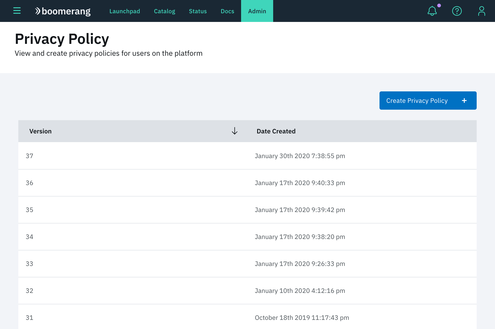
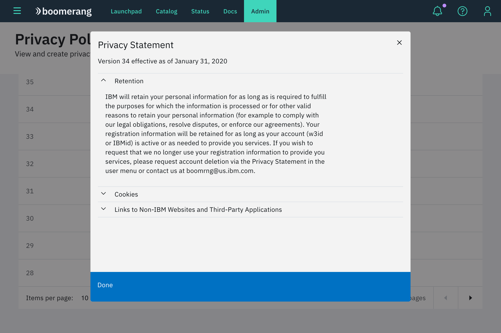
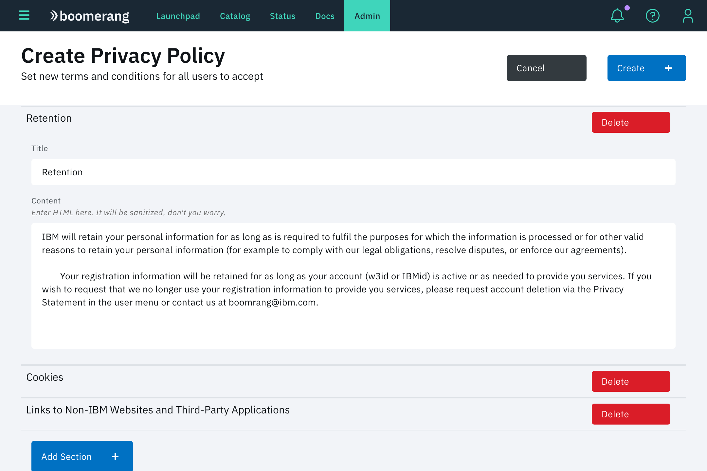
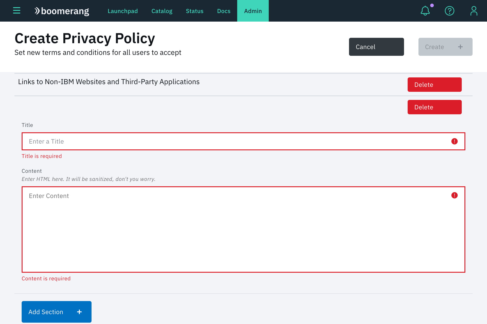
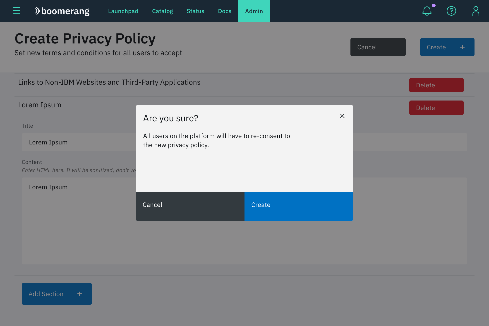

# Privacy statement

Boomerang Admin provides functionality to view, edit and create Privacy statements.

## View statements

The Privacy statements overview table provides a view of all of the policies that have been created on Boomerang. It shows the following information:

- Version
- Date Created

## View Privacy statement

The Privacy statement provides a modal with the content of the Statement. It shows the following information:

- Version
- Date Created
- Accordion sections of all the content of a statement

## Create Privacy statement

Click **Create Privacy Policy** to access the Create Privacy Statement page. Here, you can edit, delete and add new sections. It has the following content:

- **Cancel** button that returns the Privacy Policy page
- **Create** button that becomes active after the content is modified
- accordion sections of all the content of a statement
- **Delete** button to delete a section
- **Add** button to add a section

## Add Privacy statement

The Add Privacy Statement adds a new sections. It has the following content and rules:

- Title that is mandatory
- Content that is mandatory

## Confirm added privacy statement

The Add Privacy Statement adds a new sections. It has the following content:

- Modal with text informing the impact of your changes
- Click **Create** to confirm the changes

