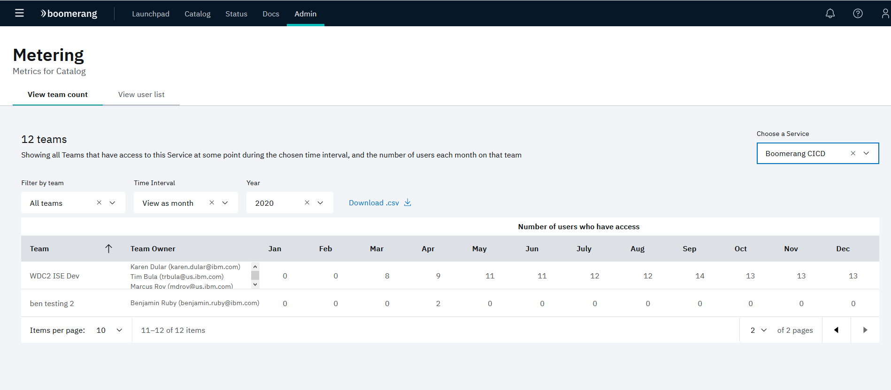
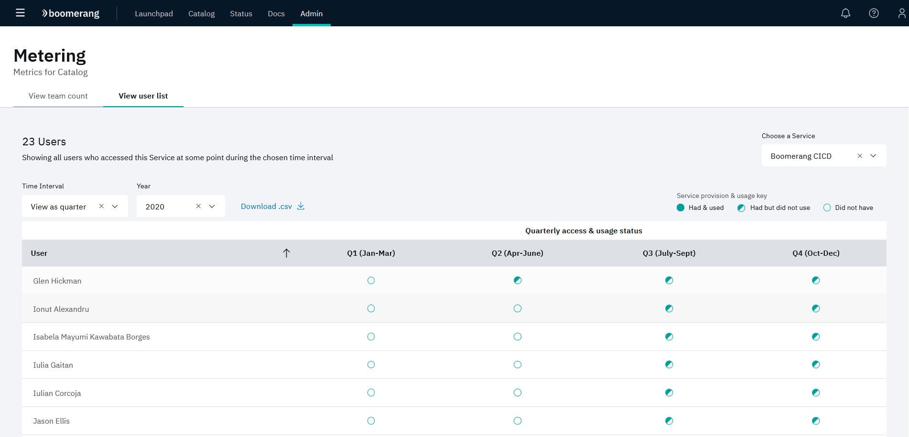

# Metering

The Metering page allows you to view annual data representing:

- the teams and the number of users that had access to catalogs grouped by:

  - Month
  - Quarter
  

- the users that had access and used catalogs grouped by:

  - Month
  - Quarter

Additionally, the displayed data can be exported in CSV format.
