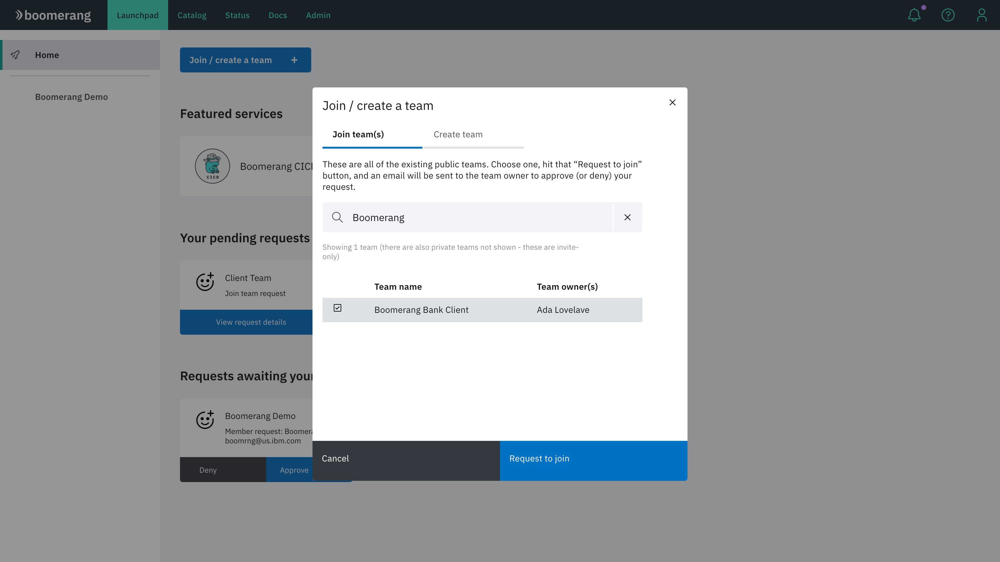
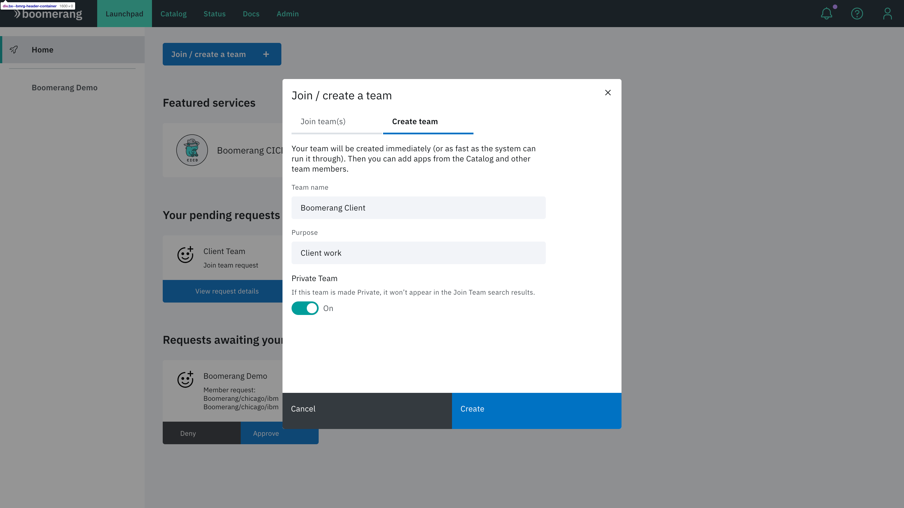

# Launchpad

The Home page in Launchpad acts as the landing site for the platform. From the Home page, a user has insights into their teams, featured services, pending requests, as well as the power to process requests if they are a Team Owner.

## Join and create a team

### Join a team

1. Navigate to the Launchpad Home screen.
2. Click **Join / create a team**.
3. Search for the team you want to join and select it.
4. Click **Request to join**.

> **Note**: Private teams are not discoverable.

### Create a team

1. Navigate to the Launchpad Home screen.
2. Click **Join / create a team**.
3. On the **Create team** tab, enter a representative **Team name**, as well as the **Purpose** for creation of the team.
4. If the team will be viewed as private, set **Private Team** to **On**. 
4. Click **Create**.

There is a platform-wide setting to automatically approve team creation. When enabled, the team is created and approved upon submitting the form. Otherwise, your form submission will generate a team creation request that requires approval and processing by a platform Administrator.

## Team navigation

The left panel contains all of the active teams available to the user. Click a team name to view attributes for team.

## Featured services

Selectable tiles allow you to quickly navigate to highlighted services on the platform.

## Your pending requests

This section displays all of the requests that you have created. Click **View request details** to view additional details about each request. You can also revoke the request if you don't want it to be processed by an Administrator or Team Owner.

## Requests awaiting your approval

If you are a Team Owner, use this section to quickly view the requests made to join your team. You can deny or approve requests.

## Private teams

Since Private teams don't appear in search results, users who want to join a team need to be invited by a Team Owner or platform Administrator. A team can be made public or private in its settings.

Private teams appear in the side panel, along with Public teams. Private teams are differentiated with a lock icon displayed alongside the Public team name.

## Private Instance

If you access a private instance of the platform, all teams that appear on the left panel are Private teams. You won't be able to join any of the teams that are on the platform unless a Team Owner or a platform Administrator adds you to that team. You can also join a Private team via a shared link. 

Likewise, all teams created on a private instance of the platform will be Private teams.
