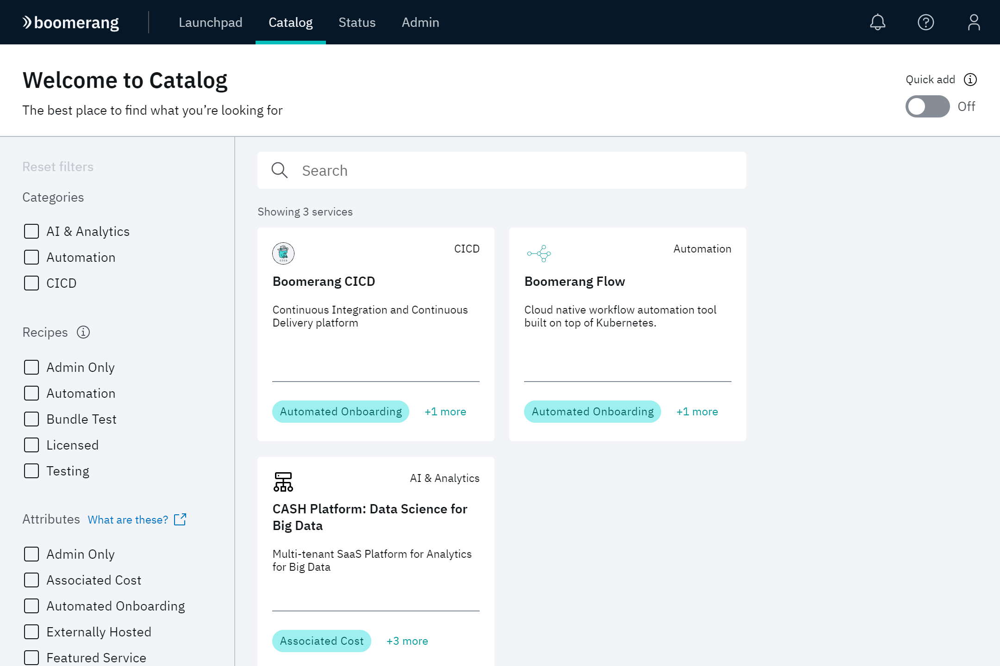
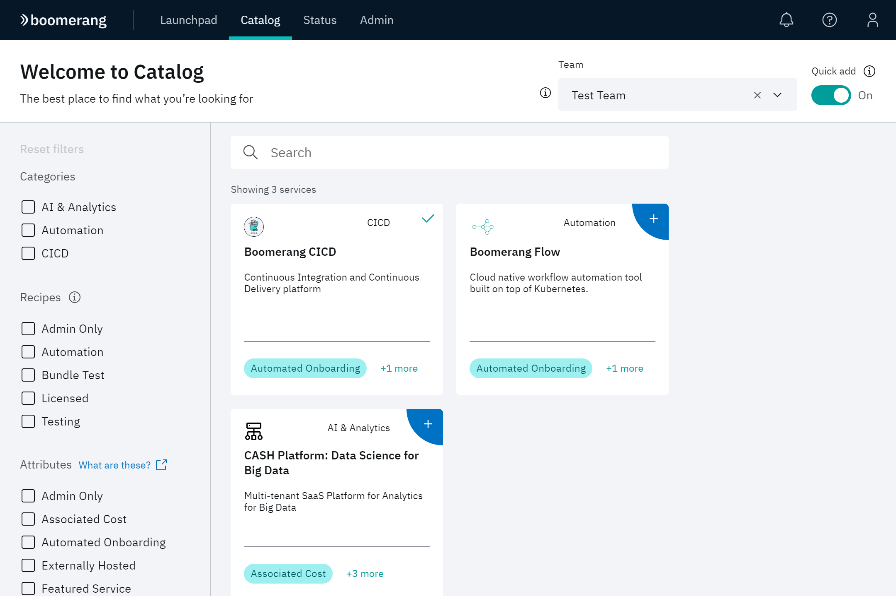
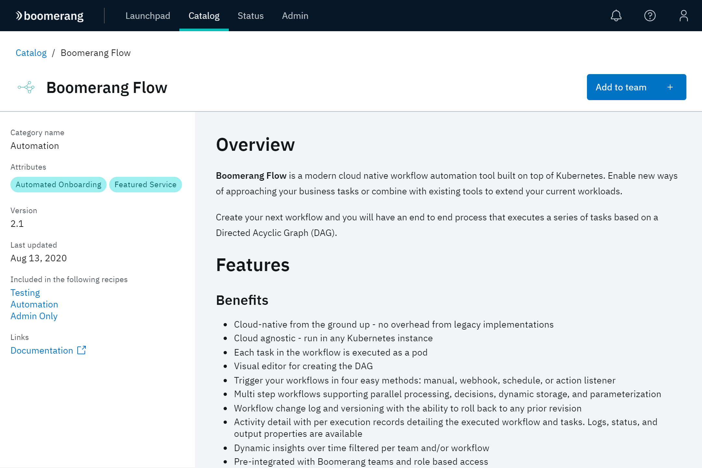
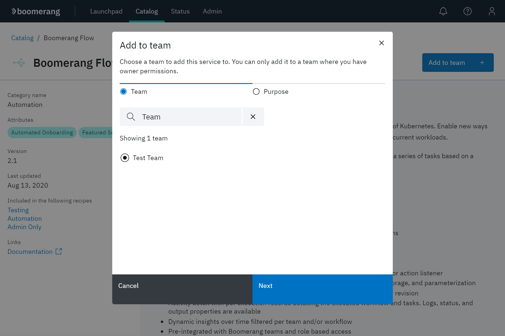
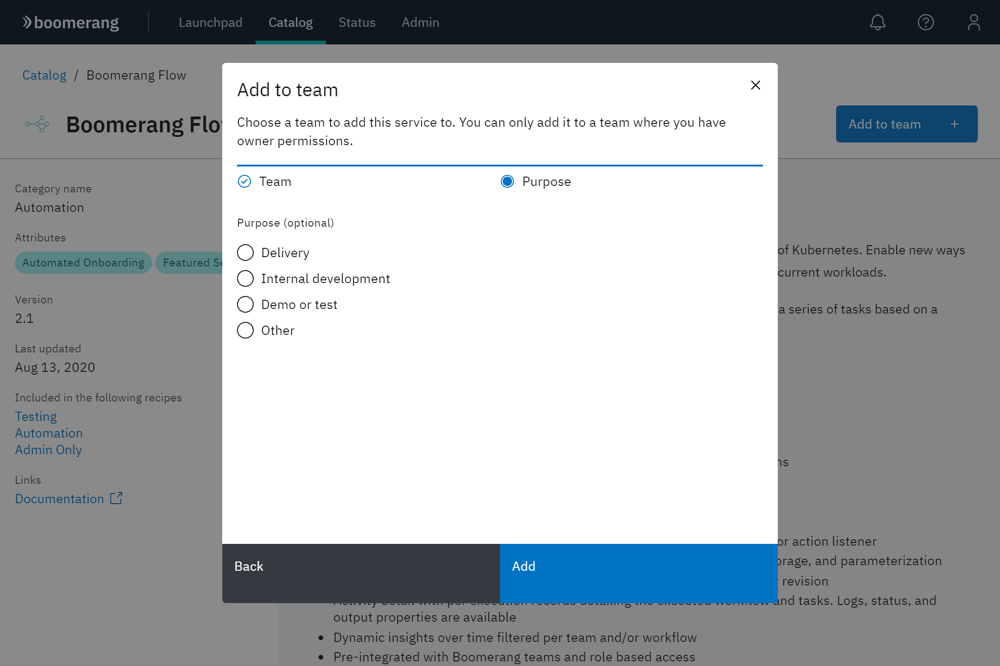
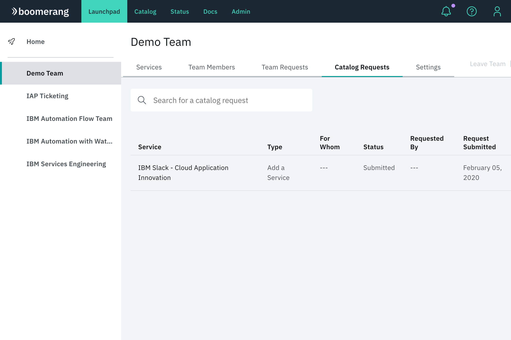
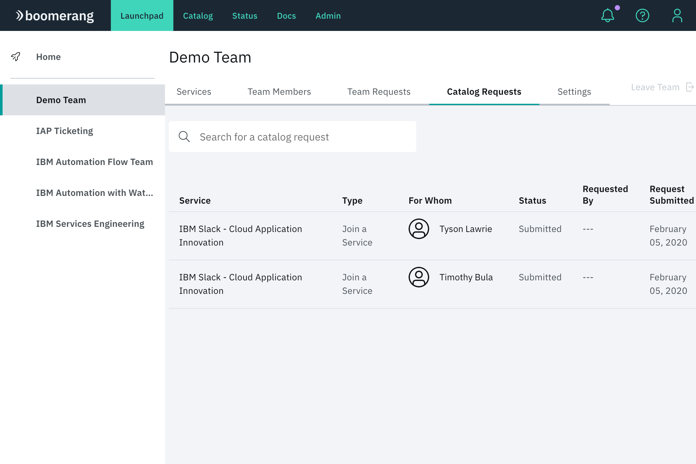
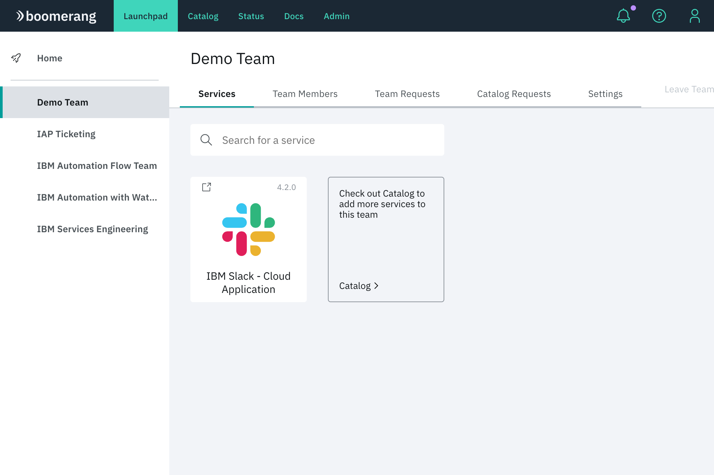

# Catalog

See a catalog of services and add them to your teams.

## Home

Search for a service and filter list by category, attribute, and recipe. Click a service to see more information about it and add it to your teams. 

You can also enable **Quick add** and quickly add services to your team without needing to navigate away from the home page.

## Service detail

View detailed information about a selected service. If you are a Team Owner, click **Add to team** to add that service to a team.

## Adding services to a team

As a Team Owner, you can add new services that can be accessed by your team. The [Catalog](https://launch.boomerangplatform.net/catalog/) is the descriptive location where a Team Owner browses and adds the required services for their team.

1. From your team screen in Launchpad, select the **Service Requests** tab. No active services appear in this screen. Use the tile that navigates to the Catalog.
2. From the Catalog, search and use filters to find the needed services for the team.
3. After selecting a specific service, you see more detailed information regarding features, and accessibility. Click **Add to team** to add that service.
4. At the Add to team modal, select the desired team and click **Next**.

> **Note**: Only teams in which you are a Team Owner can be added.

5. After selecting a team, add a purpose and click **Add**. **Purpose** is an optional field.

6. After submitting the form to add this service to the team, check your team page on Launchpad. Navigate to the **Service Requests** tab. The request for this service appears added to your team. An Administrator will have to approve this request.

6. After an Administrator approves the create service request, there will be a join service request for each team member. Not every team member has to have access to every service.

7. When a join request is approved for a member, that user will be able to navigate to the **Services** tab in their team page in Launchpad and see a tile for that service. If their join service is pending, then a tile will display that the state is pending and that further administration processing is required.

## Service attributes

Service attributes capture qualities of the services that are relevant to members. Services come in many flavors on the platform and attributes help make sense of it all.

### Admin only

The service is only for use by platform Administrators. It can't be used by regular platform users.

### Associated cost

The service has an additional cost associated with it beyond the platform. Think usage or per-user pricing.

### Automated onboarding

A member's **Join a Service** requests for the service can be automatically approved. This means that after a service is added to a team, members can automatically be given access without having to wait for platform Administrators to approve or process anything.

### Externally hosted

The service is not hosted on the platform, but an external provider. This is often associated with third-party SaaS products that can't or don't make sense to be hosted on the platform itself.

### Licensed

The service has licensing associated with it. After added to a team, you will be contacted by platform support for further discussion.

### Lite integration

The service is lightly integrated with the platform. It may not use Core platform features such as user authentication, audit, role and consent management, and status monitoring.

### Multi-Instance

The service supports being added to a team multiple times.

### Requires VPN

The service requires a VPN connection for access. It is not available via the public internet. The VPN that is required is specific to the platform instance and service.

### Third Party

The service is provided by a third party. Unless otherwise noted, they _are_ integrated into Platform user and role management.
