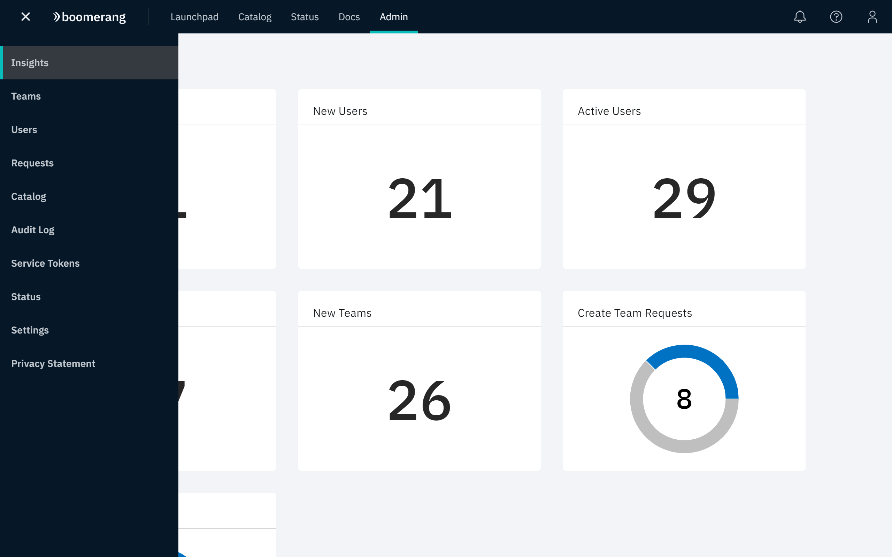

# Admin

The platform has a full operational management capability that is consolidated under the Admin application. Features are accessed using the dropdown in the top left corner of the page.

There are 5 different user roles that can be viewed in more detailed in the [Security Architecture](/essentials-core/architecture/security-architecture).

For more information on how to use Admin, please see the [How To Admin guide](/essentials-core/how-to-admin/insights/).

## Insights

**Insights** is a small dashboard that shows basic usage information of the platform. It will show;

- Total number of users
- Total number of teams
- Active number of users
- New users in last 30 days
- Number of requests

## Teams

- Information for teams includes: number of users, number of tools, date created and status (active or inactive)
- Team search
- Team detail
- Change owner of team
- Remove user from team
- Tools in team

## Users

- Name and date joined (all users)
- User search
- User detail
- Email User
- Change role(s) of user
- Activity Log
- Remove user

## Requests

All platform processing goes through requests that appear in Admin and can be processed by administrators. They involve unique actions that are required for each request type. Some of these will be custom to the Catalog template.

- Create team
- Join team
- Add tool to team
- Leave team
- Leave platform
- Close team

## Catalog

Catalog is where you manage and author the catalog templates for a solution on the platform. They denote the characteristics for a particular solution, how it interacts with the platform, and any requirements on that solution.

In particular you define the user roles, runtime settings, and the actions to be performed in requests.

## Audit log

View all activity that happens on the platform split by HTTP, CRUD, or CUSTOM, and is filterable by solution, user, and date range

## Service tokens

Functionality for administrators to view, create and delete service tokens. Service tokens allow authorization to particular functionality on the platform.

## Status

The entire platform status can be controlled from this page. This page displays maintenance and outage items.

## Settings

Settings are the post installation configurable settings that can be configured live for the running solutions.

## Privacy statement

Platform Privacy policies can be viewed and created. Creation of a new policy forces all users to consent to it.

- All Privacy policy versions, showing; date created and version
- View details for a specific policy
- Create Privacy policy
- Add section
- Delete policy

## Metering

View and export annual catalog usage by team and user.
