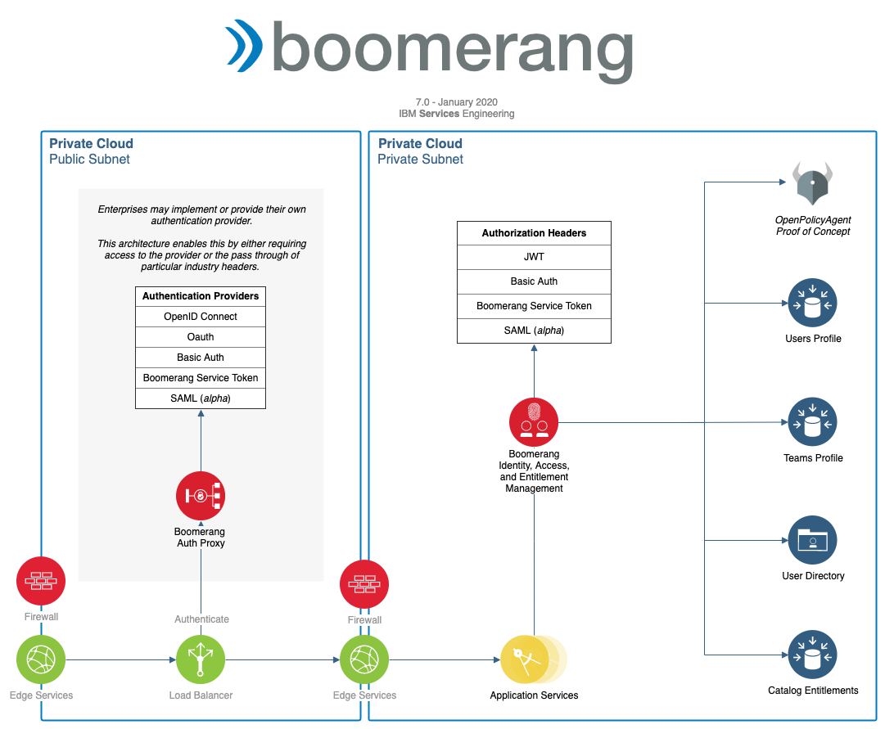
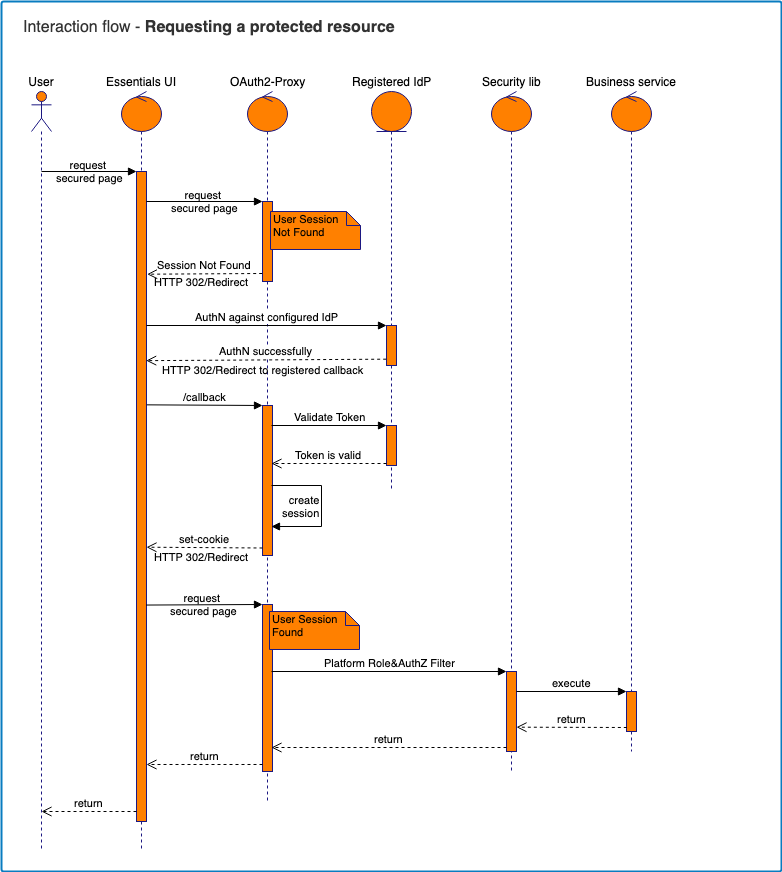
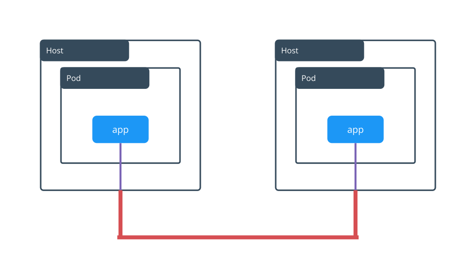

# Security architecture

Boomerang provides Identity Provider support (IDP) as well as authorization, access, and Identity and Access Management (IAM), and audit services, as part of the Core platform.

Boomerang supports a number of out-of-the-box authentication protocols that can be configured as required.



## Authentication

- Boomerang permits Single Sign-On (SSO), where a user can access multiple solutions (applications) or services within the platform, while providing their credentials only once.
- Applications which are part of the platform, can authenticate users by validating user assertions, such as authentication tokens from the identity provider, without gaining access to a user's security credentials (for example, a password).
- The security architecture provides pluggable authentication support.
- The security architecture provides support for standard protocols for federated authentication.
- The architecture provides a mechanism for service-to-service authentication by segregating service accounts from user accounts.

Enterprises may have their own access management systems for federated authentication, in which Boomerang only requires an authentication header to be present in every request.

### Authentication providers

| Provider                | Supported | Description                                                                              |
| ----------------------- | --------- | ---------------------------------------------------------------------------------------- |
| OpenID<sup>®</sup> Connect          | stable    | Authentication layer built on top of OAuth                                               |
| OAuth                   | stable    | Protocol that allows third-party applications to grant limited access to an HTTP service |
| Boomerang Service Token | stable    | Anonymous bearer tokens useful for service-to-service communication                      |
| Basic Auth              | future    | Simple authentication scheme using usernames and passwords built into the HTTP protocol  |
| SAML                    | beta      | XML-based protocol that uses security tokens containing assertions                       |

### Authentication Headers

| Header                        | Supported | Description                                                                             |
| ----------------------------- | --------- | --------------------------------------------------------------------------------------- |
| JWT with Signature Validation | stable    | JSON Web Token with implicit authentication provider verification                       |
| JWT                           | stable    | Use of access tokens that assert some number of claims                                  |
| Boomerang Service Token       | stable    | Anonymous bearer tokens useful for service-to-service communication                     |
| Basic Auth                    | future    | Simple authentication scheme using usernames and passwords built into the HTTP protocol |
| SAML Token                    | beta      | XML-based protocol that uses security tokens containing assertions (X-WEBAUTH-EMAIL, X-WEBAUTH-FNAME and X-WEBAUTH-LNAME)                     |

### Two factor authentication

The platform redirects, proxies and punches out to the specified authentication provider. In the case of two factor authentication, this is a feature that the provider needs to offer.

### Logout

The platform's sign-out functionality is being managed internally by the platform, through the authentication proxy provider. The component responsible with the cookie creation (cookie with the role to maintain the stateful information of the user) is also responsible for it's deletion.




## Authorization

- Authorization configuration is maintained centrally in the platform IAM component. The IAM component allows configuring the source for retrieving authorization information.
- Configurable support is provided for both role-based and attribute-based authorization.
- The IAM component allows returning custom authorization attributes for each application.

**Authorization concepts**

| Concept              | Description                                                  |
| -------------------- | ------------------------------------------------------------ |
| Platform Users       | Users of the platform                                        |
| Teams                | A group of platform users who have access to a set of tools   |
| Team Roles           | Roles of the team level                                      |
| Catalog              | A service that can be assigned to teams                      |
| Catalog Entitlements | Entitlements for access to a service                         |
| Service Tokens       | API Tokens to authorize and authenticate with core services  |

**Catalog services and entitlements**

Catalog Services can be onboarded to the platform and assigned to teams to use. This is called their Catalog Entitlement. Users can be assigned a role for a service that is specifically for their team. These roles are defined in the Catalog template.

Catalog Services can have many attributes. More information can be read about this in the documentation for Essentials Core.

**Roles**

| Level       | Role     | Access                                                                                                                               | Supported             |
| ----------- | -------- | ------------------------------------------------------------------------------------------------------------------------------------ | --------------------- |
| global      | Admin    | Full access to entire platform and operational administration                                                                        | stable                |
| global      | Operator | Able to maintain and operate the platform with respect to daily operational concerns.                                                | stable                |
| global      | Auditor  | Ability to view users and audit log.                                                                                                 | stable                |
| global      | Author   | Ability to create and maintain Catalog items                                                                                         | stable                |
| global      | Service  | A system service account that can not log in and is only used for API token access                                         | stable                |
| global      | User     | Standard role assigned to every user on the platform                                                                                | stable                |
| global      | Partner User | A standard role assigned by default to users on the platform that do not match the User Registration Regular Expression. Access is limited to Partner enabled services and functionality. | beta                |
| global      | Viewer   | Read-only access permanently on the platform that overrides any team setting (for example, for special sponsors or external users) | _future_              |
| team        | Owner    | The requester of the team creation automatically becomes administrator and can perform additional team actions                                 | stable                |
| team        | User     | Default user role.                                                                                                                   | stable                |
| team        | Viewer   | Read-only access to a team, where ll create, update, delete actions are disabled                                                         | _future_              |
| entitlement | User     | General catalog service access (default role for all services)                                                                       | stable                |
| entitlement | _custom_ | Any Custom user role attached to the definition of the Catalog template (for example, a scrum-master in Jira<sup>®</sup>)                  | _template definition_ |

## Access Control

**Manage and Administer**

This functionality is limited to Global roles only and is not based on Team or Catalog Entitlement.

| Interface | Administrator (Global) | Operator (Global)                                        | Auditor (Global) | Author (Global) | User (Global) | Partner (Global) |
| --------- | ---------------------- | -------------------------------------------------------- | ---------------- | --------------- | ------------- | ---------------- |
| Insights  | View                   | View                                                     | View             | -               | -             | -                |
| Teams     | Edit                   | Edit _except for Close Team and Remove Catalog Service_  | -                | -               | -             | -                |
| Users     | Edit                   | View and Send Email                                      | View             | -               | -             | -                |
| Requests  | Edit                   | Edit _except for Close Team and Leave Platform requests_ | -                | -               | -             | -                |
| Catalog   | Edit                   | View                                                     | -                | Edit            | -             | -                |
| Audit     | View                   | View                                                     | View             | -               | -             | -                |
| Tokens    | Edit                   | Edit _except for delete_                                 | -                | -               | -             | -                |
| Status    | Edit                   | Edit                                                     | -                | -               | -             | -                |
| Settings  | Edit                   | View                                                     | -                | -               | -             | -                |
| Consents  | Edit                   | View                                                     | -                | -               | -             | -                |
| Mail      | Edit                   | Edit                                                     | -                | -               | -             | -                |

**Launchpad**

Functionality in Launchpad is not based on Global roles (excluding Support Center), and for all intents and purposes, are treated as a user at the team level, other than the Partner User (Global) role, which has limited capabilities if they are a user of a team.

| Interface               | Owner (Team)  | User (Team) | User (Team) + Partner (Global)       |
| ----------------------- | ------------- | ----------- | ------------------------------------ |
| Home                    | View, Join, Create | View, Join, Create | View                     |
| Team - Services         | View and Add  | View        | View _Partner enabled services only_ |
| Team - Members          | Edit          | View        | View                                 |
| Team - Service Requests | | | |
| Team - Member Requests  | | | |
| Team - Settings         | Edit          | View        | -                                    |

Functionality in Support Center is based on Global Roles.

| Interface      | User, Author, Auditor, Partner | Operator, Admin                                            |
| ---------------|--------------------------------|------------------------------------------------------------|
| Support Center | View, Create, Update           | View, Create _including on behalf of another user_, Update |

**Catalog**

Functionality on Catalog is not based on Global roles, and for all intents and purposes, are treated as a user at the team level, other than the Partner User (Global) role, which has limited capabilities if they are a user of a Team.

| Interface      | Owner (Team)  | User (Team) | User (Team) + Partner (Global)       |
| -------------- | ------------- | ----------- | ------------------------------------ |
| Services       | View and Add  | View        | View _Partner enabled services only_ |
| Service Detail | View and Add  | View        | View _Partner enabled services and Partner enabled detail only_ |

**Status**

Functionality on Status is not based on Global roles, and for all intents and purposes, are treated as a user at the team level, other than the Partner User (Global) role, which has limited capabilities if they are a user of a Team.

| Interface      | Owner (Team)  | User (Team) | User (Team) + Partner (Global)       |
| -------------- | ------------- | ----------- | ------------------------------------ |
| Status         | View          | View        | View _Partner enabled services only_ |

**Docs**

Functionality on Docs is not based on Global roles, and for all intents and purposes, are treated as a user at the team level, other than the Partner User (Global) role, which has limited capabilities if they are a user of a Team.

| Interface      | Owner (Team)  | User (Team) | User (Team) + Partner (Global)       |
| -------------- | ------------- | ----------- | ------------------------------------ |
| Docs           | View and Add  | View        | -                                    |

## Service access tokens

For accessing certain API calls in the platform, a service token is required. Service tokens can be created from the Essentials Core Admin Service Tokens page. [Learn more](/essentials-core/how-to-admin/service-tokens) about service tokens.

Each service token is tied to a Catalog Service that has been onboarded to the platform. After creating the service token, save it immediately locally for safe keeping. There is no mechanism for viewing it again.

This service token is used to call Essentials Core services, for example the Boomerang Authorization and Identity Management Service.

These services expect an HTTP header with the key `x-access-token` and value of the token that was provided on the Boomerang Admin application.

```shell
x-access-token: "644ab012-6884-473f-a2b3-d28537b7d2af"
```

This token is used to identify and verify applications that are accessing Essentials Core services.

Service Token Categories

| Concept  | Description                                                                      |
| -------- | -------------------------------------------------------------------------------- |
| core     | Access platform services such as the Authorization service                |
| external | Protect REST end points with a token rather than using a verified user identity |
| platform | Access the platform management APIs |

## Boomerang authorization service

Every request that comes through the Boomerang platform is identified and trusted. Boomerang provides authorization and role management features directly from the Admin management interface. Applications running on the Boomerang platform are provided read-only access to these user role management APIs via the authorization service. The authorization API is a Essentials Core service, so clients need to include `x-access-token` for requests to be correctly validated.

For example, retrieving user roles can be accessed via the /auth/users/roles endpoint.

`http://bmrg-core-services-auth/auth/users/roles?userEmail=mdroy@us.ibm.com`

```js
{
    "email": "mdroy@us.ibm.com",
    "name": "Marcus Roy",
    "tool": "Demo Apps Dev",
    "teams": [
        {
            "teamName": "Multi role 2",
            "userRoles": [
                "user",
                "tester"
            ]
        }
    ]
}
```

## Audit

The platform automatically logs all CRUD activities from Essentials Core in an audit log and keeps them for **90 days**. It logs user, time, method, and final object.

The audit log can be viewed in Admin by date, service, type, and user.

## SSL certificates

The platform uses a Kubernetes<sup>®</sup> Certificate Manager integrated with [Let's Encrypt](https://letsencrypt.org/) to automatically provide the SSL certificates used by our DNS entries.

## Data Management

Data is mainly stored in the following locations:

- User Logs - ingested by Elastic<sup>®</sup>
- System Logs - ingested by Elastic
- Redis - cache to temporarily store session information of the user
- RabbitMQ<sup>®</sup> - message queue
- MongoDB<sup>®</sup> - application data
- MySQL<sup>®</sup> - application data
- PostreSQL - application data
- Persistent Volumes (PV) - application data
- Cloud Object Storage (COS) - application data, mass storage

The following table provides an overview of the data management profile.

| Data Entity      | Storage   | PII | Customer Data | Encrypted at Rest | Encrypted in Flight | Retention | Retention of Backup |
| ---------------- | --------- | --- | ------------- | ----------------- | ------------------- | --------- | ------------------- |
| User Logs        | File      | Y   | Y             | Y (\*\*)          | Y                   |           |                     |
| User Logs        | Elastic   | Y   | Y             | Y (\*)            | Y                   | 90 days   |                     |
| System Logs      | Elastic   | Y   | Y             | Y (\*)            | Y                   | 90 days   |                     |
| Session Cache    | Redis     | Y   | N             | Y (\*)            | Y (\*)              | 2 hours   |                     |
| Message Queue    | RabbitMQ  | N   | Y             | Y (\*)            | Y (\*)              | 2 hours   |                     |
| Application Data | MongoDB   | Y   | Y             | Y (\*)            | Y (\*)              |           |                     |
| Application Data | MySQL     | Y   | Y             | Y (\*)            | Y (\*)              |           |                     |
| Application Data | PostreSQL | Y   | Y             | Y (\*)            | Y (\*)              |           |                     |
| Application Data | PV        | Y   | Y             | Y (\*)            | Y                   |           |                     |
| Mass Storage     | COS       | Y   | Y             | Y                 | Y                   |           |                     |

(\*) App-level encryption (\*\*) Disk-level encryption

### Data retention

- Data in backups is retained no longer than 30 days.
- User data is never deleted, however, it is sanitized of PI data via SHA256, as part of user deletion request or offboarding.

## Encryption

Encryption on the Boomerang platform can be implemented at two distinct layers:

- Network or in-flight traffic can we encrypted through configuration of the Kubernetes networking layer and the exchange of SSL certificates,
- Data or at-rest components can be encrypted through configuration of the persistence volume layer and a passphrase.

### Data at rest encryption

Encryption of stored or persisted data is established using GlusterFS<sup>®</sup> and dm-crypt. GlusterFS is the distribution file system manager and dm-crypt provides transparent encryption of block devices. In a similar fashion to network encryption, GlusterFS also leverages digital certificates for authentication.

Encryption can be implemented at the file system level, on a directory or file, or at the volume level, (for example, the entire disk).

For further information on storage encryption see [IBM Cloud Private Encryption](https://www.ibm.com/support/knowledgecenter/en/SSBS6K_3.1.1/installing/etcd.html)

At rest encryption can also be provided by the infrastructure hosting provider. For example, SoftLayer<sup>®</sup> provides encrypted iSCSI disk using Linux<sup>®</sup> Unified Key Setup (LUKS) or IBM General Parallel File System (GPFS).

SoftLayer-provided Cloud Object Storage (COS) also supports data at rest encryption using automatic server-side Advanced Encryption Standard (AES) 256-bit encryption and Secure Hash Algorithm (SHA)-256 hash.

### Data in-flight encryption

Network encryption using Kubernetes is established between each node or host via a secure IPSec tunnel. The IPSec tunnel uses Internet Key Exchange (IKE) for mutual authentication between each nodes in your cluster. For authentication, each node has a digital certificate that is signed by a trusted authority and a private key for that digital certificate. Node certificates and keys are generated during the installation of IBM Cloud<sup>®</sup> Private. The Calico pod running on each node also has IP over IP mode enabled (IP tunneling protocol that encapsulates one IP packet in another IP packet).

Networking within the cluster can be encrypted through the use of self-signed Kubernetes certificates generated during installation of IBM Cloud Private.



For further information on networking encryption see [IBM Cloud Private IPSec](https://www.ibm.com/support/knowledgecenter/SSBS6K_3.1.1/installing/ipsec_mesh.html)

SoftLayer-provided Cloud Object Storage (COS) also supports data in-flight encryption using built-in, carrier-grade Transport Layer Security/Secure Sockets Layer (TLS/SSL) encryption.

## Kubernetes policies

There are a number of policy types in Kubernetes that help ensure security. We leverage a number of these.

### Pod security policy

Pod Security Policies (PSP) enable fine-grained authorization of pod creation and updates. They define a set of conditions that a pod must run with in order to be accepted into the system. From host access to Linux<sup>®</sup> capabilities and privileges. See [Kubernetes Pod Security Policies](https://kubernetes.io/docs/concepts/policy/pod-security-policy/) for more information.

We currently leverage the predefined [IBM Cloud Private pod security policies](https://www.ibm.com/support/knowledgecenter/en/SSBS6K_3.1.1/manage_cluster/security.html). This allows us to leverage a maintained defined set of standards for our solutions.

By default all pods run under `ibm-anyuid-psp` however the CICD Executor and Flow workers run with priviledged access under the `ibm-privileged-psp`. The default PSP is assigned at the namespace level, with the CICD and Flow solutions taking care of creating the Kubernetes Service Accounts and role bindings to the elevated PSP at install time.

### Image Policies

We leverage cluster-wide image policies with a list of approved containers that can be accessed.
