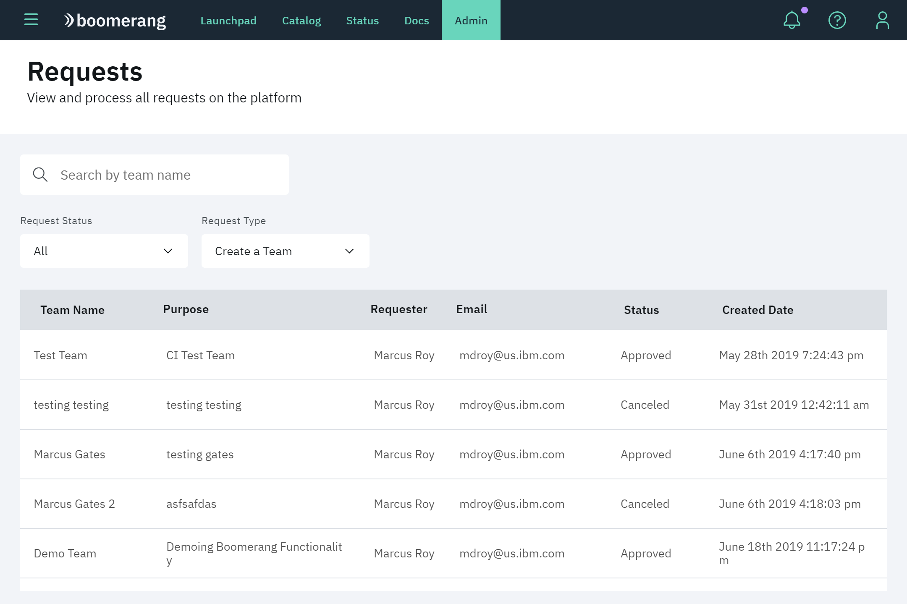
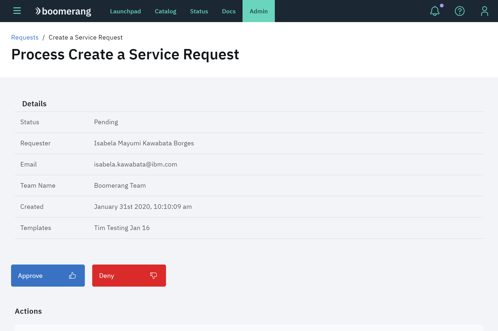
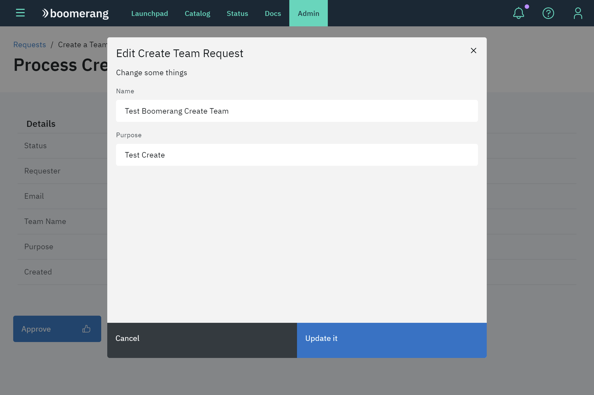
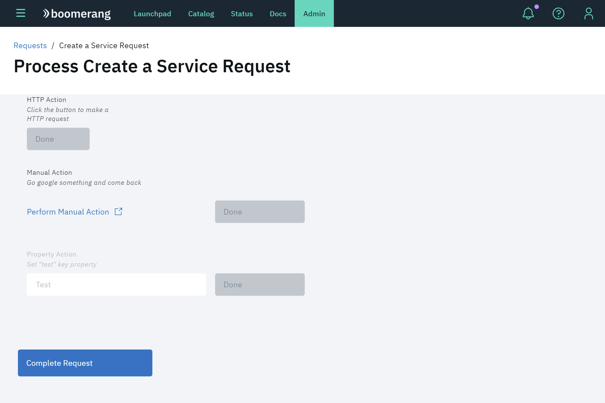

# Requests

Boomerang Admin provides functionality for Administrators to view and manage all requests for services, teams or members on our platform.

## Requests table

The [Requests Table](https://launch.boomerangplatform.net/admin/table) provides an organized view of all the requests made in the platform, including:

- Team name
- Date created
- Status
- Purpose
- Requester
- Requester Email

> Note: Only the first three columns (**Team Name**, **Created Date**, and **Status** are sortable). You can also search by the request name and team name.

By default, the table will show the _Create Team_ requests with all status, but there are two dropdown filters to help you find the correct requests by:

- Request Status (All, submitted, pending, in progress, approved, or denied)
- Request Type (Create, Join, Leave, Remove Team or Service, or Leave the Platform)

When you select a request, you will be redirected to the _Process Request_ page, see more details in the next section.

## Process request

See details about the selected request and execute actions for the request.

### Details

A summary of the request details shows the same information as the table along with the requested templates if available for the request type. If the request is in a `pending` status, you will also have two buttons to Approve or Deny and then complete the request or activate the action sections below, if there is any.

### Edit team

Change the team name or purpose before approving the creation. This is only valid for `Create a Team` requests.

### Actions

This section is only available in Services requests, if the request was approved. You can update the actions needed in this section by editing the service in [Catalog](https://launch.boomerangplatform.net/admin/catalog).

There are 4 types of actions:

- HTTP
- Flow
- Manual
- Set property

**HTTP**  
Click **Execute** to execute a preconfigured HTTP request.

**Flow**  
Like HTTP, click **Execute** to execute the request. But, this action executes an action from our [Flow Application](https://launch.boomerangplatform.net/flow/apps/flow/workflows).

**Manual**  
This action requires a manual action from the user before completing it.

**Set Property**  
Set a property to be used in the service.

If all the requirements were completed, a **Complete Request** button will be shown. Click **Complete Request** to complete the selected request.

