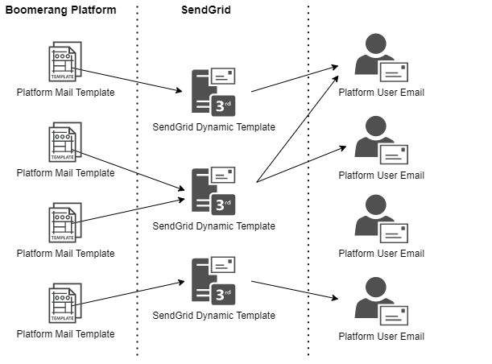
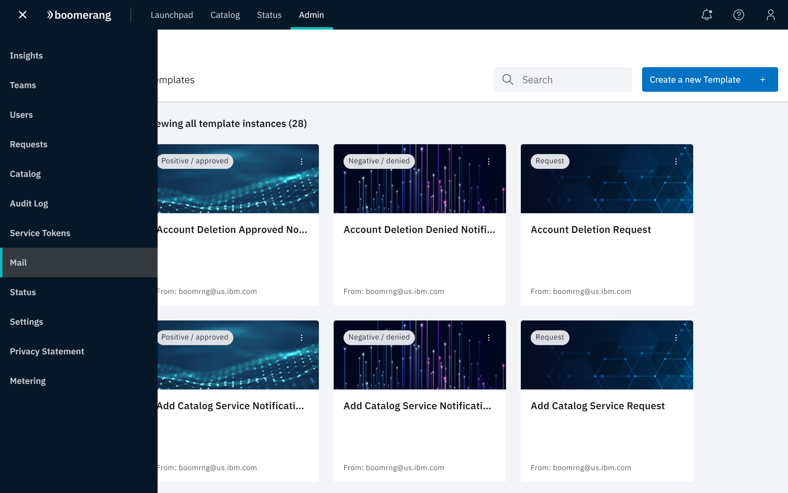
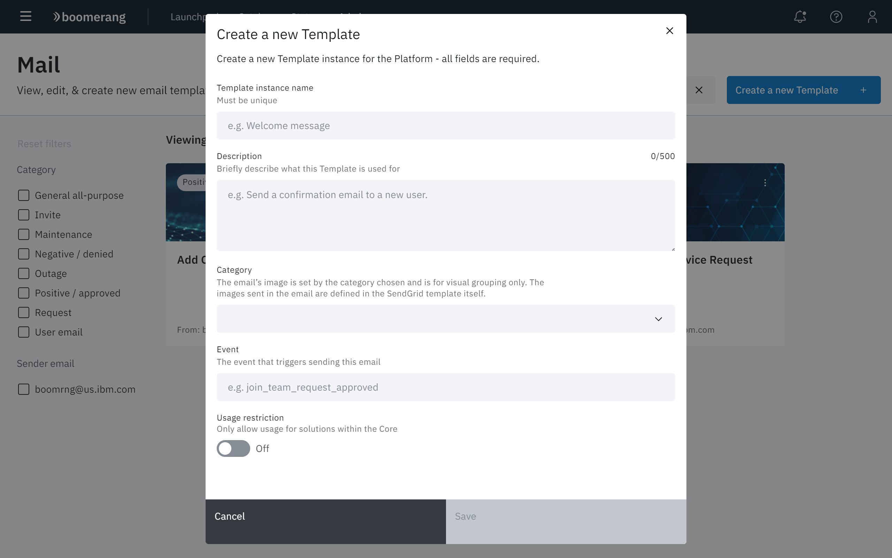
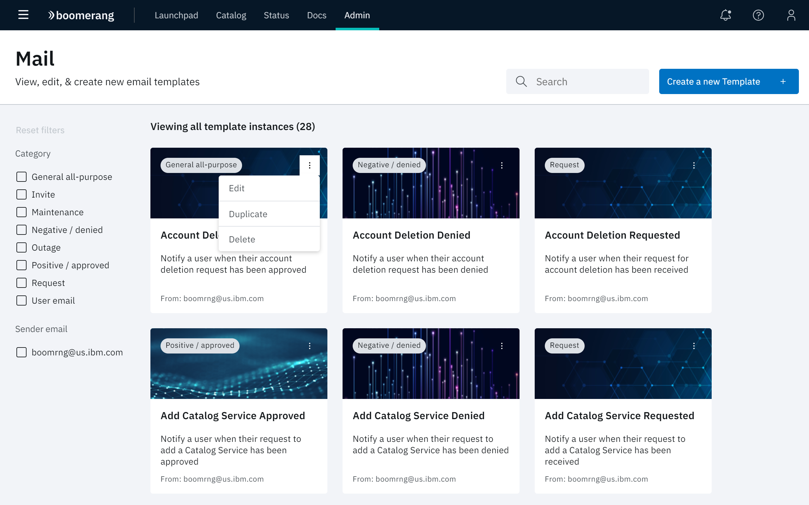
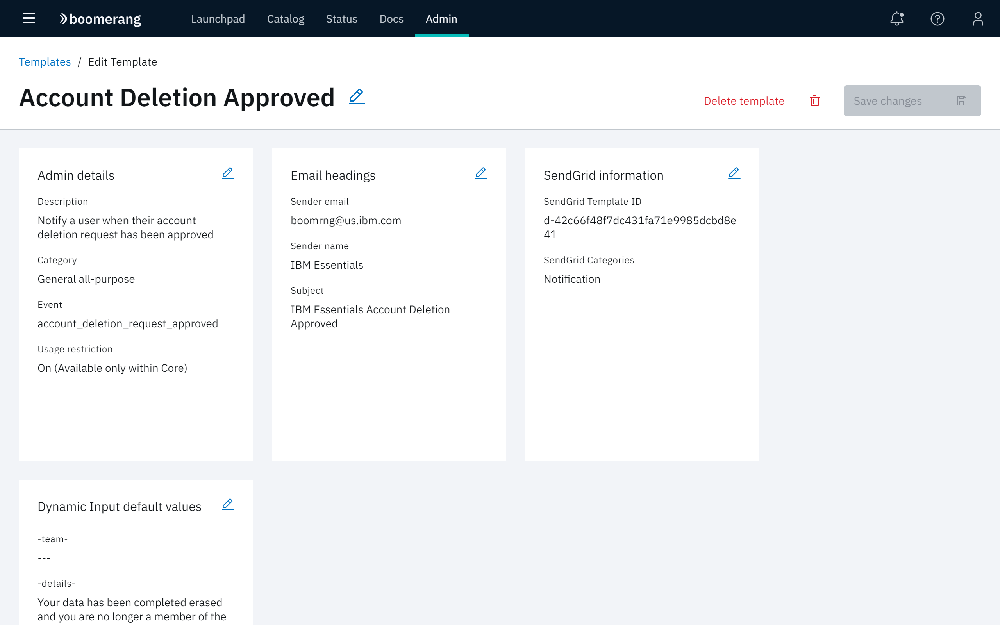

# Working with Platform Mail templates

Boomerang Admin provides functionality to view, edit and create platform Mail templates. These templates are used in the platform to generate email notifications to a user when an event has occurred. For example, users receive these emails for a Join Team Request or an Add Catalog Service Notification.

As shown in the diagram, the platform Mail templates are mapped to SendGrid® Dynamic templates. Each platform Mail template is defined with the required SendGrid metadata, event type, and dynamic inputs.

Admin Mail templates can have a many-to-one relationship to the SendGrid Dynamic templates. There can be multiple Admin Mail templates that use the same SendGrid Dynamic template, but each Admin Mail template is attached to a different event in Boomerang and uses different default substitution values accordingly.

Boomerang leverages the SendGrid service to send the mail events in the platform.

## Prerequisites

- Administrators must have a valid SendGrid account. SendGrid Dynamic templates have been predefined for use in the platform and mapped accordingly. No further action is required.
- If you are running a private instance of Essentials Core, the predefined SendGrid mail templates must be imported into your SendGrid account. Consult your Boomerang Product Team for direction.
- SendGrid is running in the background as a service.

## View platform Mail templates

In the Boomerang platform header, Click **Admin**, then select **Mail** from the Admin side navigation. The Boomerang Mail templates are shown on the Mail page in Boomerang Admin.

For ease in viewing and identification, templates are displayed as tiles, that demonstrate the visual appearance of the template, along with the following labels:

- Title - the **Template instance name** assigned to the template when it was created or edited is shown at the center of the tile.
- Sender - the **Sender Email** assigned to the template when it was created or edited is shown at the bottom of the tile.
- Category - the predefined **Category** that was assigned to the template when it was created or edited is displayed by a tag at the top of the tile.

### Filter and sort templates

You can search for any of the currently available platform Mail templates by typing an identifier in the Search field in the top right of the page. The display changes to display templates that contain that identifier in its name, description, category, or email sender and name.

To filter the display of templates, select one or more categories in the left **Category** panel. The display changes to display templates that only contain metadata for the selected categories.

## Create a new platform Mail template

To create a new platform Mail template:

1. Click **Create a new Template**.

2. At the **Create a new Template** modal, supply the following parameters:

| Name                                                      | Description                                                                                                                                                                                                                                                                     |
| --------------------------------------------------------- | ------------------------------------------------------------------------------------------------------------------------------------------------------------------------------------------------------------------------------------------------------------------------------- |
| **Template instance name**| The unique title of the template that is displayed on the Mail page.|
| **Description**| A brief description of the template and its use.|
| **Category**                                              | The Category assigned is for visual grouping of templates only. The images that appear in the template that the user views in the email are defined in the SendGrid template itself. Refer to [Create Template](#Create-Template).                                              |
| **Event**                                                 | The platform event that triggers the email notification.                                                                                                                                                                                                                        |
| **Usage restriction**                                     | If enabled (**On**), the template is restricted to Core usage only, for request processing as part of the Core platform and cannot be triggered by a solution. If this control is disabled (**Off**), the template can be used by the solutions that sit on Core, such as CICD. |
| **SendGrid Template ID**                                  | This is the identifier assigned to the SendGrid template associate with the Boomerang Mail template being created. This ID is found in the Edit Template <_template name_> page. See [Edit Template](#Edit-Template).                                                           |
| **SendGrid Categories**                                   | This optional field identifies any categories associated with the SendGrid template that would assist in locating the template in the SendGrid application.                                                                                                                     |
| **Sender Email**, **Sender Name**, **Email subject line** | These values are used the email sent to the user as: sender's email address, sender's name, and email subject line, respectively.                                                                                                                                               |
| **Add Dynamic Input**                                     | Provides for input of custom variable values to be used in the email. Multiple inputs can be added.                                                                                                                                                                             |

## Edit platform Mail templates

Certain fields of a platform Mail template can be customized. For example, you may want to update the category or add additional information to the message body.

If you are running a private instance of Essentials Core, you may want to customize certain fields specific to your platform Mail templates (for example, URLs and email addresses in the message body).

> **Note**: Do not customize any of the default SendGrid Dynamic templates provided with the platform. Modifying certain properties in a default template may cause issues with future platform Mail templates. Instead, new SendGrid Dynamic templates should be created for use. Consult your Boomerang Product Team for direction.

1. Click **Edit** from the overflow menu on the tile that corresponds to the platform Mail template that you wish to edit.

2. At the Edit Template <_template name_> page, click the pencil icon on any tile that contains parameters you want to edit.
3. Make updates as needed, then click **Save** to update the template with your changes.

| Tile                         | Parameter                | Description                                                                                                                                                                                                                                                                                                                                                                                                                                                                                                                                                                                                                                                                                                                                                                                                                                                                                                                                       |
| ---------------------------- | ------------------------ | ------------------------------------------------------------------------------------------------------------------------------------------------------------------------------------------------------------------------------------------------------------------------------------------------------------------------------------------------------------------------------------------------------------------------------------------------------------------------------------------------------------------------------------------------------------------------------------------------------------------------------------------------------------------------------------------------------------------------------------------------------------------------------------------------------------------------------------------------------------------------------------------------------------------------------------------------- |
| Admin details                | **Description**          | A brief summary of the template and its use.                                                                                                                                                                                                                                                                                                                                                                                                                                                                                                                                                                                                                                                                                                                                                                                                                                                                                                      |
| Admin details                | **Category**             | The category label that appears on the platform Mail template. Categories include: **General all-purpose**, **Invite**, **Maintenance**, **Negative/denied**, **Outage**, **Positive/approved**, **Request**, and **User email**.                                                                                                                                                                                                                                                                                                                                                                                                                                                                                                                                                                                                                                                                                                                 |
| Admin details                | **Event**                | The platform event that will trigger the email. Events include: `status_outage_resolved`   `account_deletion_request` `join_teamrequest_approved` `email_user` `leave_team_request_from_owner_approved` `add_servicer_equest` `leave_team_request_approved` `status_outage_update` `invite_user` `create_team_request_denied` `status_maintenance_complete` `leave_team_request_from_owner_denied` `add_service_request_approved` `add_service_request_denied` `status_maintenance_update` `join_team_request_from_owner` `account_deletion_request_denied` `join_team_request` `status_maintenance_scheduled` `leave_team_request_denied` `leave_team_request` `status_outage_created` `leave_team_request_from_owner` `account_deletion_request_approved` `join_team_request_denied` `create_team_request` `create_team_request_approved` `email_user_cicd` |
| Admin details                | **Usage Restriction**    | The setting of the Usage Restriction toggle set when the template was created.                                                                                                                                                                                                                                                                                                                                                                                                                                                                                                                                                                                                                                                                                                                                                                                                                                                                    |
| Email headings               | **Sender email**         | The email address of the sender.                                                                                                                                                                                                                                                                                                                                                                                                                                                                                                                                                                                                                                                                                                                                                                                                                                                                                                                  |
| Email headings               | **Sender name**          | The name of the email sender.                                                                                                                                                                                                                                                                                                                                                                                                                                                                                                                                                                                                                                                                                                                                                                                                                                                                                                                     |
| Email headings               | **Subject**              | The text used in the Subject line of the email.                                                                                                                                                                                                                                                                                                                                                                                                                                                                                                                                                                                                                                                                                                                                                                                                                                                                                                   |
| SendGrid information         | **SendGrid template ID** | The unique value assigned to the SendGrid template by SendGrid.                                                                                                                                                                                                                                                                                                                                                                                                                                                                                                                                                                                                                                                                                                                                                                                                                                                                                   |
| SendGrid information         | **SendGrid categories**  | The categories assigned to the SendGrid template in SendGrid.                                                                                                                                                                                                                                                                                                                                                                                                                                                                                                                                                                                                                                                                                                                                                                                                                                                                                     |
| Dynamic input default values | **team**                 | The team affected by the event.                                                                                                                                                                                                                                                                                                                                                                                                                                                                                                                                                                                                                                                                                                                                                                                                                                                                                                                   |
| Dynamic input default values | **details**              | The message body for the email.                                                                                                                                                                                                                                                                                                                                                                                                                                                                                                                                                                                                                                                                                                                                                                                                                                                                                                                   |
| Dynamic input default values | **action**               | The event that triggers the request.                                                                                                                                                                                                                                                                                                                                                                                                                                                                                                                                                                                                                                                                                                                                                                                                                                                                                                              |
| Dynamic input default values | **type**                 | The purpose of the email.                                                                                                                                                                                                                                                                                                                                                                                                                                                                                                                                                                                                                                                                                                                                                                                                                                                                                                                         |
| Dynamic input default values | **status**               | Indicates if the request was approved or denied.                                                                                                                                                                                                                                                                                                                                                                                                                                                                                                                                                                                                                                                                                                                                                                                                                                                                                                  |
| Dynamic input default values | **url**                  | The URL of the SendGrid template.                                                                                                                                                                                                                                                                                                                                                                                                                                                                                                                                                                                                                                                                                                                                                                                                                                                                                                                 |
| Dynamic input default values | **message**              | The text used in the message body of the email.                                                                                                                                                                                                                                                                                                                                                                                                                                                                                                                                                                                                                                                                                                                                                                                                                                                                                                   |
