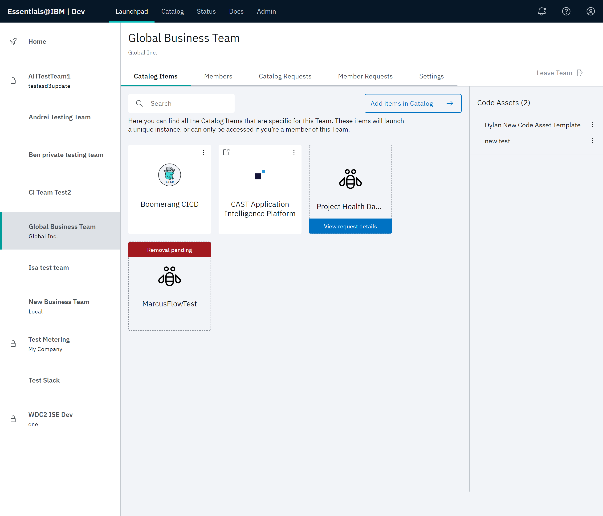
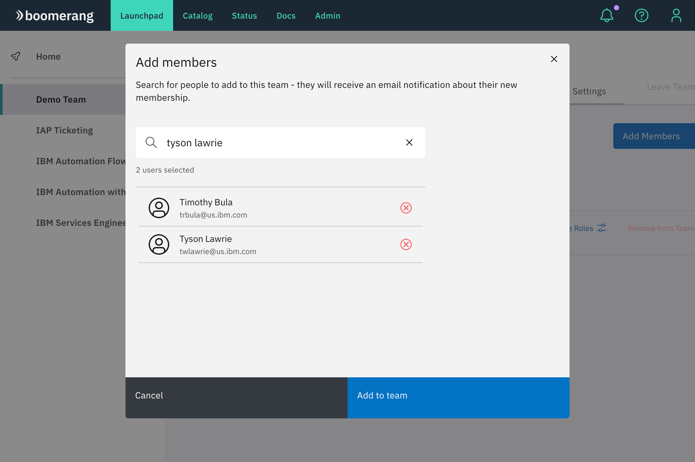
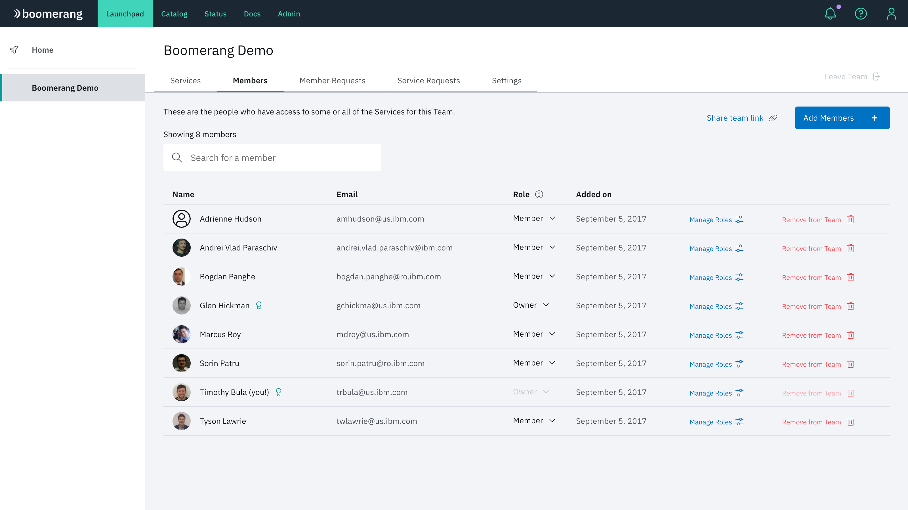
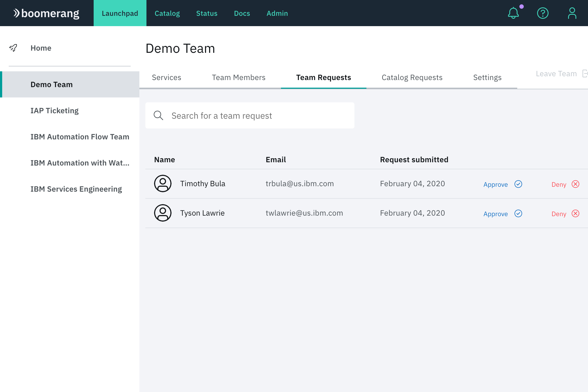
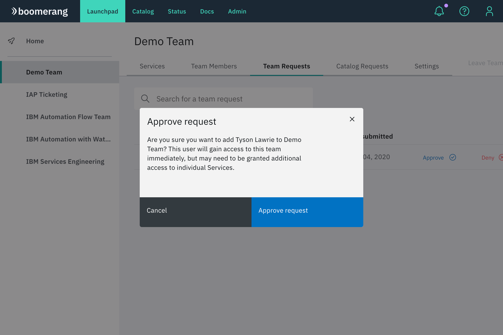
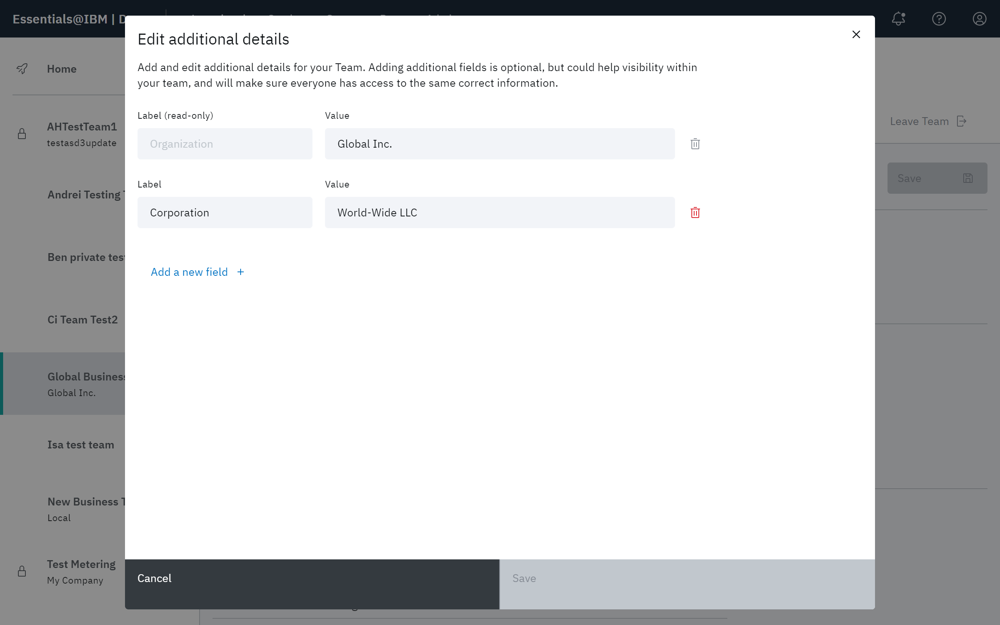
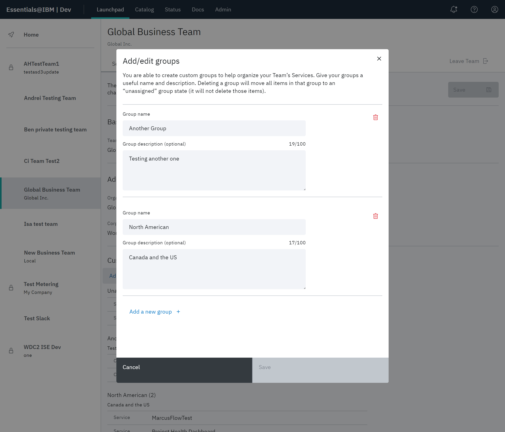
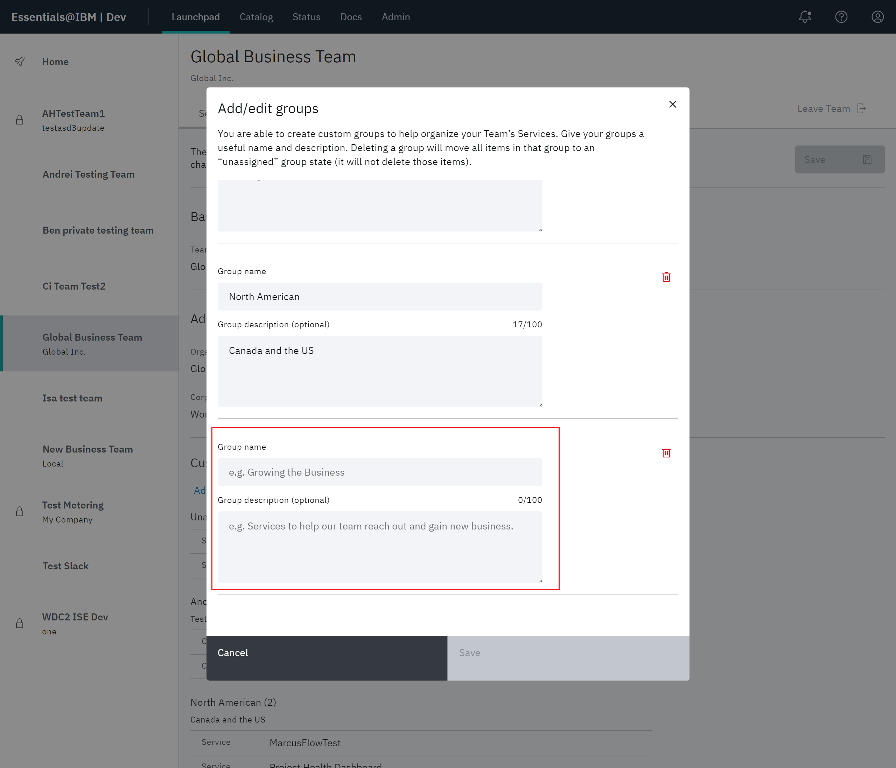
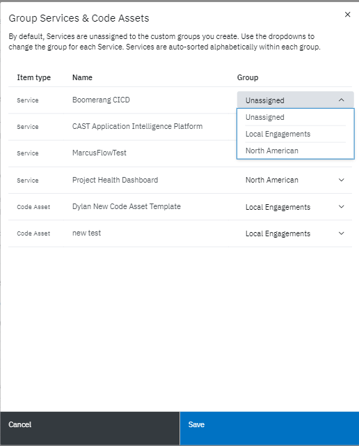
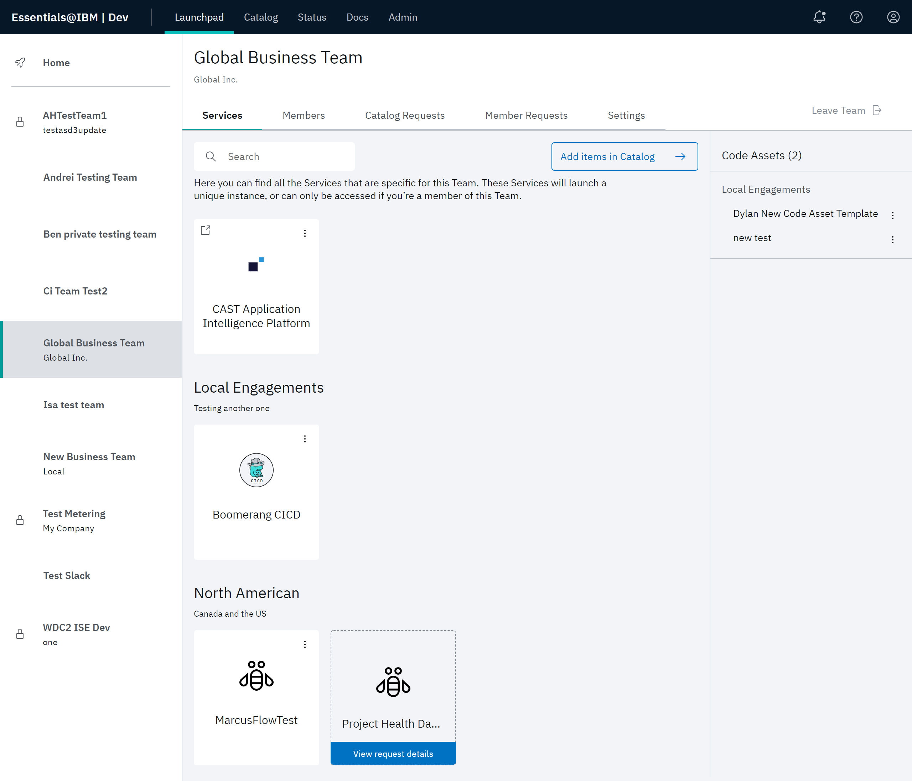

# Working with teams

Teams are accessed from Launchpad. All currently active teams are displayed in the left panel. Both private and public teams are displayed. A team can be made public or private by the Team Owner in team settings.

The teams listed on the Home page are the visual representation of groups of settings in the application. These settings define how processes are managed within that team. The concept of a team, however, is seen as a much broader descriptive provider from a security and role point of view. Refer to the discussion of teams and team roles in the [Security Architecture](/essentials-core/architecture/security).

| Team Setting    | Description        | 
| ---------------- | --------------------------- | 
| Public    |All teams that are configured with a **Public** setting are viewable in the Teams pane. Users who want to join a public team can use the **Join/create team** feature. |
| Private   | Private teams appear in the side panel, along with public teams. Private teams are differentiated with a lock icon displayed alongside the public team name. Private teams aren't discoverable by non-team members. They don't appear in the search results for joining a team, and users who want to join need to be invited by a Team Owner or platform Administrator. |
| Private Instance | If you access a private instance of the platform, all teams that appear on the left panel are private teams. You won't be able to join any of the teams that are on the platform unless a Team Owner or a platform Administrator adds you to that team. You can also join a private team via a shared link. Likewise, all teams created on a private instance of the platform will be private teams.|

# Team Functionality

The Team details page provides functionality for Team Owners and members to view and manage their teams on the platform. Functionality includes:

- Catalog Items
- Members
- Catalog Requests
- Member Requests
- Settings

> **Note:** Team Owners control who joins their team, and they also make requests for services to be added to their teams. The Team Owner role allows an elevated type of user to manage the members and services of their teams. Refer to [Managing teams](/essentials-core/how-to-admin/teams).

## Catalog items

This functionality allows you to view and search all of the Catalog items added to a team, which include services and code assets. 

This center of the page displays selectable tiles allow you to quickly navigate to highlighted services on the platform. In this example, Boomerang CICD and CAST Application Intelligence Platform have been approved from the Catalog for the Global Business team. 

In the far right panel, any code assets approved from the Catalog for your team are displayed under the heading **Code Assets**.

### Status

Services that are pending approval appear with a **View request details** tag. If a service is pending removal, it will appear with a red **Removal pending** tag. Likewise, code assets pending removal are indicated with a red caution icon. 

#### Add a Catalog item

Use **Add items to catalog** to request to add additional items to a team. You can follow the **Check out Catalog** link or navigate to **Catalog** in the top navigation bar. See the [Working with the catalog](/essentials-core/how-to-guide/catalog) for more information.

> **Note**: Only Team Owners can request to add a Catalog item to a team.

When you add a Catalog item to your team, a `Create a Service` request is created. When approved, a corresponding `Join a Service` request is created for the service for each user in the team. Users gain access to the service after their request has been approved. Users can see all pending service requests in the **Catalog Requests** tab.

> **Note**: If you change your mind or make a mistake, Team Owners can create a remove request to remove a Catalog item from their team.

<!--  -->

## Members

### View team members

All members of a team are searchable by name and email. Team Owners can manage members roles, update their permissions, and request to remove them from the team.

> **Note**: Teams must have at least one Team Owner. If there is currently only one owner, that owner cannot be a regular user. To change the Team Owner, you must make another team member a Team Owner first.

<!--  -->

### Adding team members

Team Owners can add or invite new team members from the **Members** tab in the header. You can search all platform users in your team by name and email.

1. Using the search bar, query for users to add to your team. 
2. Click the desired member to add and click **Add to team**. You can add multiple users at once. You can also remove a selected user by clicking the red `x` next to their name.

3. If a team member does not exist on the platform, you can invite them to the platform and team with an invite link with **Share team link** or **Email**.

> **Note**: **Email** has to be enabled at the platform level to use the email method. The **Share team link** is always be available.

#### Share team link

Provides a unique link to be shared that allows the accepting user to join a team upon using the link.

Share links can be one-time use or multi-use. They are valid for 24 hours.

#### Manage roles

Click **Manage Roles** for a specific member in the members list to update their roles per service. Learn more about [Service roles](https://wdc2.cloud.boomerangplatform.net/dev/docs/essentials-core/7.5.0/architecture/security-architecture#authorization).

<!--  -->

#### Remove team member

You can request to remove a team member and all of the services from a team. When approved, the member loses all access to the team and its services.

> **Note**: If you change your mind or made a mistake, you can cancel the remove request by selecting **Cancel remove request** for the associated member in the members list.

<!--  -->

## Member requests

Click **Member Requests** in the header to view and process all of join requests for this team. Users can quickly approve or deny requests without need to navigate to the requests feature.

<!--  -->

#### Approving join requests

1. At this point, the request needs to be approved. Under the **Settings** tab, there is a configuration where join team requests can be enabled to be auto-approved (we recommend disabling this feature in shared instances). If **Auto-approval new team members** is enabled, then those individuals will be added to your team. If it is not enabled, then we will have two join team requests in the **Member Requests** tab.

2. Select **Approve** for each of the pending requests in order to add them to your team.

3. Navigate to **Members** to view the new members of your team. As the Team Owner, you also have additional capabilities from this page. Team Owners can add other members as an owner. Team Owners can also manage the roles that a member has for each of their team services, code assets or recipes. A team member can also remove a member of their team (although they cannot remove themselves).

## Catalog requests

Catalog requests allow you to view all outstanding requests from the Catalog for this team including **Create a Catalog Item**, **Join a Catalog Item**, **Remove a Catalog Item** and **Leave a Catalog Item**. View more about the different [Request types](/essentials-core/how-to-admin/requests).

<!--  -->

## Settings

The features available on the **Settings** tab allow you to define the look and feel of the Teams page, as well as how the team interacts with platform functionality. For example, you can edit team name, description, and team logo, edit team labels, add or edit groups of services and code assets, and set privacy properties.

 ### Basic details
 
 Click the pencil icon next to **Basic details**. The Basic details modal allows you to enter a **Team Name**, **Group Description**, and **Team Logo** (.jpeg, .jpg, .png, .svg, or .ico). Your entries are updated on the Teams page.
 
 ### Additional details

Click the pencil icon next to **Additional details**. If you want to define multiple labels, the first label shown, **Organization**, is required. The value supplied for **Organization** is displayed directly under the team name on the Team details page.

Additional labels you define are not present on the Teams page. They are used for informational purposes only and saved to the **Settings** tab.

### Custom groups

A custom group is a defined set of services and code assets. By defining a group of Catalog items, you can quickly add all the Catalog items to your application for that group.

Any custom groups you have defined for your team appear listed in the **Custom Groups for Services & Code Assets** section. (Any services or code assets that have not been assigned to any group appear under the **Unassigned** heading.)

> **Note**: You must first have Catalog items defined for your team before you can create a group assigned to those items.

To edit an existing group, or add a new group name and description:

1. Click **Add/edit groups**. In the Add/edit group modal, click **Add group**.

2. The Add/edit groups modal displays all currently defined groups, and allows editing of those groups. To add a new group, scroll past all the current groups and use the blank fields at the end of the list to specify the new group. Click **Save**.

 > **Note**: The Add/edit groups modal also provides a delete function for each group.

3. Click **Group Services & Code Assets**. At the Services and assets modal, use the drop downs next to each service or code asset to assign or reassign items to the group. Click **Save**.

4. Click **Launchpad** and highlight your team. The custom groups you defined appear in the services or code assets portion of the page.

### Team Privacy

The toggles in this section enable auto-approve for **Join a Team** requests and define the team as public or private.

<!--  -->
