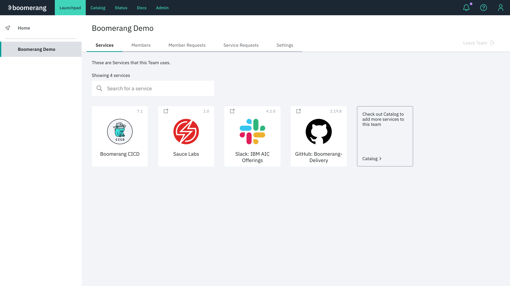

# Working with teams

Teams are accessed from the Essentials Home page. All currently active teams are displayed in the left pane. 

Both private and public teams are displayed. A team can be made public or private by the Team Owner in team settings. Refer to 

### Public teams

All teams who are configured with a **Public** setting is viewable in the Teams pane. User who want to join a public team can use the **Join/create team** feature.

### Private teams

Private teams appear in the side panel, along with Public teams. Private teams are differentiated with a lock icon displayed alongside the Public team name. 

Private teams aren't discoverable by non-team members. They don't appear in the search results for Join a team, and users who want to join need to be invited by a Team Owner or platform Administrator. 

### Private Instance teams

If you access a private instance of the platform, all teams that appear on the left panel are Private teams. You won't be able to join any of the teams that are on the platform unless a Team Owner or a platform Administrator adds you to that team. You can also join a Private team via a shared link.

Likewise, all teams created on a private instance of the platform will be Private teams.

# Team Functionality

The Team details page provides functionality for Team Owners and Team Members to view and manage their Teams on the Platform. Functionality includes:

- Services
- Team Members
- Team Requests
- Catalog Requests
- Settings

> **Note:** Team Owners control who joins their team, and they also make requests for services to be added to their teams. The Team Owner role allows an elevated type of user to manage the members and services of their teams. Refer to [Administering Teams](/essentials-core/how-to-admin/teams).

## Create a team

1. From the Essentials Home page, click `Join / create a team`. If you are not on the Home page, click **Launchpad** and make sure **Home** is selected.

2. Select `Create team` and specify a representative team name, as well as the purpose for creation of the team.
3. Click `Create`. The team appears along with the existing teams in the left navigation panel.

>**Note**: There is an admin platform-wide setting for automatic team creation. If that is enabled, then your team would be automatically created upon submitting the form. Otherwise, your form submission will generate a team creation request that will have to be approved by an administrator.

## Join a Team

1. From the Launchpad desktop, click `Join / create a team`. If you are not on the Home page, click **Launchpad** and make sure **Home** is selected.

2. Select **Join team(s)**. Search for a team based on its name. Select your team in the search list and click `Request to join`.

>**Note**: Only teams that are not private will show here.

### Share Link

If you have been provided a unique share link by your team owner, you will be navigated to Launchpad automatically with you request automatically processed to join the team.

>**Note**: If you have not previously consented to the platform, you will be promoted to do so.

## Services

This functionality allows you to view and search all of the services added to a team. You can request to add new services to a team via Catalog. Services that have a pending **Join a Service** are also shown with information about the request.

> Only Team Owners can request to add a service to a team in Catalog.

#### Add a service

Use **Catalog** to request to add additional services to a team. You can follow the **Check out Catalog** link or navigate to **Catalog** in the top navigation bar. See the [Catalog How-To](/essentials-core/how-to-guide/catalog/) for more information.

When you add a Catalog service to your team, a Create a Service request is created. When approved, a corresponding Join a Service request is created for the service for each user in the team. Users gain access to the service after their request has been approved. Users can see all pending service requests in the **Service Requests** tab.

> **Note**: If you change your mind or make a mistake, Team Owners can create a Removal request to remove a Catalog service from their team.

<!--  -->

## Members

### View team members

All members of a team are searchable by name and email. Team Owners can manage members roles, update their permissions, and request to remove them from the team.

> **Note**: Teams must have at least one Team Owner. If there is currently only one owner, that owner cannot be a regular user. To change the Team Owner, you must make another team member a Team Owner first.

<!--  -->

### Adding team members

Team Owners can add or invite new team members from the **Members** tab in the header. You can search all platform users in your team by name and email.

1. Using the search bar, query for users to add to your team. 
2. Click the desired member to add and click **Add to team**. You can add multiple users at once. You can also remove a selected user by clicking the red `x` next to their name.

3. If a team member does not exist on the platform, you can invite them to the platform and team with an invite link with **Share team link** or **Email**.

> **Email** has to be enabled at the platform level to use the email method. The **Share team link** is always be available.

#### Share team link

Provides a unique link to be shared that allows the accepting user to join a team upon using the link.

Share links can be one-time use or multi-use. They are valid for 24 hours.

#### Manage roles

Click **Manage Roles** for a specific member in the members list to update a member's roles per service. Learn more about [Service roles](https://launch.boomerangplatform.net/docs/essentials-core/7.3.0/architecture/security-architecture#authorization).

<!--  -->

#### Remove team member

You can request to remove a team member and all of the services from a team. When approved, the member loses all access to the team and its services.

> **Note**: If you change your mind or made a mistake, you can cancel the remove request by selecting **Cancel remove request** for the associated member in the members list.

<!--  -->

## Member requests

Click **Member Requests** in the header to view and process all of join requests for this team. Users can quickly approve or deny requests without need to navigate to the Requests feature.

<!--  -->

#### Approving join requests

1. At this point, the request needs to be approved. Under the **Settings** tab, there is a configuration where join team requests can be enabled to be auto-approved (we recommend disabling this feature in shared instances). If **Auto-approval new team members** is enabled, then those individuals will be added to your team. If it is not enabled, then we will have two join team requests in the **Team Requests** tab.

2. Select **Approve** for each of the pending requests in order to add them to your team.

3. Navigate to **Team Members** to view the new members of your team. As the Team Owner, you also have additional capabilities from this page. Team Owners can add other members as an owner. 

    Team Owners can also manage the roles that a member has for each of their team services. A team member can also remove a member of their team (although they cannot remove themselves).

## Service requests

Service requests allow you to view all outstanding requests from the Catalog for this team including **Create a Service**, **Join a Service**, **Remove a Service** and **Leave a Service**. View more about the different [Request types](https://launch.boomerangplatform.net/docs/essentials-core/7.4.0/how-to-admin/requests).

<!--  -->

## Settings

**Settings** like enabling auto-approve for **Join a Team** requests and making the team public or private are available at this page.

<!--  -->
