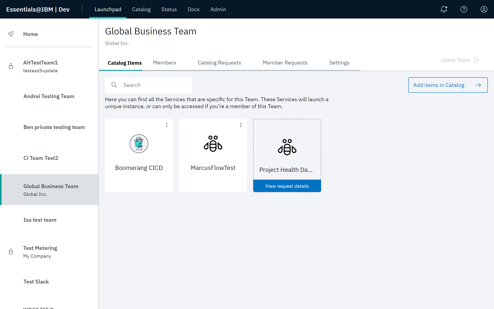
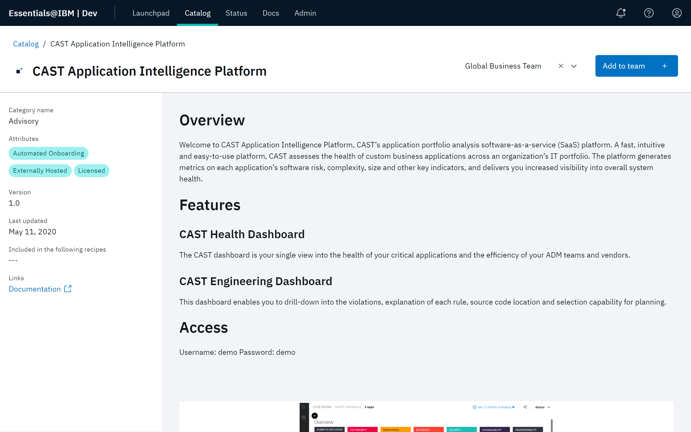
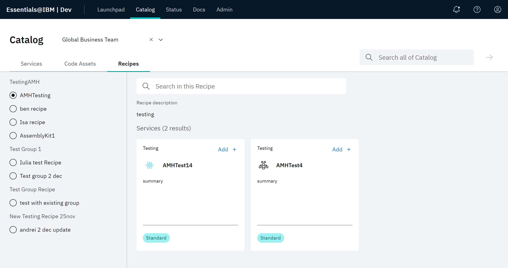
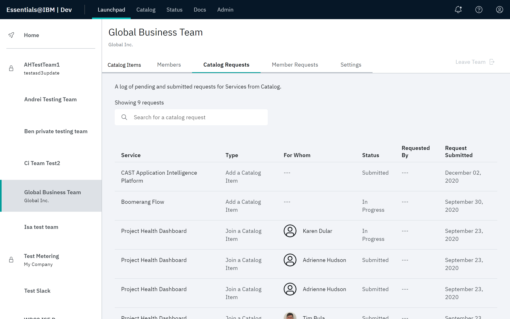
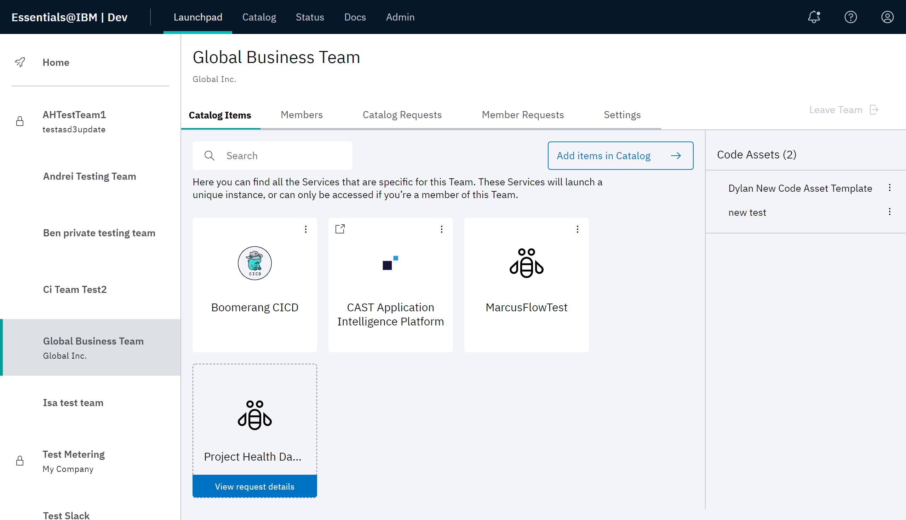
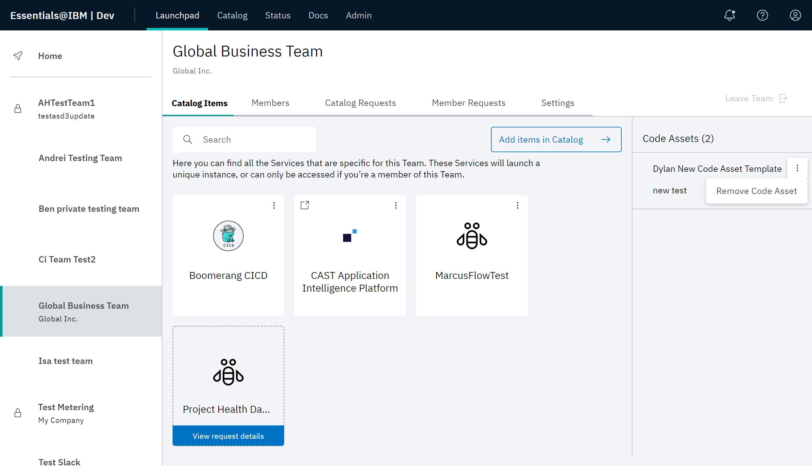

# Working with the Catalog

Services, code assets, and recipes that are available to your team are displayed on the Catalog page. Click the **Services**, **Code Assets**, or **Recipes** tab to view the associated items.

You can search for an item and filter the list by category, attribute, and recipe. Click an item to see more information about it and add it to your teams.

## Service attributes

Service attributes capture qualities of the services that are relevant to members. Services come in many flavors on the platform and attributes help make sense of it all.

| Attribute     | Description        | 
| --------- | ---------------------------- | 
| Admin Only |The service is only for use by platform Administrators. It can't be used by regular platform users. | 
| Associated Cost |The service has an additional cost associated with it beyond the platform. Think usage or per-user pricing. |
| Automated Onboarding |A member's **Join a Service** requests for the service can be automatically approved. This means that after a service is added to a team, members can automatically be given access without having to wait for platform Administrators to approve or process anything. |
| Externally Hosted | The service is not hosted on the platform, but an external provider. This is often associated with third-party SaaS products that can't or don't make sense to be hosted on the platform itself. |
| Licensed |The service has licensing associated with it. After added to a team, you will be contacted by platform support for further discussion. |
| Lite Integration |The service is lightly integrated with the platform. It may not use Core platform features such as user authentication, audit, role and consent management, and status monitoring. |
| Multi-Instance |The service supports being added to a team multiple times. |
| Requires VPN |The service requires a VPN connection for access. It is not available via the public internet. The VPN that is required is specific to the platform instance and service. |
| Third Party |The service is provided by a third party. Unless otherwise noted, they _are_ integrated into Platform user and role management. |

# Adding services, code assets, and recipes

As a Team Owner, you can add a Catalog item that can be accessed by your team. The [Catalog](https://launch.boomerangplatform.net/catalog/) is the descriptive location where a Team Owner browses and adds the required items for their team.

In this procedure, adding a service will be demonstrated. The procedure also applies to adding a code asset of recipe.

1. From your team page in Launchpad, select the **Catalog Items** tab. Any currently active Catalog items, as well as any requests in progress for an item appear in this screen. 
2. Click **Add items in Catalog** to navigate to the Catalog page.

> **Note**: Catalog items can also be added to a team directly from the Catalog page. In this case, you will be asked to select a team before proceeding. You can only add items to teams in which you are a Team Owner.

3. If you have selected the **Services** or **Code Assets** tab, use the search and filter controls available in each tab to find the needed items for the team. Use the **Choose a Team** pull down at the top of the page to select the team that will be assigned the Catalog item. Click **Add +** on the tile to quickly add the item to the team without viewing the detailed information.

4. To view detailed information for a tile regarding features and accessibility, click the tile. From the detailed view, click **Add to team** to add that item. 

5. If you have selected the **Recipes** tab, select a recipe in the left pane to view tiles representing the services and code assets defined in that recipe. Select a tile to see more detailed information regarding features, and accessibility, then click **Add to team** to add that item. Or, you can also click **Add +** on the tile to quickly add the item without viewing the detailed information.

6. At the Add to team modal, specify a **Reason for adding** and click **Save**.

7. After submitting the form to add this item to the team, check your team page on Launchpad. Navigate to the **Catalog Requests** tab. The request for this Catalog item appears added to your team. An Administrator will have to approve this request.

8. After an Administrator approves the create request, select **Admin** then **Requests**. There will be a join request for each team member. Not every team member has to have access to every catalog item.

9. When a join request is approved for a member, that user will be able to navigate to the **Catalog Items** tab in their team page in Launchpad and see that catalog item. If the item requested was a code asset, that item will appear in the right pane. Pending joins are also indicated.

# Removing a Catalog item

Catalog items can be removed from a team. Select the **Services** tab at your team details page.

Identify the item to be removed and select the overflow menu for that item. Click **Remove Service**.

Identify a code asset in the Code Assets pane and select the overflow menu for that code asset. Click **Remove Code Asset**.

