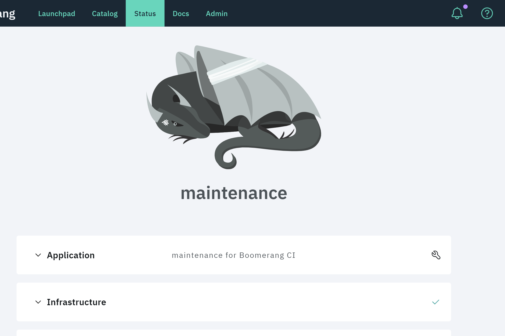
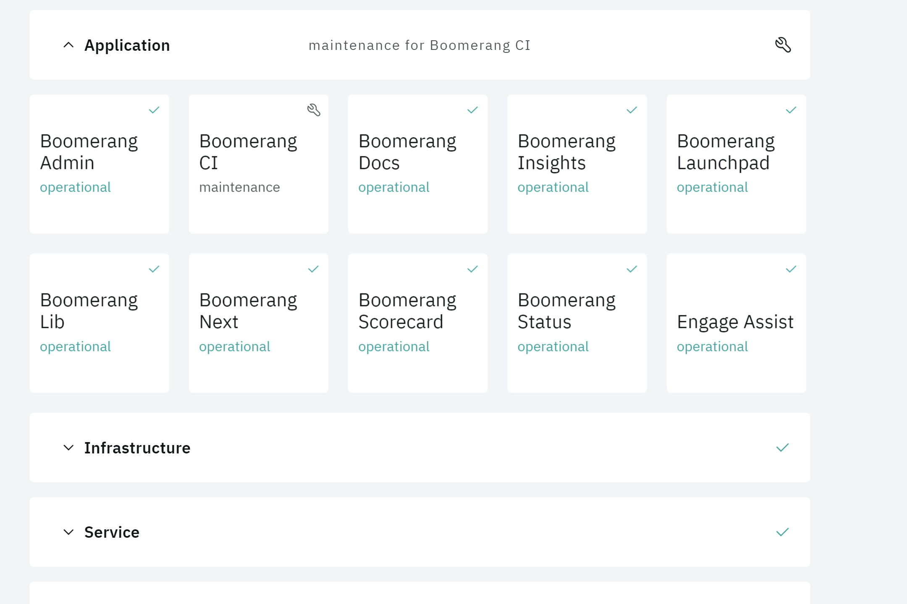
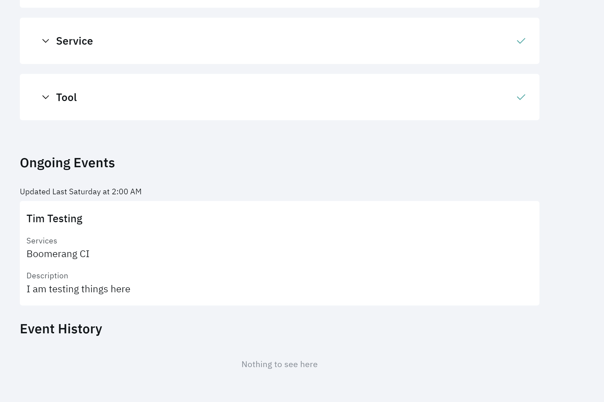
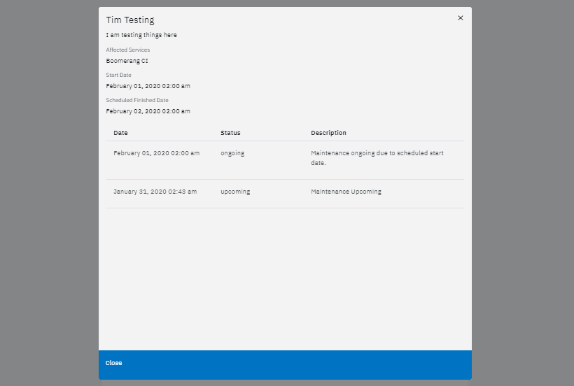

# Checking status

This feature allows you to see status of the entire IBM Services Essentials platform, check services status and view information about incidents and maintenances.

## Services

This is a list of services grouped by type.

## Ongoing Events

This information is about incidents and maintenances that are `ongoing`.

## Event History

Event History includes information about `resolved` incidents and `finished` maintenances.

## Event Details

Click an event to see more details about it.

