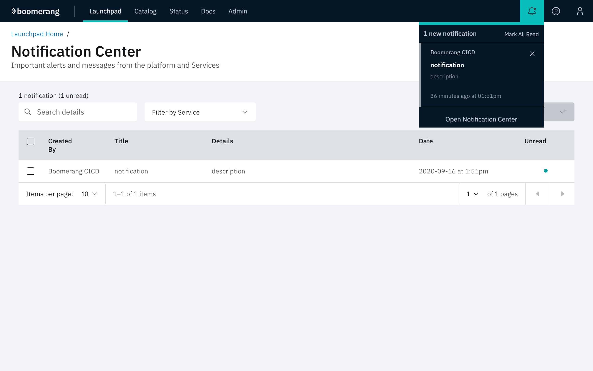

# Viewing the Notifications Center

The IBM Services Essentials platform provides notification capabilities as a common service to solutions running on the platform. 

Click the Notification Center tile on the Home page to view the Notifications Center.

The Notification Center provides a centralized place to view and interact with these notifications. The center is available for all applications that are tightly integrated to the Core services.

Click the notifications bell in the Platform header to reload the Notification Center and refresh the notifications listing.

