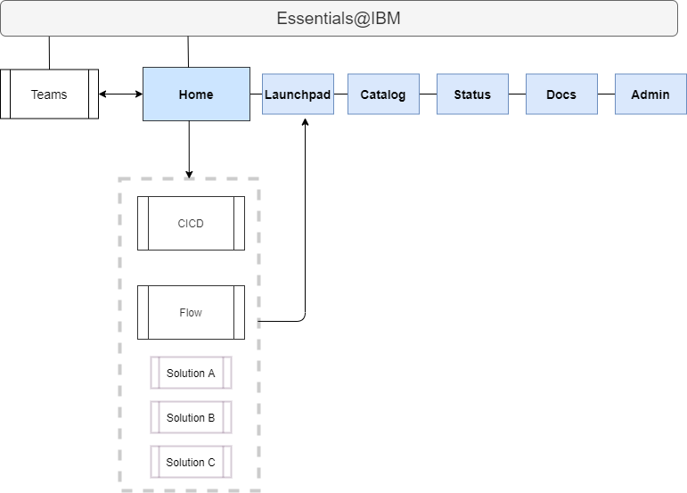
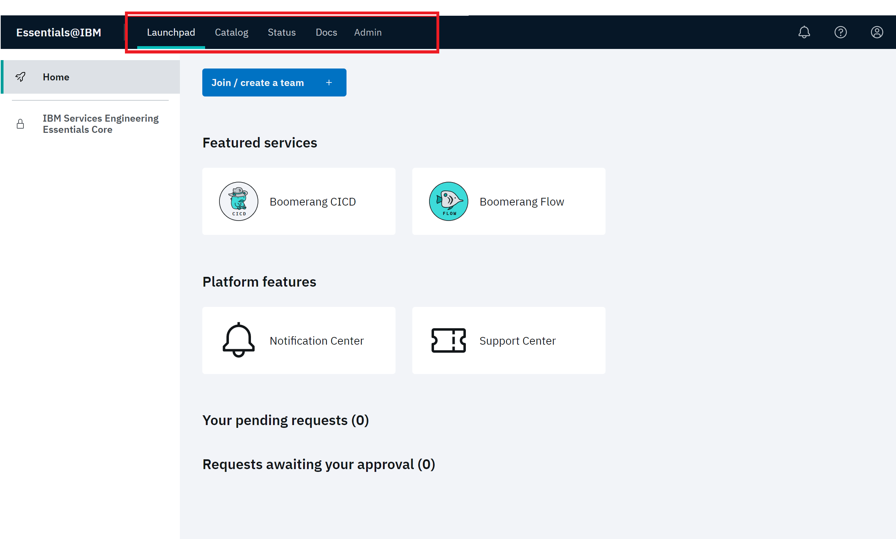
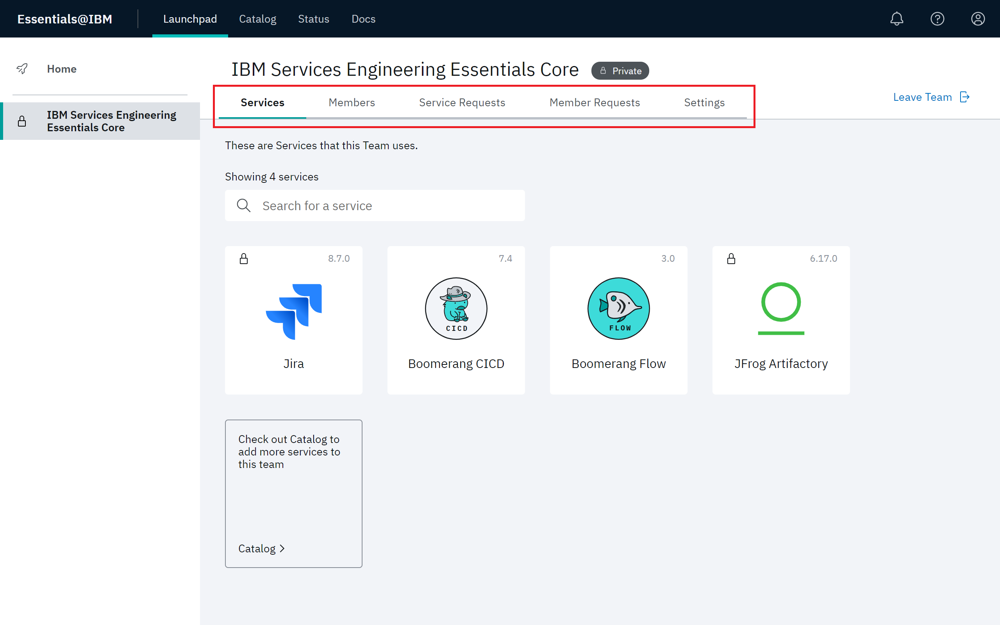
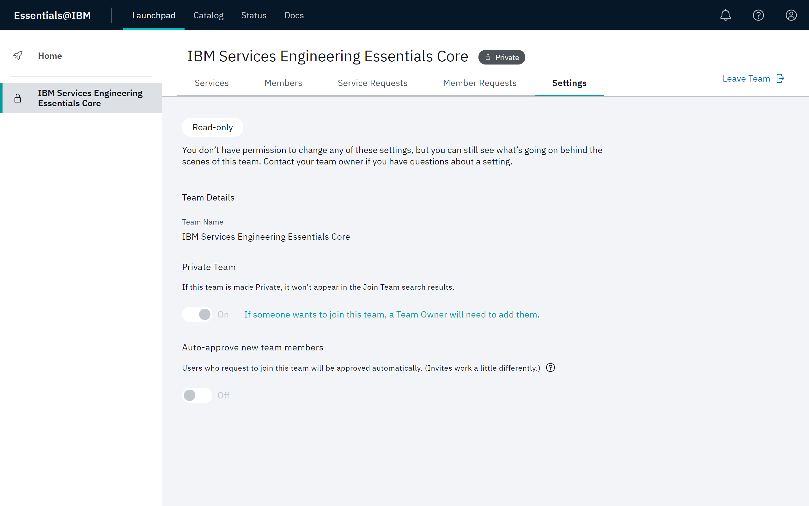

# Navigating Essentials Core

Essentials Core is the layer in the platform that provides services and libraries for solution integration. Here, you access the functionality for team and service management. 

A unique feature of Essentials Core is **Launchpad**. Regardless of where you are in solution development, you can click **Launchpad** to return to the Essentials Core Home page.

Essentials Core also provides insights into the well-being of the platform with functionality for audit events, notifications and settings. 

> **Note**: Additionally, all authentication and authorization of users is managed by the Core. This functionality is governed by `Auth Proxy`. Refer to [Installation](/essentials-core/installing/installing) and [Security Architecture](/essentials-core/architecture/security).

# Home page

The Essentials@IBM Home page is displayed when logging on to the the IBM Services Essentials platform.

The following features are available on the Essentials@IBM Home page.

- Essentials@IBM task bar
- Join/create a team
- Featured services
- Platform features
- Your pending requests
- Requests awaiting your approval
- Team navigation pane

## Essentials@IBM task bar

> **Note**: The Essentials@IBM task bar is available with all services on the platform.

The Essentials Core task bar provides the following features:

- **Launchpad** – Click **Launchpad** at any time to return to the Home page for Essentials@IBM. 
- **Catalog** - Click **Catalog** to define and manage the lifecycle of your services. Refer to [Working with the Catalog](/essentials-core/how-to-guide/catalog) for details. 
- **Status** – This feature allows you to gain insight into maintenance events and outages. Refer to [Checking Status](/essentials-core/how-to-guide/status) for details. 
- **Docs** – **Docs** accesses the centralized location for all information on the platform
- **Admin** – This feature accesses the functionality for tracking and managing the platform, its teams, and users. Refer to [Administrative Tools](/essentials-core/how-to-admin/admin) for details. 

## Join/create a team

Click **Join/create a team** to access the Join/create a team modal. Refer to Refer to [Working with Teams](/essentials-core/how-to-guide/teams) for detailed instructions for creating a team or joining a team.

## Featured services

This area highlights selectable tiles allow you to quickly navigate to highlighted services on the platform. For example, CICD and Flow currently appear in this example.

## Platform features

Two features, Notification Center and Support, provide helpful tools and information during operation. 

Notification Center provides important alerts and messages from the platform and Services. Refer to [Viewing the Notification Center](/essentials-core/how-to-guide/notificationscenter). 

Support Center  allows you to enter support tickets and track of existing tickets. Refer to [Using the Support Center](/essentials-core/how-to-guide/supportcenter).

## Your pending requests

This section displays all of the requests that you have created. Click **View request details** to view additional details about each request. You can also revoke the request if you don't want it to be processed by an Administrator or Team Owner.

If you are a Team Owner, use this section to quickly view the requests made to join your team. Refer to [Working with Teams](/essentials-core/how-to-guide/teams) for detailed instructions.

## Requests awaiting your approval

If you are a Team Owner, use this section to quickly view the requests made to join your team. You can deny or approve requests.
Refer to [Administering Requests](/essentials-core/how-to-admin/requests) for detailed instructions.

## Team navigation pane

The left pane on the page lists the teams that are currently approved for your solution. Select any team to display the corresponding Team page.

> **Note**: Since Private teams don't appear in search results, users who want to join a team need to be invited by a Team Owner or platform Administrator. A team can be made public or private in its **Settings**.

Select the appropriate tab for team, member and service functionality. Refer to [Working with Teams](/essentials-core/how-to-guide/teams) for detailed instructions.

The **Settings** tab allows you to configure settings for the team, like enabling auto-approve for `Join a Team` requests and making the team public or private.

