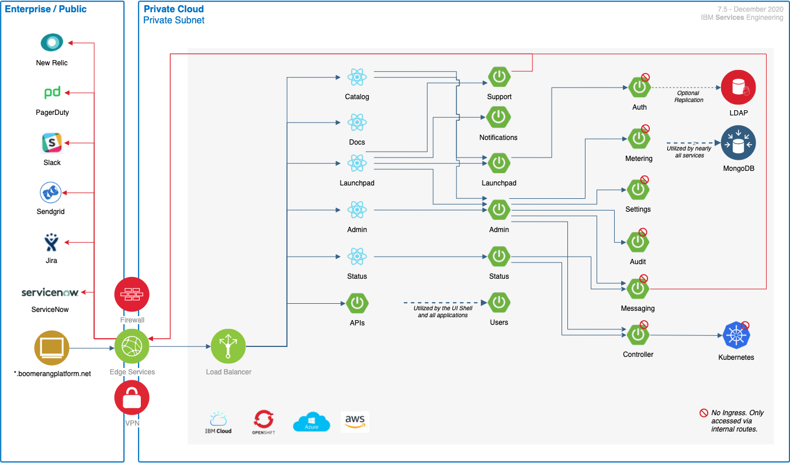

# Application architecture

**Dependencies**

The following platform-wide dependencies are prior to, and in addition to, any dependencies for the additional components, such as Core.

| Dependency                | Implementation                                                            | Version | Notes                                                                                                        |
| ------------------------- | ------------------------------------------------------------------------- | ------- | ------------------------------------------------------------------------------------------------------------ |
| Kubernetes®                | IBM Cloud® Private (3.2.1+) or Red Hat® OpenShift® Container Platform (4.3+) | 1.13.9+ |                                                                                                              |
| Application Load Balancer | NGINX                                                                     | 0.23.0  |                                                                                                              |
| Certificate Manager       | Jetstack Cert Manager                                                     | 0.7.0   | If using IBM ICP 3.1.1 or higher, use the IBM Cert Manager provided, which is a forked implementation. |
| Logs                      | Elasticsearch®                                                             | 5.5.1   |                                                                                                              |
| Monitoring                | New Relic® Infrastructure, New Relic Kubernetes®, New Relic APM Agent       | 4.10.0  | _if enabled_                                                                                                 |
| Tracing                   | Jaeger                                                                    |         | _if enabled_                                                                                                 |

## Core

Core is the centralized enabler and common services for a platform. It provides an architecture and application functionality to create an interoperable set of services that can be brought together to create applications.

This creates a collection of technology capabilities and components that enable you to build upon it. The Core exposes upward services for applications to run, that enable the rapid development of those applications. This ensures a common consistent approach, methodology, and implementation. The Core provides a holistic joint experience, opposed to disparate custom microservices.

Core allows applications to be designed and constructed agnostic to the underlying infrastructure or security protocols.

### Features

The following are the functional features provided by the platform and are supported by a user experience, and frameworks. 

- Authentication
- Authorization (role-based access control, RBAC)
- Audit
- Requests
- Catalog (service discovery and provisioning)
- Logging
- Settings
- Status management
- Notifications
- Messaging (Mail and Slack®)
- Support (Support Center, Raise a Bug, Contact Us)
- Docs
- API Docs
- Content

#### Optional features

The following subset of features can be optionally enabled or disabled via feature flags at installation time with further integration information provide post install via the platforms settings. These features are disabled as part of Core Lite.

- Notifications
- Messaging (Mail and Slack)
- Support (Support Center, Raise a Bug, Contact Us)
- Docs
- API Docs
- Metering

#### Optional operational integrations

The following optional operational integrations can be enabled at installation with the Helm® chart.

- Tracing with Jaeger
- Monitoring with New Relic
- Wordpress® Integration

### Resource requirements

The minimum resource specification requirements for running these components in non-HA, and not including middleware. This is the minimum starting requirement, not the running requirement based on usage patterns. The memory and CPU will increase with usage.

| Implementation | CPU    | Memory | Disk           |
| -------------- | ------ | ------ | -------------- |
| Core           | 1 vCPU | 2.2 GB | No Persistence |
| Core Lite      | 1 vCPU | 1.6GB  | No Persistence |

### Technology components

| Component      | Type         | Technology         | Internal to Internal    | External Ingress | Dependency          | Optional Side Cars |
| -------------- | ------------ | ------------------ | ----------------------- | ---------------- | ------------------- | ------------------ |
| Admin          | Front End    | React + Node.js    | Launchpad MS, Admin MS  | true             |                     |                    |
| Launchpad      | Front End    | React + Node.js    | Launchpad MS            | true             |                     |                    |
| Catalog        | Front End    | React + Node.js    | Launchpad MS            | true             |                     |                    |
| Status         | Front End    | React + Node.js    | Launchpad MS, Status MS | true             |                     |                    |
| Admin          | Microservice | Spring Boot (Java) | Auth MS                 | true             | MongoDB             | New Relic APM      |
| Launchpad      | Microservice | Spring Boot (Java) | Admin MS                | true             | MongoDB             | New Relic APM      |
| Status         | Microservice | Spring Boot (Java) |                         | true             | MongoDB, NewRelic   | New Relic APM      |
| Controller     | Microservice | Spring Boot (Java) | Status MS               | false            | MongoDB, Kubernetes | New Relic APM      |
| Auth           | Microservice | Spring Boot (Java) |                         | false            | LDAP, MongoDB       | New Relic APM      |
| Audit          | Microservice | Spring Boot (Java) |                         | false            | MongoDB             | New Relic APM      |
| Users          | Microservice | Spring Boot (Java) |                         | true             | MongoDB             | New Relic APM      |
| Settings       | Microservice | Spring Boot (Java) |                         | false            | MongoDB             | New Relic APM      |

### Optional technology components

| Component     | Type         | Technology               | Internal to Internal | External Ingress | Dependency               | Optional Side Cars |
| ------------- | ------------ | ------------------------ | -------------------- | ---------------- | ------------------------ | ------------------ |
| Content       | Front End    | React + Node.js          |                      | true             | Wordpress _if enabled_   |                    |
| Docs          | Front End    | React + Gatsby + Node.js | Launchpad MS         | true             |                          |                    |
| Messaging     | Microservice | Spring Boot (Java)       |                      | false            | MongoDB, SendGrid, Slack | New Relic APM      |
| Notifications | Microservice | Spring Boot (Java)       |                      | true             |                          | New Relic APM      |
| Support       | Microservice | Spring Boot (Java)       |                      | true             | Jira® or ServiceNow       | New Relic APM      |
| APIs          | Microservice | Spring Boot (Java)       |                      | true             |                          | New Relic APM      |
| Metering      | Microservice | Spring Boot (Java)       |                      | false            | MongoDB             |                     | New Relic APM      |

_Notes:_

1. Optional sidecars are what is known at the application layer. This does not include any DaemonSets defined at the Infrastructure or Orchestrator layer.

### Dependencies and integrations

| Dependency    | Implementation | Version | Required                                                                                                                |
| ------------- | -------------- | -------- | ----------------------------------------------------------------------------------------------------------------------- |
| NoSQL         | MongoDB        | 4.0.12   | True                                                                                                                    |
| LDAP          | OpenLDAP       | 2.4.48   | Only for catalog items that require LDAP such as Jira or Artifactory®. The groups and roles are then synced to the LDAP. |
| Bug Reporting | Jira           | 8.0.1    | Required if support is enabled                                                                                          |
| Mail          | SendGrid       | API v3   | Required if messaging is enabled                                                                                          |
| Communication | Slack          | API      | Required if messaging is enabled                                                                                          |
| Content       | Wordpress      | API      | Required if the Wordpress for content integration is enabled                                                           |

_Notes:_

1. The OpenLDAP® requires an LDIF (LDAP data interchange format) to be applied to alter `groupOfUniqueNames`.

## Browser support

We currently support Chrome and Firefox® with a best effort on Safari®.
