# Managing teams

Boomerang Launchpad provides functionality for Team Owners and members to view and manage their teams on the platform. Click **Teams** at the **Admin** dropdown to view the Teams overview page.

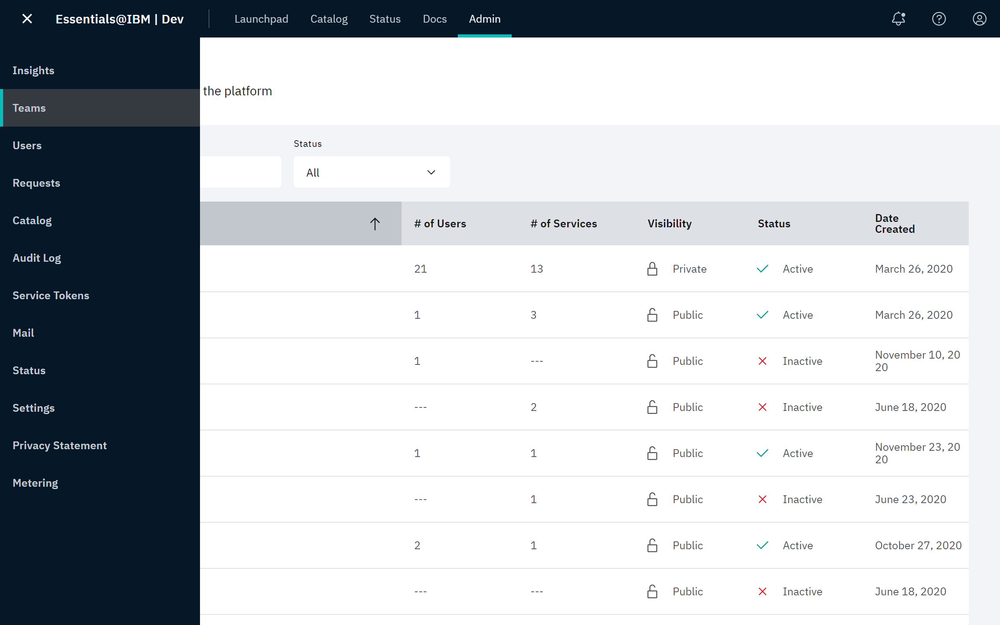

The [Teams Overview](https://launch.boomerangplatform.net/admin/teams) provides a pageable and sortable tabular view of all the teams on the platform. Summary data for each team is displayed in the following columns:

- Team name
- Number of users
- Number of services
- Date created
- Status

> **Note**: Only the following columns are sortable: **Team Name**, **Date Created**,and **Status**. You can also search for a team by it's name.

Each row is selectable and navigates to a details page for the selected team.

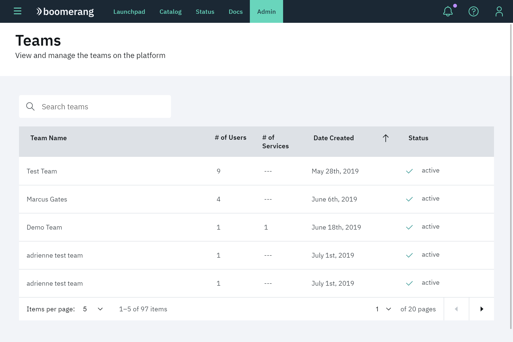

### Detail

Click the desired team name in the Teams overview page to view its details page.

The team detail view empowers Admin users to view and manage individual teams. Functionality includes:

- **Close Team**
- **Catalog Items**
- **Members**
- **Member Requests**
- **Catalog Requests**
- **Settings**

At a high level, the details page gives platform Administrators the ability to perform the same actions as the Team Owner.

## Close team

Click **Close Team**  to request to close a team. By closing a team, all members will lose access to the services and all functionality and this feature will de disabled.

## Catalog items

On the **Catalog Items** tab, you can view and manage all of the Catalog items (services and code assets) added to a team. You can request to add new items and manage existing ones by editing their properties and removing them from the team. Refer to [Working with the catalog](/essentials-core/how-to-guide/catalog).

### Add a Catalog item

Click **Add a catalog item** to request to add additional items to a team. At the Add a Catalog Item modal, select the item to add and click **Next**. Supply a **Purpose** for the item, then click **Add**.

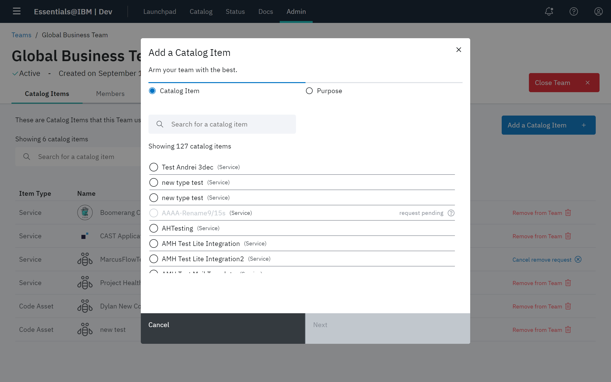

An `Add a Catalog Item` request will be created. Once it is approved, a corresponding `Join a Catalog Item` request will be created for each user in the team. Once their request has been approved, users have access to the Catalog item.

### Edit properties

Use the [Catalog Template](/essentials-core/how-to-admin/catalog), to edit and save settings for an item after it has been created. Learn more about [service settings](/essentials-core/extending/settings).

Click **Edit settings**. At the Edit Settings modal, edit the parameters that appear. Click **Save**.

> **Note**: Not all settings are exposed on the Catalog template.

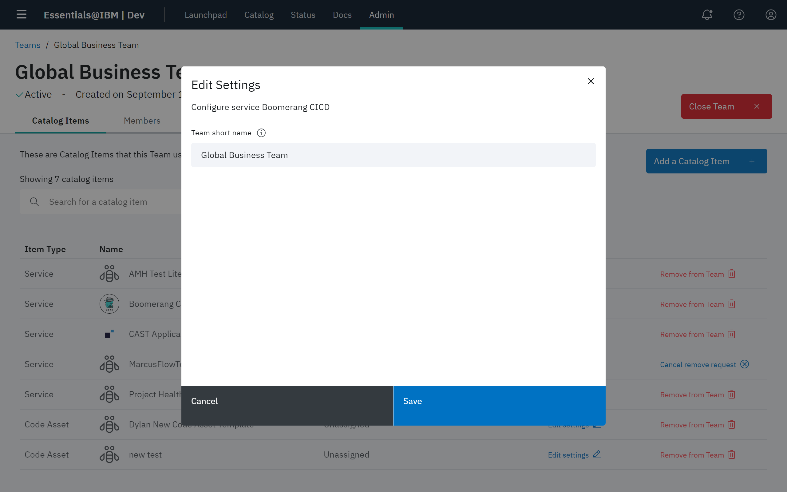

### Remove a Catalog item

Click **Remove from Team** to request to remove an item from a team. A `Remove a Catalog Item` request will be created. Once it is approved, corresponding `Leave a Catalog Item` request will created against the item for each user in the team.

> **Note**: If you change your mind or make a mistake, you can cancel the remove request by selecting **Cancel remove request** in the catalog items list.

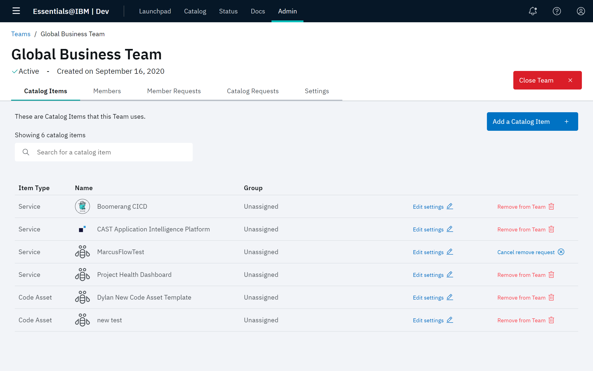

## Members

All members in a team are viewable on the **Members** tab. They are searchable by name and email. Users can manage members roles, update team ownership, request to remove users and view their detailed user page.

> **Note**: Teams must have at least one Team Owner. If a team has only one Team Owner, you cannot make them a regular user. If you would like to change the Team Owner, you must first make another team member a Team Owner.

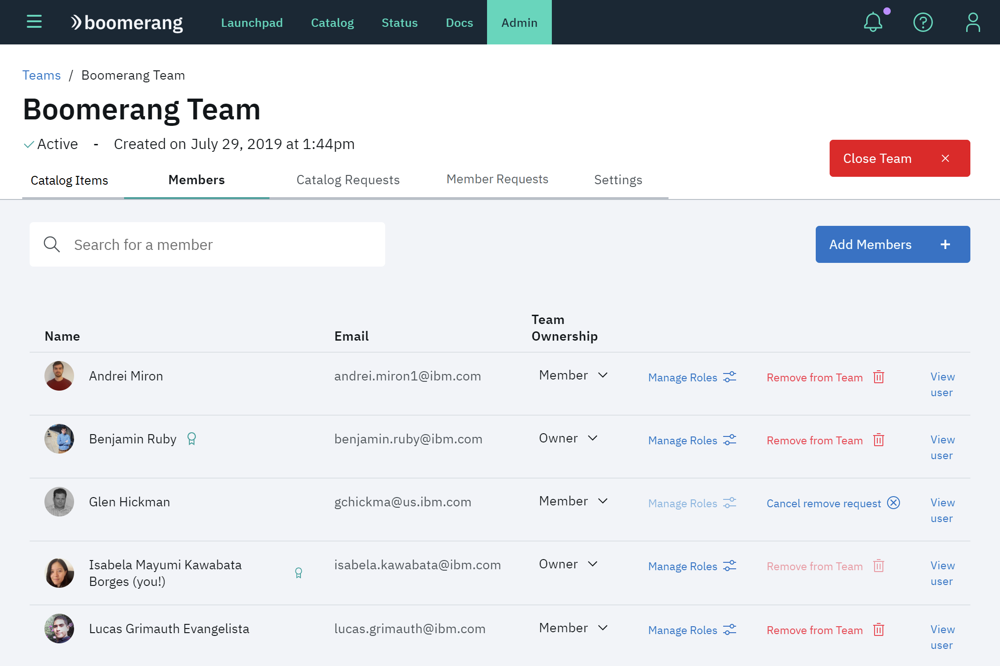

### Add team members

On the **Members** tab, click **Add Members**. Use the Search field to locate users. You can search all platform users by name and email. Select the desired user and click **Add to team**. You can request to add one or more users to the team as members. 

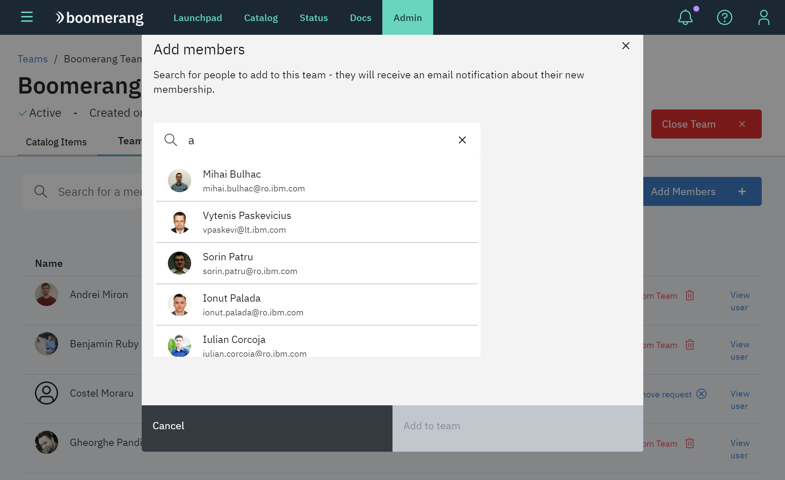

### Manage roles

Click **View user** to view a member's details and associated teams. Here, you can update a member's roles per Catalog item. Learn more about [Service roles](https://wdc2.cloud.boomerangplatform.net/dev/docs/essentials-core/7.5.0/architecture/security-architecture#authorization).

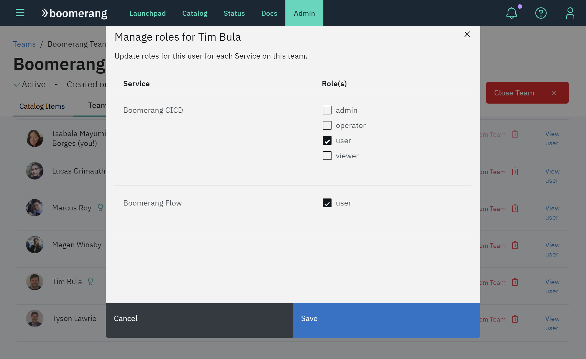

### Remove team member

Click **Remove from Team** to remove a team member from a team. Requests to leave the team and all of the Catalog items will be created. Once approved, the user will lose all access to the team and its services and code assets.

> **Note**: If you change your mind or made a mistake, you can cancel the remove request by selecting **Cancel remove request** in the Members list.

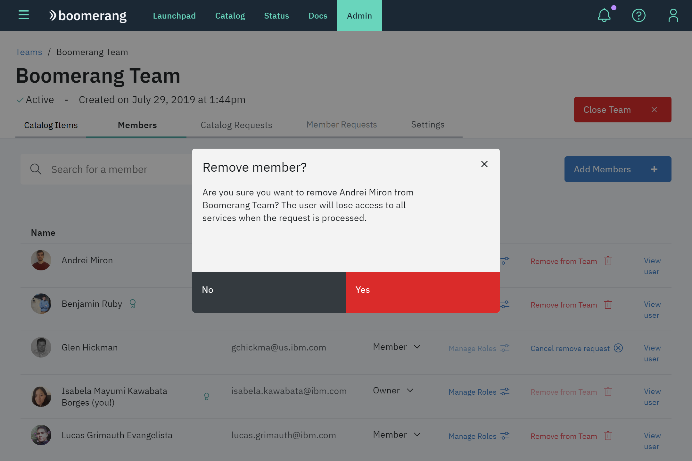

### View user

Click **View user**. On this page, you can view and modify roles, remove a member from the team or platform, email the member, and view details for each team the member belongs to.

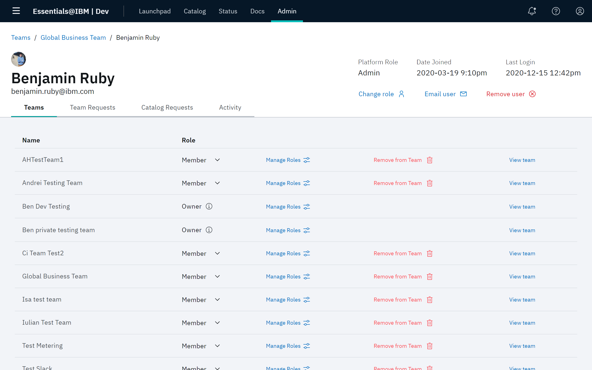

The tabs on the Member details page allow you to access that user's **Team Requests**, **Catalog Requests**, and **Activity** on the platform.

## Member requests

This page allows you to view and process all of join requests for this team. Users can quickly approve or deny requests without need to navigate to the requests feature.

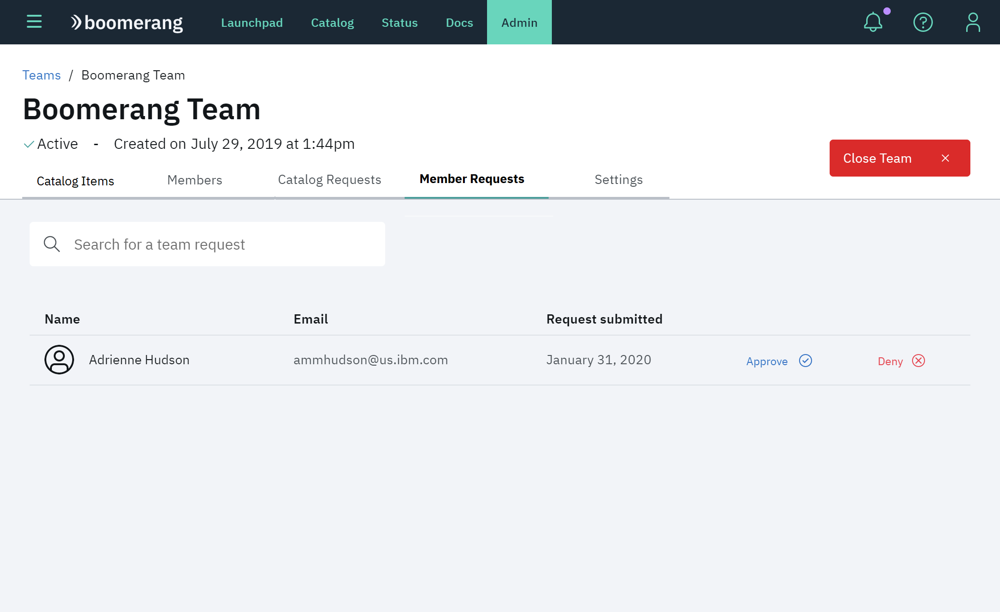

## Catalog requests

This page allows you to view all outstanding catalog requests for this team, including `Add a Service`, `Join a Service`, `Remove a Service` and `Leave a Service`. **View request** takes you to the detailed view of the request for more information and processing. View more about the different [Request types](/essentials-core/how-to-admin/requests).

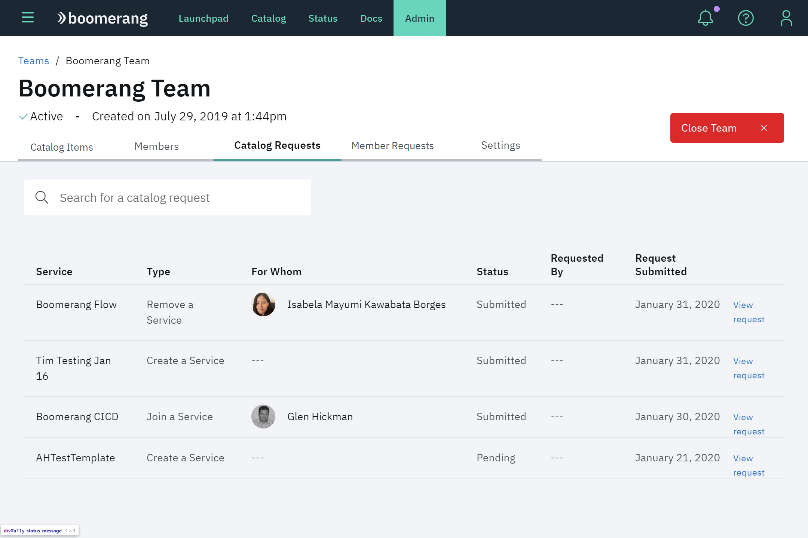

## Settings

Configure settings for the team, like customizing fields on the Team page, enabling auto-approve for `Join a Team` requests and making the team public or private.

### Private teams

Private teams won't appear in search results. Users must be invited to join by a Team Owner or Administrator. A team can be made public or private in its settings. Refer to [Working with teams](/essentials-core/how-to-guide/teams).
