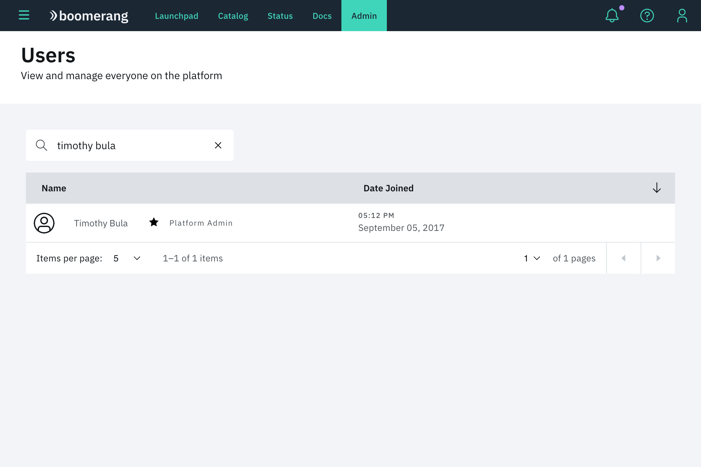
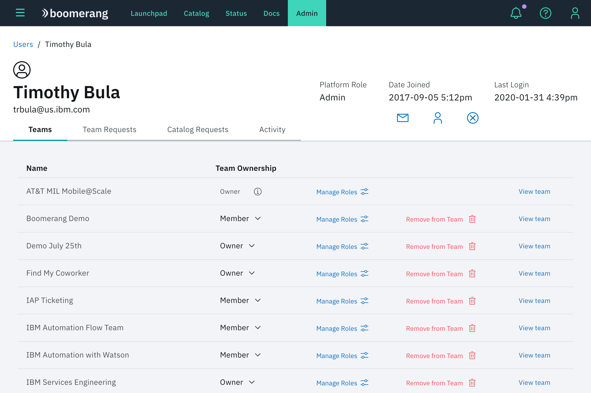
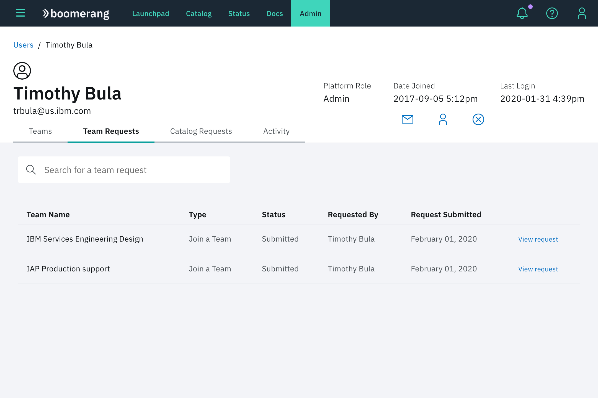
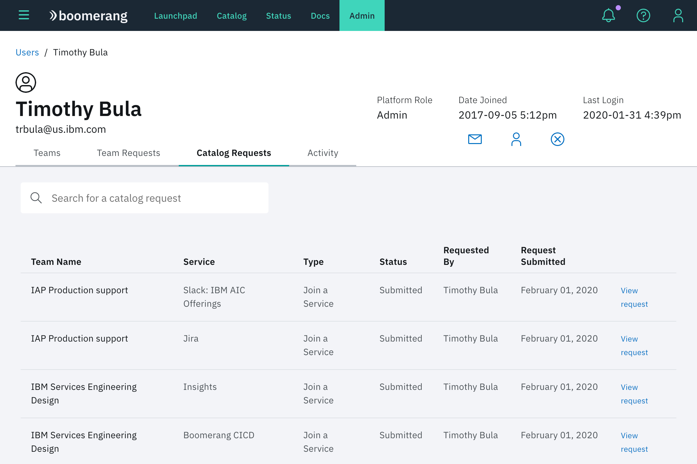
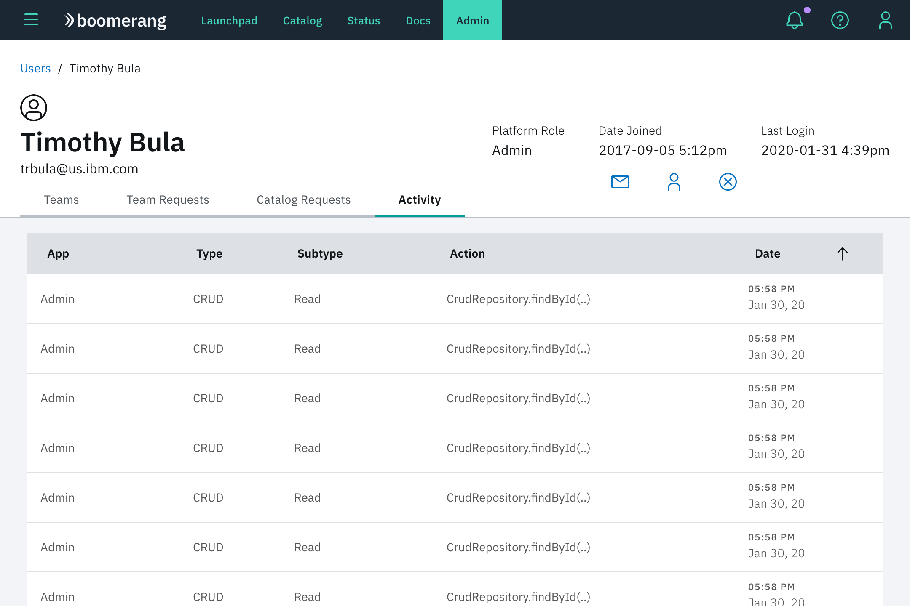

# Managing users

Administrators can view detailed information about all users on the platform. They view and address their outstanding requests, as well as change user roles.

On this page, an Administrator can search and find a particular user on the platform. Select a user to navigate to that user's detailed page.

## Detail

This is the first page that an Administrator sees for a user. The header contains overview information, as well as actions an Administrator can take on behalf of the user. The action icons on the right side of the header allow an Administrator to:
- send an email to a user, 
- change the platform role of a user, 
- submit a request to remove the user from the platform.

### Teams

This table displays the user's team information in the following columns:
- **Name** is a display column that indicates the name of a user's team.
- **Role** displays the user's current role in that team. Dropdowns allow the Administrator to make changes to whether the user is a regular member of the team, or a Team Owner.
- The third column buttons trigger a modal that allows the user to see all the services associated with this team, and specify the user's role for each of these services. 
- The fourth column buttons trigger a modal that allows the Administrator to submit a request to remove a user from the team. If there is already a request to remove this user from the team, then the button will trigger a modal that allows the Administrator to revoke the request. 
- The last column provides links that navigates the Administrator to the detailed team page.

> **Note**: Teams must have at least one Team Owner. If the user is the only owner of a team, you cannot change their team ownership. If you would like to change ownership, you must make another team member owner first.

### Team requests

This table displays the open team requests for the particular user. With this view, an Administrator is able to search and locate specific requests. The table gives detailed information about the status of the requests (completed requests will not be displayed in this table). The final column provides a link that allows the Administrator to navigate to the specific request and make an approval or denial.

### Catalog requests

This table allows an Administrator to view all of the outstanding catalog requests for the user. The table shows what service is being requested and what team the service is associated with. The table shows whether this catalog request is to join an existing team service, or whether the request is to create a new service for a team from the catalog. The final column provides a link to process this request, similar to the **Teams** requests tab.

### Activity

This tab displays a table that is similar to the audit feature in **Admin**. Additional detailed information for the audit process can be found in the Audit documentation. The interactive table allows you to browse the entire history of activity on the platform for a user.

