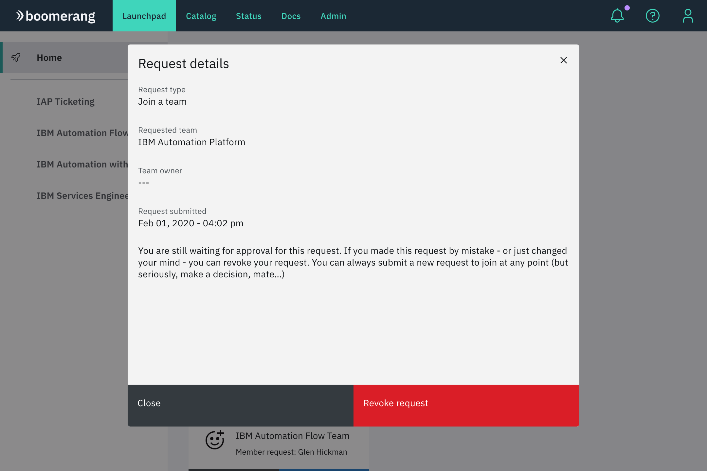
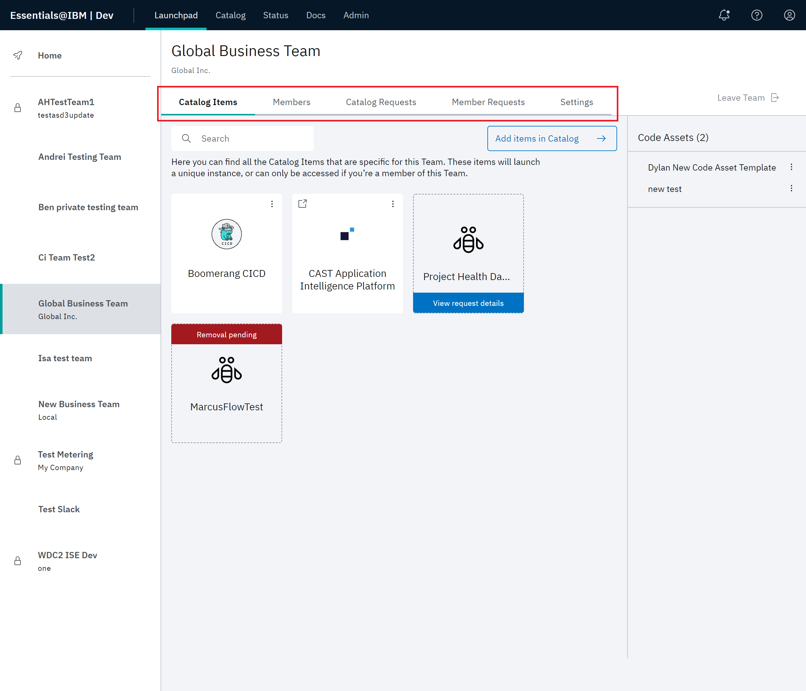

# Navigating Essentials Core

Essentials Core is the layer in the platform that provides services and libraries for solution integration. Here, you access the functionality for team and service management. 

A unique feature of Essentials Core is **Launchpad**. Regardless of where you are in solution development, you can click **Launchpad** to return to the Launchpad Home page.

Essentials Core also provides insights into the well-being of the platform with functionality for audit events, notifications and settings. 

> **Note**: Additionally, all authentication and authorization of users is managed by Essentials Core. This functionality is governed by `Auth Proxy`. Refer to [Installation](/essentials-core/installing/installing) and [Security Architecture](/essentials-core/architecture/security).

# Home

The following features are available from the Launchpad Home page.

- Essentials navigation bar, including **Launchpad**.
- Join/create a team
- Featured services
- Platform features
- Your pending requests
- Requests awaiting your approval
- Team navigation pane

## Essentials Core navigation bar

> **Note**: The Essentials core navigation bar is available with all services on the platform.

The Essentials Core navigation bar provides the following features:

- **Launchpad** – Click **Launchpad** at any point in solution development return to the Launchpad Home page.
- **Catalog** - Click **Catalog** to define and manage the lifecycle of your services and code assets. Refer to [Working with the catalog](/essentials-core/how-to-guide/catalog) for details. 
- **Status** – This feature allows you to gain insight into maintenance events and outages. Refer to [Checking status](/essentials-core/how-to-guide/status) for details. 
- **Docs** – **Docs** accesses the centralized location for all information on the platform
- **Admin** – This feature accesses the functionality for tracking and managing the platform, its teams, and users. Refer to [Administrative capabilities](/essentials-core/how-to-admin/admin) for details. 
- User Profile - The User Profile menu accesses features that allow you to control which teams are visible on the Teams pane, view the **About the Platform** version and **Privacy Statement**, **Request account deletion**, and **Sign out**. Refer to [Getting started](/essentials-core/introduction/getting-started) for details.

## Join/create a team

Click **Join/create a team** to access the Join/create a team modal. Refer to Refer to [Getting started](/essentials-core/introduction/getting-started) for detailed instructions for creating a team or joining a team.

## Featured catalog items

The center of the page highlights selectable tiles allow you to quickly navigate to highlighted services on the platform. In this example, Boomerang CICD and Boomerang Flow appear for selection. Refer to [Working with the catalog](/essentials-core/how-to-guide/catalog).

## Platform features

Two features, Notification Center and Support, provide helpful tools and information during operation. 

Notification Center provides important alerts and messages from the platform and Services. Refer to [Viewing the Notification Center](/essentials-core/how-to-guide/notificationscenter). 

Support Center  allows you to enter support tickets and track of existing tickets. Refer to [Using the Support Center](/essentials-core/how-to-guide/supportcenter).

## Your pending requests

This section displays all of the requests that you have created. Click **View request details** to view additional details about each request. You can also revoke the request if you don't want it to be processed by an Administrator or Team Owner.

If you are a Team Owner, use this section to quickly view the requests made to join your team. Refer to [Working with teams](/essentials-core/how-to-guide/teams) for detailed instructions.

## Requests awaiting your approval

If you are a Team Owner, use this section to quickly view the requests made to join your team. You can deny or approve requests.
Refer to [Administering requests](/essentials-core/how-to-admin/requests) for detailed instructions.

## Team navigation pane

The left pane on the page lists the teams that are currently approved for your solution. Select any team to display the corresponding Team page. Select the appropriate tab for team, member and catalog functionality. Refer to [Working with teams](/essentials-core/how-to-guide/teams) for detailed instructions.

> **Note**: Since Private teams don't appear in search results, users who want to join a team need to be invited by a Team Owner or platform Administrator. A team can be made public or private in its **Settings**.

The features available on the **Settings** tab allow you to define the look and feel of the teams page, as well as how the team interacts with platform functionality.

For example, you can edit team name, description, and team logo, edit team labels, add or edit groups of services and code assets, and set privacy properties.

