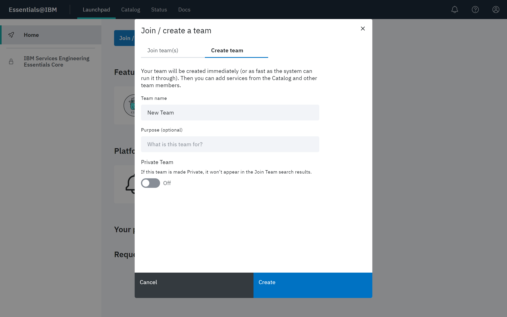
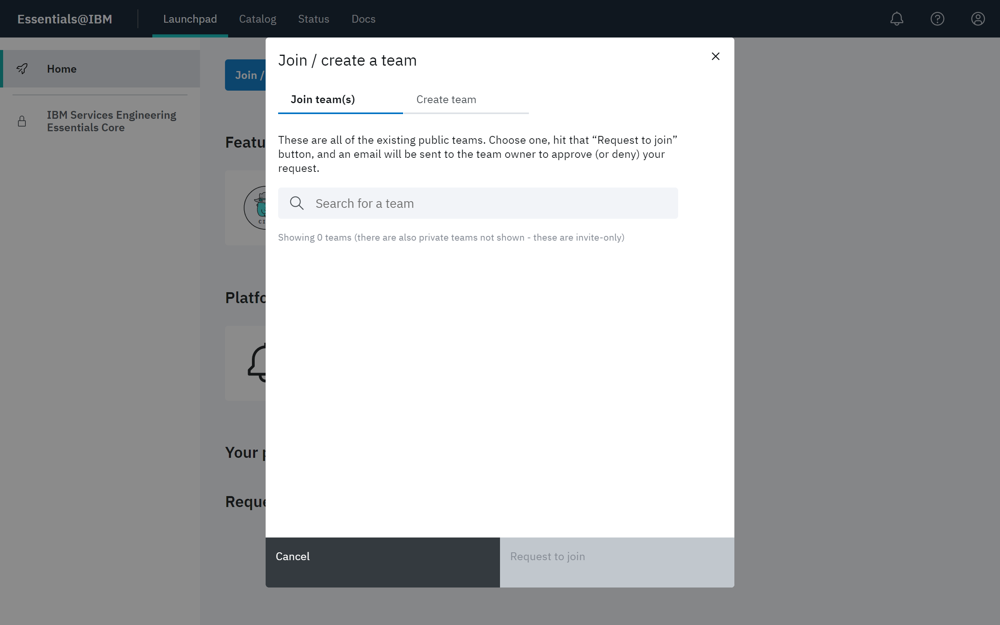
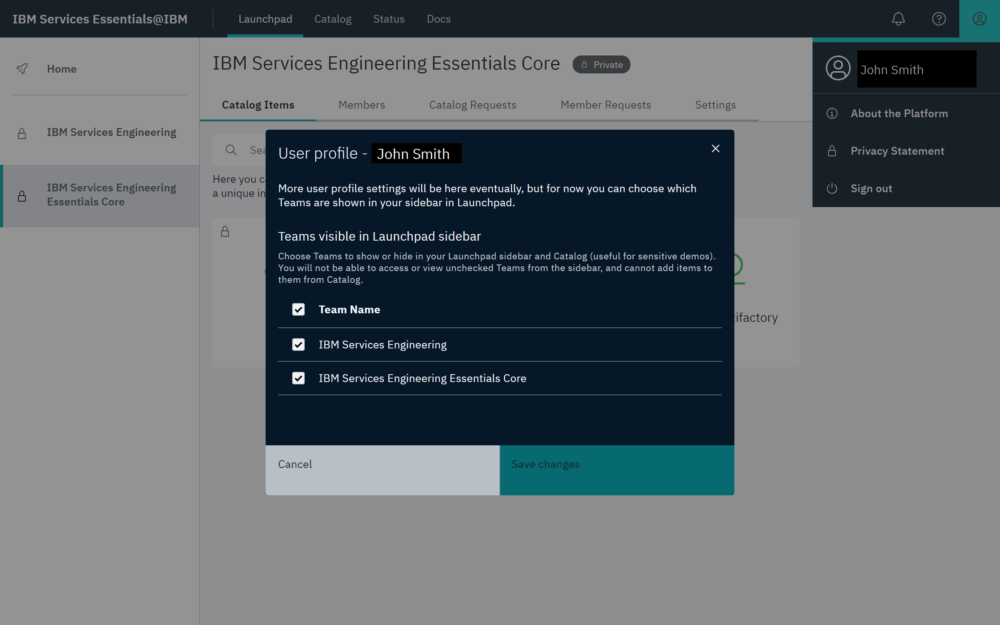
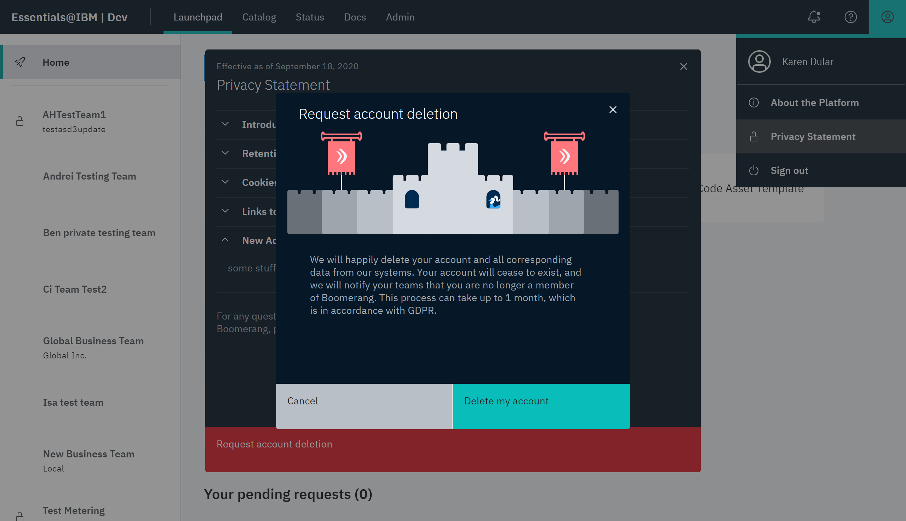

# Getting started with a solution

To get started with developing a solution with IBM Services Essentials the following steps are generally taken:

- Create or join a team
- Add Catalog items to your team

> **Note**: Functionality is also available to customize the appearance of your team, as well as customize the services and code assets available to your team, once it is created. Refer to [Working with teams](/essentials-core/how-to-guide/teams).

## Create or join a team

### Create a team

1. From the Essentials Home page, click **Join / create a team**. If you are not on the Home page, click **Launchpad** and make sure **Home** is selected.

2. Select **Create team** and specify a representative team name, as well as the purpose for creation of the team.

3. Click **Create**. The team appears along with the existing teams in the left navigation panel.

> **Note**: There is an admin platform-wide setting for automatic team creation. If that is enabled, then your team would be automatically created upon submitting the form. Otherwise, your form submission will generate a team creation request that will have to be approved by an administrator.

### Join a Team

1. From the Launchpad desktop, click **Join / create a team**. If you are not on the Home page, click **Launchpad** and make sure **Home** is selected.

2. Select **Join team(s)**. Search for a team based on its name. Select your team in the search list and click **Request to join**.

> **Note**: Only teams that are not private will show here.

#### Share Link

If you have been provided a unique share link by your Team Owner, you will be navigated to Launchpad automatically with you request automatically processed to join the team.

> **Note**: If you have not previously consented to the platform, you will be promoted to do so.

## Add catalog items

Add items from the Catalog for your team. Items include services, code assets and recipes. Refer to [Working with the Catalog](/essentials-core/how-to-guide/catalog).

## Customize your user profile

The User Profile menu accesses features that allow you to control which teams are visible on the Teams panel, view the **About the Platform** version and **Privacy Statement**, **Request account deletion**, and **Sign out**.

### Configure viewable teams

Click your name in the User Profile menu and use the modal that appears to enable or disable the teams you would like viewable in the Teams panel. Viewable teams also affect the associated Catalog items that are available to you. Click **Save changes**.

### Delete your account

To remove your account from the platform, select **Privacy Statement**, then click **Request account deletion** at the bottom of the privacy statement. At the Request account deletion modal, click **Delete my account**. A Remove from Platform request will be sent to the Administrator.  

## Administration

As a platform Administrator, you have these features available (refer to [Administrative capabilities](/essentials-core/how-to-admin/admin)):

1. View the Insights page for a summary of team dynamics.
2. View teams, users, service tokens, and service status, as well as triaging those elements.
3. Create and manage the Catalog templates.
4. View, edit and create email templates.
5. Adjust platform-wide settings.
6. View and create platform privacy statements.
7. View metrics for Catalog services.

# Key Concepts

As you build the foundation for your solution, familiarize yourself with these key concepts of Essentials Core. These concepts are the foundational building blocks for the platform's common services, ensuring a consistent platform that abstracts away technical complexities and importantly provides: 

- Authentication
- Authorization
- Entitlements
- Audit
- Privacy and Consent
- Requests and Operational Processing
- Configuration Management
- Status and Health

See [framework architecture](/essentials-core/architecture/framework-architecture) to find out more information.

