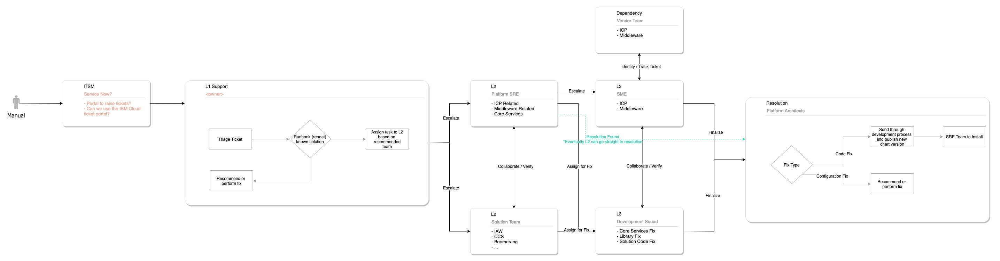
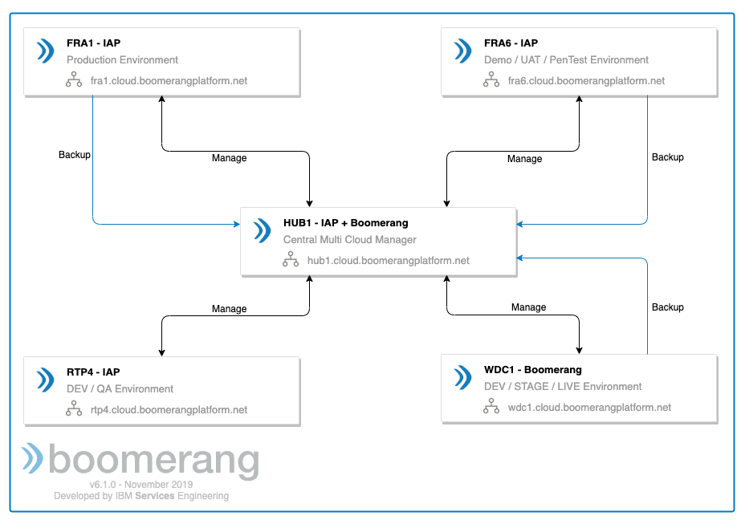

# Support and Operations

The following section presents the support and operations architecture for the IBM Services Essentials platform.

## Support

## Service Level Objectives

The standard support plans for this instance allow you to choose between Community, Standard, and Premium support plans. The level of support chosen determines the severity and service level agreements (SLAs) that are followed. 

Please note that not all support plans are supported by all Catalog services.

| | Community | Standard | Premium |
| --- | --- | --- | --- |
| Description | Provides the most basic level of support and is usually associated with community edition access to a service or solution. Typically used for proof of concepts or for workloads that don't require traditional severities and response times. | The default level of support for a Catalog service delivery team. Typically used by delivery teams with long-term time frames and no deadlines | The highest level of support for priority handling. Usually for teams that have strategic and critical delivery time frames. |
| Coverage | Based on best effort | North American business hours | North American and Romanian Business Hours |
| Channels / Routing | Community Slack Channel and Boomerang Support Center | Community Slack® Channel1, Boomerang Support Center, and Email | Email, Dedicated Slack Channel, Boomerang Support Center, and PagerDuty |

1 Community Slack is a shared internal IBM Slack channel

### Severities and Target 2 Response and Resolution Times1

| Severity | Definition | Community | Standard | Premium |
| --- | --- | --- | --- | --- |
| 1 | Critical service is non-operational with severe impact. Highly complex tasks that require the global SMEs to be involved. | - | Response: 8 hours Resolution: 16 hours | Response: 4 hours Resolution: 8 hours |
| 2 | Significant impact to a service however still useable or a workaround can be identified to allow continued use. | - | Response: 16 hours Resolution: 32 days | Response: 8 days Resolution: 16 |
| 3 | A feature of a service is not working, but impacts to use are less than significant. | - | Response: 16 hours Resolution: - | Response: 8 hours Resolution: - |
| 4 | Query or issue with minimal to no impact. | - | 

1 Response and Resolution times are calculated based on support coverage locations business hours
2 Target is an average across the year and is not guaranteed

## Support Layers

There are a number of areas and layers to the operations of the platform.

| Layer                   | Owner                  | Support Notes                                                                                                                                                                                   |
| ----------------------- | ---------------------- | ----------------------------------------------------------------------------------------------------------------------------------------------------------------------------------------------- |
| Solution / Application  | Development Squad      | Development squads will need rotational Software Reliability Engineers (SREs) to support investigation and coordinate fixes to the site.                                                                                         |
| Core                    | ISE                    | Core is used to operate and maintain the application platform and custom applications. The ISE operations team will perform all levels of support and be the initial contact point for requests. |
| IBM Cloud® Private (ICP) | Cloud / ISE            | Depends who owns this layer.                                                                                                                                                                    |
| Virtual Machines        | Cloud (for example, SoftLayer®) | Cloud provider will support but tickets need to be raised against them.                                                                                                                          |
| Infrastructure          | Cloud (for example, SoftLayer) | Cloud provider will support but tickets need to be raised against them.                                                                                                                          |

### Support Contacts

As with all the layers mentioned in the above table, the first point of contact is designed to be the IBM Services Engineering (ISE) SRE team. If the support relates to a layer that is not directly owned by ISE, then a ticket would be raised and managed by this team against the owning team.

Resolution follows a product methodology and lifecycle.

> **Note**: Regardless of whether client assumes Level 1 support when on premise, the support team will still have a Level 1 layer to receive the tickets raised by a customer.

## Support Teams

As the team grows, all members of the various squads will play a role in the support teams. This will include triage and resolution of issues. This ensures the team learns invaluable information as to how the customers are using the product but also provides basic knowledge sharing of the layers inside the platform.

| Role                          | Level     | Description                                                                                                                                             |
| ----------------------------- | --------- | ------------------------------------------------------------------------------------------------------------------------------------------------------- |
| First Responders / Operations | L1 & L1.5 | First to deal with ServiceNow® tickets and issues that occur.                                                                                             |
| SME / Solutions team          | L2 & L3   | For particular layers and solution components, for example, IAW or ACC.                                                                                           |
| SRE                           | L2 & L3   | ICP / Core / Some Middleware. We plan on having escalation paths in service now that go to PagerDuty and New Relic that feeds PagerDuty and ServiceNow. |
| AppOps                        | L2 & L3   | Infrastructure Issues

## Support Center

The request types can be split into: enhancement and issues.

### Enhancement

Enhancements will come through from various sources, either as a feature needed to win work, or over time from customer solution teams.

Enhancement requests need to be reviewed by the Platform and Solution team architect review board.

Enhancements can be implemented through feature toggles or direct to code base. We never implement a forked version of the code base for a specific scenario.

### Issue

An issue can be triaged and evaluated for severity and potential fix category. If a previous fix has been found and is available in the support runbook, that can be followed.

If it requires a ticket to be raised against a dependent provider such as the IBM Cloud team, we will track to resolution.

If it requires a code fix, we will assign to the development squad for fix, test, version, and installation.
                                                        
## Multi Cluster Management

When IBM Services Essentials platform utilizes a multicluster deployment topology, we recommend using a centralized hub to manage these with either IBM Multi Cluster Manager (MCM) or RedHat® Advanced Cluster Management (ACM)

The primary concept revolves around a centralized hub as much as possible. We utilize IBM's MultiCloud Manager (MCM) to control and manage the Kubernetes® clusters. At this time, we are only using this for read-based visibility, such as networking visibility. In the future, we will use this to centrally apply policies and ensure governance.

Additionally, the hub is also the central storage for backups using NFS and Minio. See [Backups](/boomerang/operations/backups) for more detail.

## Monitoring and alerting

We have a huge number of tools for the monitoring and alerting in the platform. IBM Cloud® Private comes with Elasticsearch® and Prometheus®, however, in our implementation we have also instrumented New Relic at all layers.

| Purpose                   | Implementation         |
| ------------------------- | ---------------------- |
| Logging                   | Elasticsearch          |
| Kubernetes Monitoring     | Prometheus, New Relic  |
| Infrastructure Monitoring | New Relic              |
| Application Monitoring    | New Relic              |
| Alerting                  | PagerDuty              |
| Tracing                   | OpenTracing and Jaeger |

## Backups

Backups are a required item for higher level environments such as User Acceptance Test (UAT) and Production. In our platform there is both Kubernetes® and Virtual machine-based requirements, depending on the solution.

### Kubernetes

For Kubernetes based solutions, we are using VELERO® (formerly Heptio Ark), which provides the tools to back up and restore Kubernetes cluster resources and persistent volumes.

VELERO will:
* Take backups of all or selected cluster resources and restore in case of loss
* Migrate cluster resources to other clusters
* Replicate your production cluster to development and testing clusters

VELERO consists of:
* A server that runs on your cluster
* A command-line client that runs locally

### Our implementation

For all the clusters being run and maintained internally by the IBM Services Essentials and IBM Automation Platform SRE teams, VELERO will be backing up to a centralized Minio in our Hub cluster which has a redundant disk backup. 

The schedule for this defaults to every 24 hours. For increased frequency, this needs to be identified and worked through on a case-by-case basis.

Backups are kept for seven days unless otherwise requested.

## Virtual machines

Solution teams will need to provide backup scripts that will be scheduled by cron.
