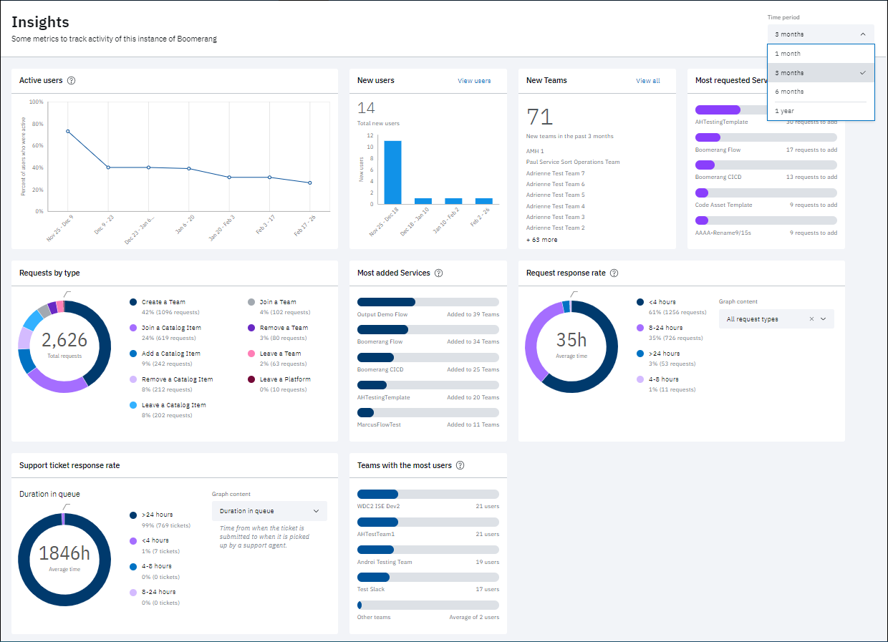
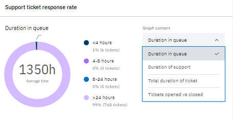

# Insights

The Insights dashboard for the administration of the platform presents usage and KPI-based information to any user with the Administrator, Auditor, or Operator role. 

You can select the time interval over which data is collected and presented in the Insights dashboard with the Time period pulldown in the top right corner of the page. Intervals of **1 month**, **3 months**, **6 months**, and **1 year** are selectable.

Specifically, the following tiles are presented for your instance of the platform:

| Tile | Description |
| ------ | --- |
| **Active users** | The percent of users active in the selected time interval interval |
| **New users** | The total number of new users in the selected time interval |
| **New teams** | The total number of new teams created in the selected time interval |
| **Requests by type** | The total number of requests made in the selected time interval, with color-coded bands indicating types of requests according to percentage |
| **Most requested Services** | The five services with the most requests to add to a team over the selected time interval |
| **Most added Services** | The five services that have been added to the most teams over the selected time interval |
| **Request response rate** | Request response rates over the selected time interval, with color-coded bands indicating response times by percentage|
| **Support ticket response rate** | The time from when the ticket is submitted to when it is picked up by a support agent.|
| **Teams with the most users** | The top five teams with the most users over the selected time interval. |

## Viewing active users

This tile plots the percentage of active users in the selected time interval. A user is defined as active if they have logged into the Platform at least once during the given time period. The number of data points plotted per time interval is as follows:

- three months: two weeks (six data points)
- six months: one month (six data points)
- one year - one month (12 data points)

*Example*: If 50 users logged in during a specific time period, and during that time period there were 100 unique users registered on the platform, then that data point represents 50 percent.

Mouse over the interactive points on the plot to obtain a specific count of new users at designated time intervals.

## Viewing request response rates

You can make selections at the Graph content pull-down to affect the data displayed in the Request response rate graph.

Available selections include the following types of data: (default) **All request types**, **Join a Team**, **Create a Team**, **Leave a Team**, **Remove a Team**, **Join a Catalog Item**, **Add a Catalog Item**, **Leave a Catalog Item**, **Remove a Catalog Item**, **Leave a Platform**.

The response rates graphed are based on the average time from when a request was submitted to when it was closed. The graphs also indicate bins of data, color-coded according to times <4 hours, 4-8 hours, 8-24 hours, and greater than 24 hours.

## Viewing support ticket response rates

You can make selections at the Graph content pull-down to affect the data displayed in the response rate graph.

The graphs indicate bins of data, color-coded according to times <4 hours, 4-8 hours, 8-24 hours, and greater than 24 hours.

Available graphs include the following types of data:
- (default) **Duration in queue**  
    The time from when the ticket is submitted to when it is picked up by a support agent. Average time is indicated in the center of the donut.
- **Duration of support**  
    The time from when the ticket is picked up by a support agent to when the ticket is closed.
- **Total duration of ticket**  
    The time from when the ticket is submitted to when it is closed.
- **Tickets opened vs closed**  
    The number of new tickets created compared to the number of tickets closed. The ratio of open:closed tickets is indicated in the center of the donut.

