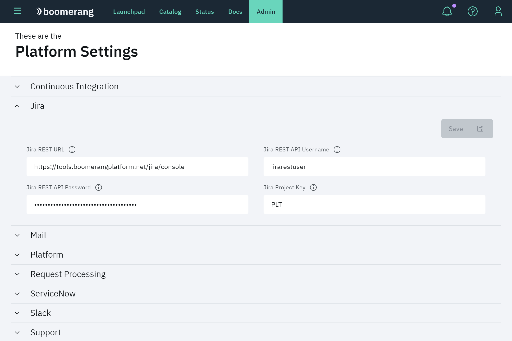
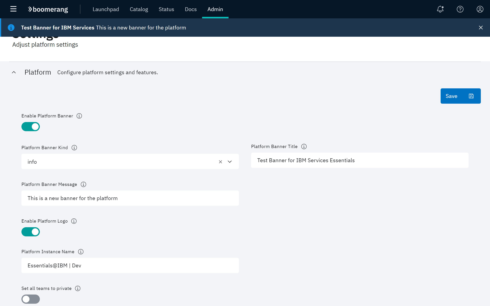

# Working with Platform Settings

The Platform Settings page allows users to configure platform-level settings. The page organizes settings by category and are saved independently of other categories.

The following categories of settings are provided:

|Category  | Description |
| --- | ---|
|Jira® | Configuration for the Jira integration with the platform |
|Mail | Configuration for the Mail and SendGrid® integration |
| Platform | Configuration for platform settings and features |
| Request Processing | configuration for request processing for the platform |
| ServiceNow® | Configuration for the ServiceNow integration for the platform |
| Slack® | Configuration for the Slack integration |
| Support | Configuration for platform support |
| User | Configuration for user profile services |

## Jira

Use these setting to integrate a Jira instance with the platform. Jira can be configured as the support system for handling issues that are raised against the platform.

## Mail

These settings are used to configure mailing notifications. Users can control if emails are sent out for request processing activities and if so, how those emails are configured.

## Platform

These settings affect the presentation of content in certain areas of the platform. For example, a user can define a platform banner to be displayed.

### Customizing the platform banner

The following controls define a banner that will appear directly below the header for all pages displayed in the platform:

1. Enable **Enable Platform Banner**.
2. Select a **Platform Banner Kind** as **error**, **info**, **success** or **warning**. Each selection produces an associated icon in the banner.
3. Enter a name for the banner you are creating in the **Platform Banner Title** field.
4. Enter text that will appear in the banner in the **Platform Banner Message** field.
5. Enable **Enable Platform Logo** to display a logo in the banner.
6. Supply a name for this instance of the IBM Services Essentials platform in the **Platform Instance Name** field.

> **Note**: The banner can be closed at any time by clicking the "x" in the banner.

### Controlling specific content

The following controls can be used to affect the appearance or content displayed in these areas of the platform user interface:

| Control | Description |
| --- | ---|
|**Set all teams to private** | When enabled, all teams in the platform will be designated as private. Refer to [Working with teams](/essentials-core/how-to-guide/teams).|
| **Community URL** | The URL you are directed to after SSO authentication. |
| **Require organization team label** | When enabled, you must enter a value for **Organization** in your team **Settings**. |

### Validating users

When a user is invited to a team (Add Member modal), the user's email is validated against the value in the **Platform User Validation Regular Expression** field. 

If validated, an invite is sent to that email. The invite is valid for 24 hours, and if not accepted within that time, the invite is revoked, the user record is marked deleted, and the email on that record is hashed. 

> **Note**: If the user's email is determined to be a Partner user, a `pending_invite` user record with that email is created. Refer to _Enabling Partner users_.

### Enabling Partner users

Instead of handling invites to Partner users via email links, invitations can be managed by enabling or disabling the **Enable Partner User Validation** toggle. 

An `Allowlist` is used to maintain a record of all Partner users that are currently on the platform or invited. Partner users can be synced to the allow list using the **Enable Partner User Allowlist Sync** toggle.

| toggle | state | action |
| --- | --- | ---|
|**Enable Partner User Allowlist Sync** | enabled | Calls the Controllers create secret endpoint with a `POST /controller/users` | 
| **Enable Partner User Allowlist Sync** | disabled | Calls the Controllers delete secret endpoint with a `DELETE /controller/users `|

> **Note**: When the toggle is enabled, and you invite a user that does not match the regular expression, then the user is added to the `Allowlist`.

## Request processing

You can control how platform requests are processed with these settings. Currently, a user can set up auto-approval for team creation.

## ServiceNow

These settings are used to integrate a ServiceNow instance with the platform. ServiceNow can be configured as the support system for handling issues that are raised against the platform.

## Slack

These settings specify the configurations to integrate Slack notifications as part of the platform. You can specify the main channel for your users and also specify the channel where requests are directed to.

## Support

You can specify which support system is being used for the platform (Jira or ServiceNow) with these settings.

## User

These setting are used to configure the URL endpoint in which user information and user profile images will be pulled for the platform.
