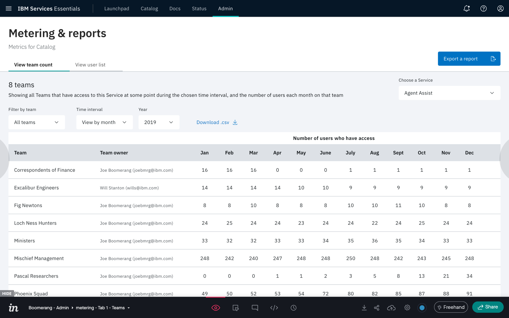
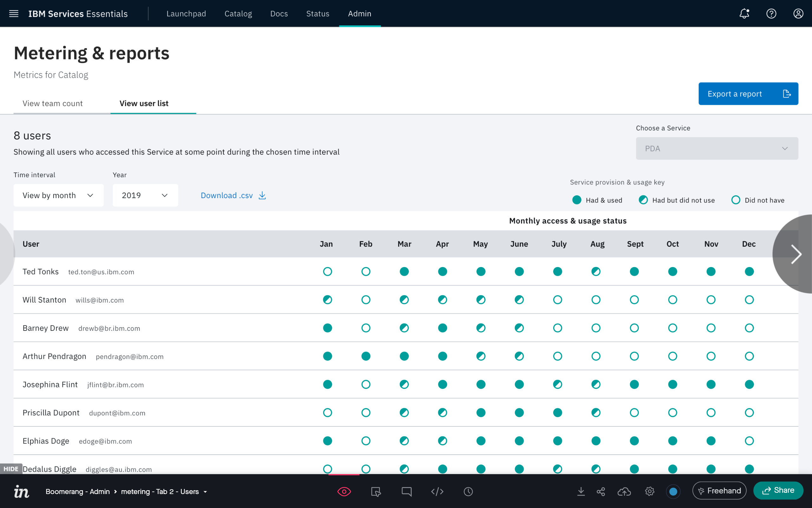
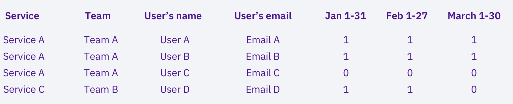

# Metering

The Metering page allows you to view annual data based on the data retention set specific for your installation. (A discussion of data retention is found in [Data management](/essentials-core/architecture/security-architecture#data-retention) in the Security Architecture topic.)

The Metering page provides the following functionality:

- Viewing service use by team and users
- Viewing user access to services
- CSV and MS Excel® exports of the selected data. 

> **Note**: Two dashes (--) appear for any data interval that has no data or has data in progress. Exports are also disabled if a chart has no data.
## Viewing data by team count

Click the **View team count** tab. A view of the teams that have access to a selected service at some point during the chosen time interval, and the number of users on those teams is presented.

You can customize the data presented on this page with the following controls.

| Control           | Description              |
| -------------  | ---------------------------------- |
| **Filter by team** | Displays data for a specific team.|
| **Time interval** | Displays data for either each month in the selected year or each quarter in the selected year.|
| **Year** | Selects a specific year of data for display.|
## Viewing the user list

Click the **View user list** tab. A view of the users who accessed a selected Service at some point during the chosen time interval is presented. Usage in each time interval is indicated by the following icons:

- solid circle - The user has the service and has used the service.
- half filled circle - The user has the service but did not use the service.
- empty circle - The user did not have the service.

You can customize the data presented on this page with the following controls.

| Control            | Description              |
| -------------  | ---------------------------------- |
| **Choose a Service** | Selects the data in a specific service for display.|
| **Time interval** | Displays data for either each month in the selected year or each quarter in the selected year.|
| **Year** | Selects a specific year of data for display.|

## Exporting Data

Metering provides for exporting data in either CSV or MS Excel format. 

### CSV File

Click **Download .csv** and the data defined by the current parameters is download to your default download directory in CSV format.

### Report Format

Click **Export a report** and you will be stepped through a series of dialogs that request the following export parameters:

| Export Parameter  | Requirement              |
| -------------  | ---------------------------------- |
| **Date range** | Specify a **Start date** and an **End date** that defines the range of data included in the report. Date range is broken into whole months; one month per line in the Excel sheet.|**Services** | Enable the checkboxes for each service you want to include in the report.|
|**Teams** | Prior to specifying the team names, you are presented with a **Filters** list, where you can restrict the teams listing by industry. when presented with the Teams listing, enable the checkboxes for each team yo want to include in the report.|

The final **Export a report** modal **Review** section presents a summary of the parameters requested for export. If you need to return to prior settings and redefine the data for export, click **Previous**. Click **Next** to proceed with export.

The MS Excel spreadsheet downloaded consists of a single sheet of data over the selected time period with the following columns: **Service**, **Team**, **User's name**, **User's email**, **Month**. A column appears for every month in the range of data.

For example:

