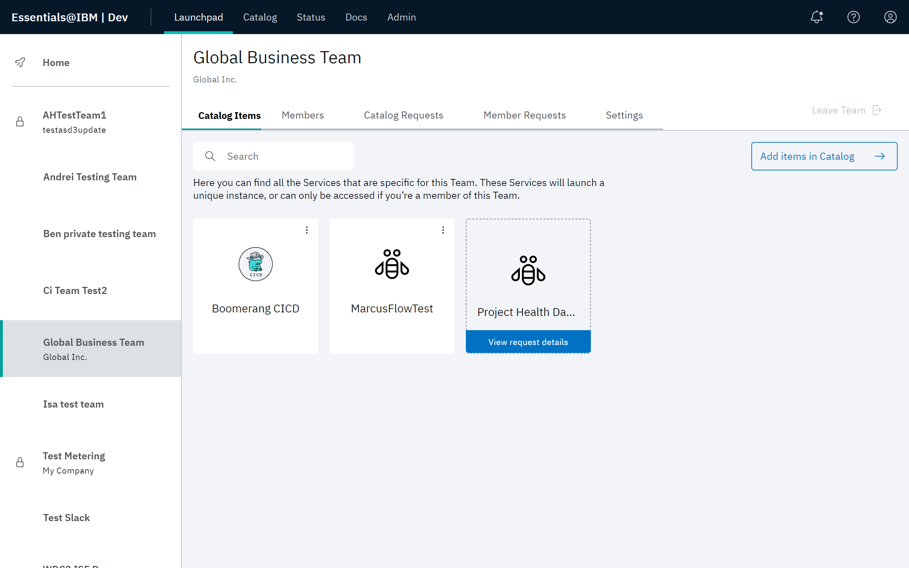
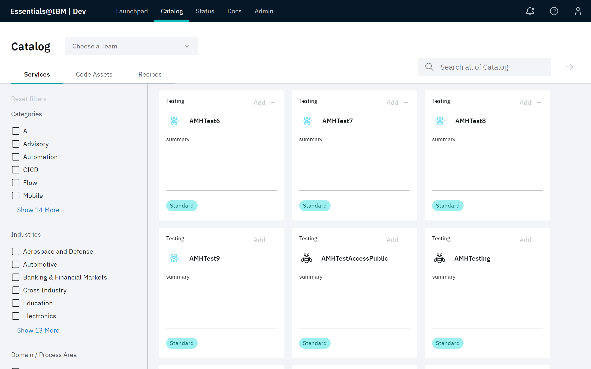
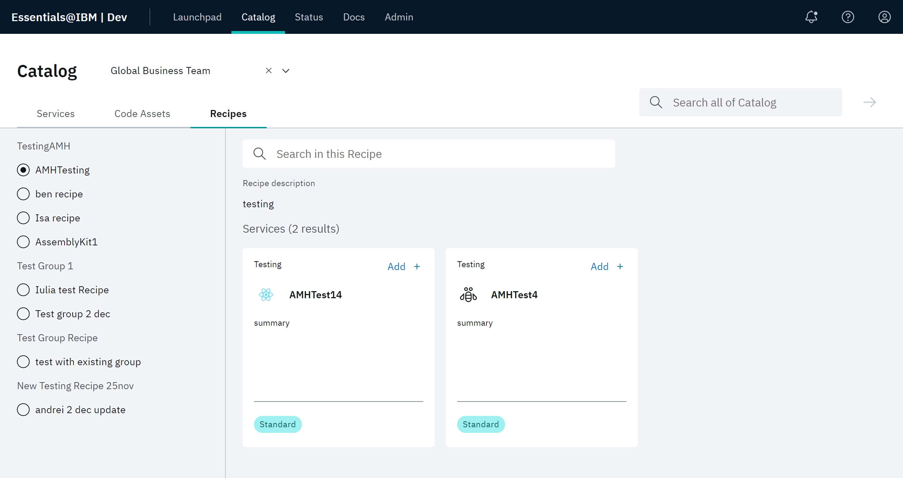
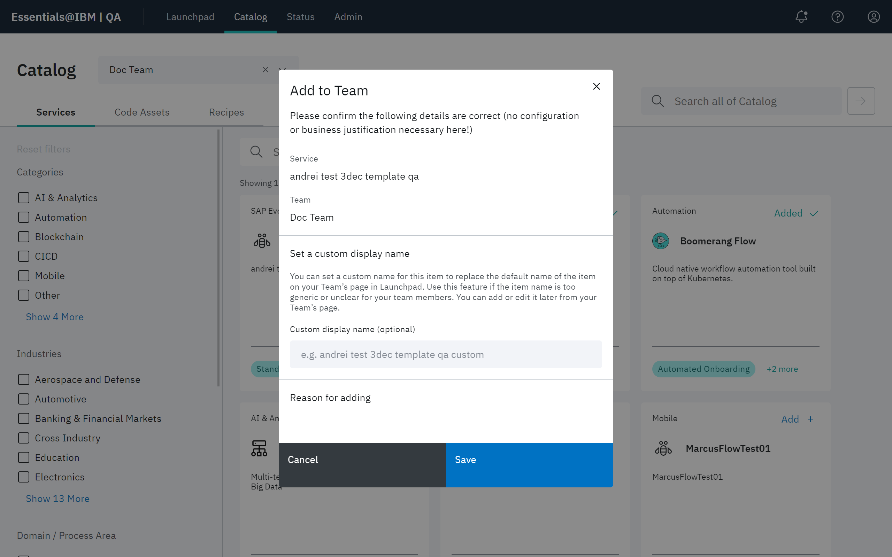
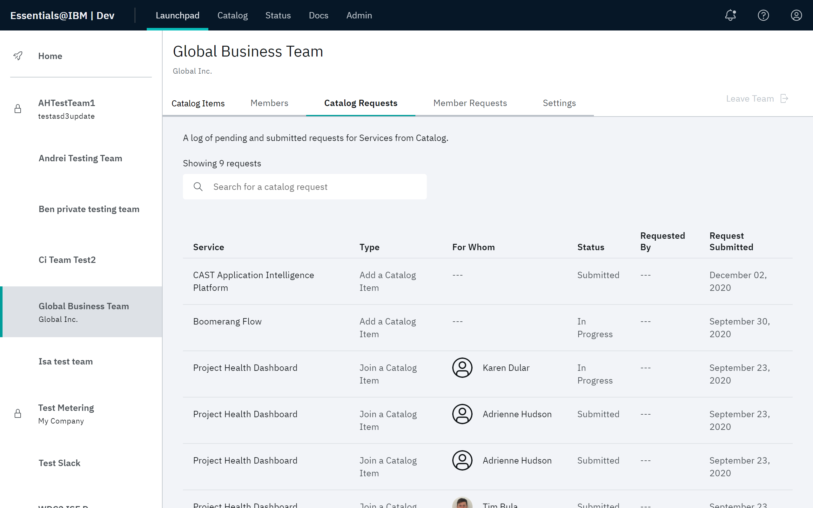
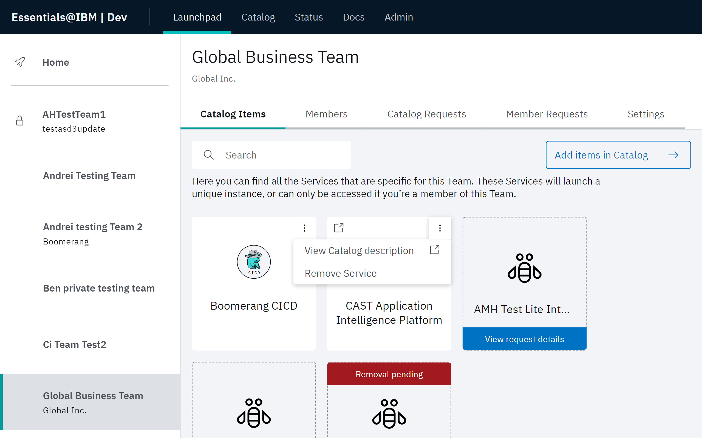

# Working with the Catalog

Services, code assets, and recipes that are available to your team are displayed on the Catalog page.  Click the **Services**, **Code Assets**, or **Recipes** tab to view the associated items.  The Catalog page provides the following functionality:

- Filter the Catalog items
- Click an item to see more information about it and add it to your team
- View your team's Catalog details
- Delete a Catalog item from your team 
## Filtering Catalog items

You can search for an item using the Search field at the top of the header. You can also restrict the list produced using the filter parameters in the left panel. **Reset filters**, available in the left panel, allows you to clear the filters. 

| Available Filters | Description  | 
| ---------------- | --------------------------- |
| **Services** tab | The **Categories**, **Industries** and **Domain / Process Area** filter parameters narrow down the search results to Catalog services that are specific to a certain industry that was identified when the Catalog template for that service was created. See [Catalog templates](/essentials-core/how-to-admin/catalog). Service **Attributes** capture qualities of the services that are relevant to members. Services come in many flavors on the platform and attributes help make sense of it all. **Note** that the **Attributes** filter parameters do not affect filtering for Catalog services. These attributes are used by the code behind and refer to attributes that may have been assigned when service is created from a Catalog template. See [Catalog templates](/essentials-core/how-to-admin/catalog). |
| **Code Assets** tab | The **Types**, **Industries** and **Domain / Process Area** filter parameters narrow down the search results to Catalog services that are specific to a certain industry that was identified when the Catalog template for that service was created. See [Catalog templates](/essentials-core/how-to-admin/catalog). |
| **Recipes** tab | The filter parameters available for selection in the **Recipes** tab are those recipes that have been added to the teams that you are a member of. See [Adding services, code assets, and recipes to your team](/essentials-core/how-to-guide/catalog#Adding-services,-code-assets,-and-recipes-to-your-team).|

## Adding services, code assets, and recipes to your team

As a Team Owner, you can add a Catalog item that can be accessed by your team. The [Catalog](https://launch.boomerangplatform.net/catalog/) is the descriptive location where a Team Owner browses and adds the required items for their team.

In this procedure, adding a service will be demonstrated. The procedure also applies to adding a code asset or recipe.

1. From your team page in Launchpad, select the **Catalog Items** tab. Any currently active Catalog items, as well as any requests in progress for an item appear in this screen. 
2. Click **Add items in Catalog** to navigate to the Catalog page.

> **Note**: Catalog items can also be added to a team directly from the Catalog page. In this case, you will be asked to select a team before proceeding. You can only add items to teams in which you are a Team Owner.

3. If you have selected the **Services** or **Code Assets** tab, use the search and filter controls available in each tab to find the needed items for the team. 

If you have selected the **Recipes** tab, select a recipe in the left pane to view tiles representing the services and code assets defined in that recipe.

4. Use the **Choose a Team** pull down at the top of the page to select the team that will be assigned the Catalog item. Click **Add +** on the tile you want to add to the team. 

5. Supply the requested fields at the Add to Team modal for that Catalog item. Click **Save**.

| Type | Description |
|-- | -- |
|**Service** | The title of the item you are adding.|
|**Team** | The name of the team you are adding the item to.|
|**Custom display name (optional)** | Type a name for the item that will appear for this item in the team. This name replaces the default name for this item in the Catalog. |
|**Reason for adding** | A description of the use case for adding this item to the team. |

7. After submitting the form to add this item to the team, check your team page on Launchpad. Navigate to the **Catalog Requests** tab. The request for this Catalog item appears added to your team. An Administrator will have to approve this request.

8. After an Administrator approves the create request, select **Admin** then **Requests**. There will be a join request for each team member. Not every team member has to have access to every catalog item.

9. When a join request is approved for a member, that user will be able to navigate to the **Catalog Items** tab in their team page in Launchpad and see that catalog item. If the item requested was a code asset, that item will appear in the right pane. Pending joins are also indicated.

## Viewing your team's Catalog details

To view details for any catalog item or code asset:

1. From your team page in Launchpad, select the **Catalog Items** tab.
2. Select the overflow menu for that item or asset. The following items are available.

| Item | Description |
|-- | -- |
|**View Catalog description** | Displays the Catalog details page or Code Asset template page for that selection. |
|**Remove from My Launchpad Favorites** | If the selected item appears in the Favorites, it is removed from your Favorite Services.|
|**Edit Service display name** or **Edit Code Asset display name** | Select this item to access a modal that allows you to edit the name of the service or code asset.  Note that is item is only available to Team Owners and Administrators.|
|**Remove Service** or **Remove Code Asset** | Removes the service or code asset from your team. Note that is item is only available to Team Owners and Administrators.|

## Removing a Catalog item or asset from your team

To remove a catalog item or code asset from your team: 

> **Note**: Remove functionality is only available to Team Owners.

1. From your team page in Launchpad, select the **Catalog Items** tab.
2. Identify the item or asset to be removed and select the overflow menu for that item. Click **Remove Service** or **Remove Code Asset**, as appropriate.
3. A Remove Service modal is displayed. Click **Submit removal request** to confirm the removal.  
    Your request is submitted for review by the Site Administrator.

