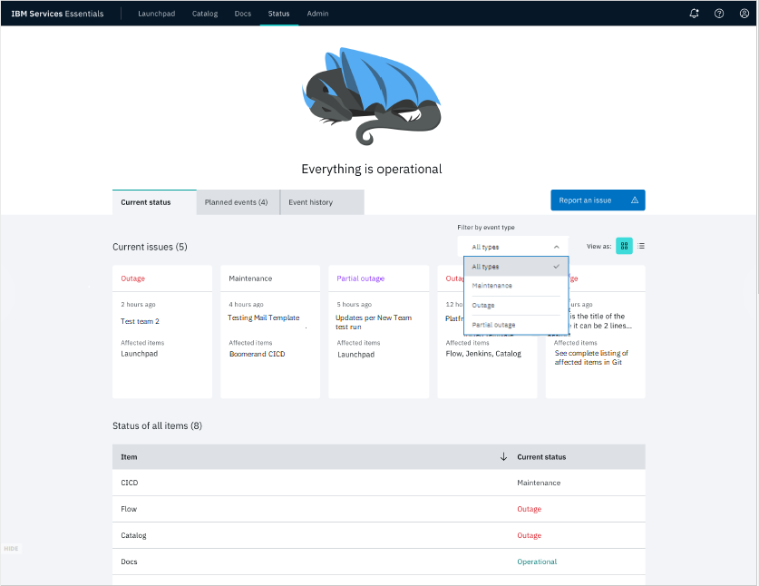
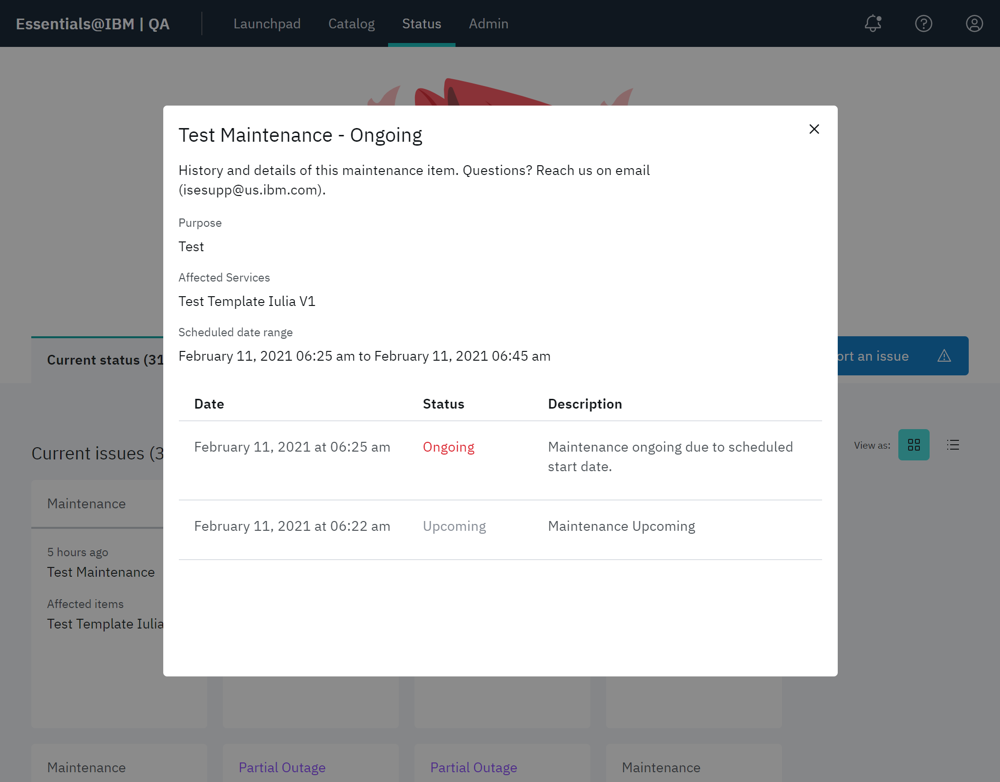

# Checking status

This feature allows you to see status of the entire IBM Services Essentials platform, check services status and view information about incidents and maintenances.

Select an item at the Filter by event type to restrict the display to the status for any of the following types: **Maintenance**, **Outage**, **Partial outage**, or **All types**.

The number of events in each type is indicated by a count indicator on each tab.

| Type | Description |
|-- | -- |
| **Current status** | This is a list of all current issues in the platform and their status. |
| **Planned events** | This information is about any planned maintenance or events. |
| **Event history** | Event History includes information about `resolved` incidents and `finished` maintenances. |

## Filtering the event list

The bottom of the page presents a list of all event types in the selected tab. Use the **Item** and **Current status** headers sorts the associated items alphabetically, in either ascending or descending order.
## Viewing event details

Click an event to see more details about it.

