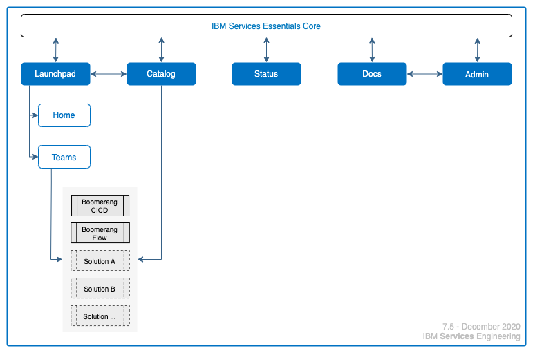
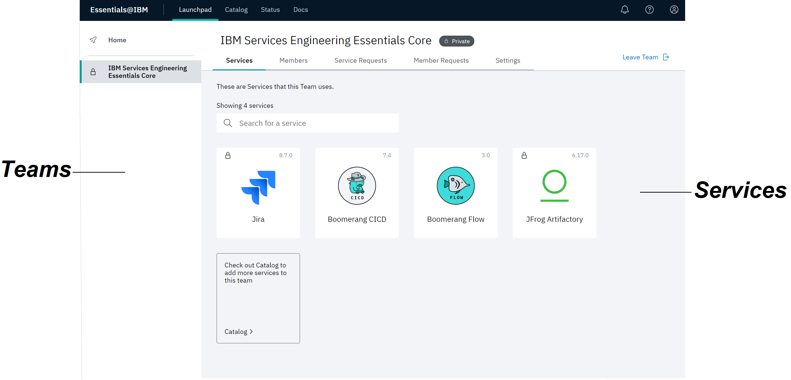
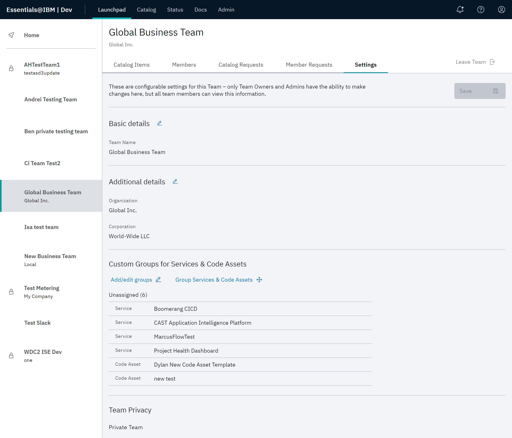
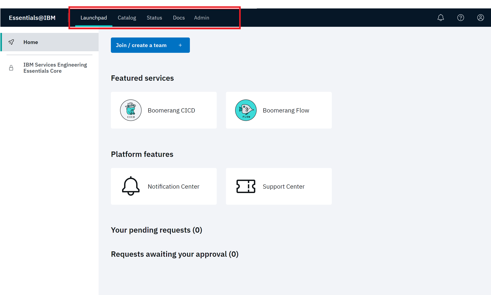
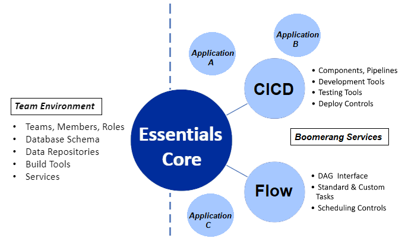

# Navigating IBM Services Essentials

The IBM Services Essentials platform leverages an intuitive user interface based upon the centralized seamless user interface coupled with the frameworks provided by IBM Services Essentials Core.

This allows for a highly extensible and customizable implementation and encourages the services and assets provided on the platform to leverage the common services.

IBM Services Essentials Core defines how your team works within your solution. It is where you define your team and its members, member roles and the services available to your team. Refer to the [Overview](/essentials-core/introduction/overview) for more information.

## Launchpad

A unique feature of IBM Services Essentials Core is **Launchpad**. Regardless of where you are in solution development, you can click **Launchpad** to return to the Launchpad Home page.

The following features are available from Launchpad.

- Essentials navigation bar, including **Launchpad**.
- My Launchpad
  - Join/create a team
  - Favourite Catalog items
  - Pending requests
  - Requests awaiting your approval
  - Platform notifications
- Your Teams

### My Launchpad

The My Launchpad page is where you manage your teams and day to day usage such as your favourited services, see platform notifications, and requests. 

### Join/create a team

Click **Join/create a team** to access the Join/create a team modal. Refer to Refer to [Getting started](/essentials-core/introduction/getting-started) for detailed instructions for creating a team or joining a team.

### Favourited Catalog items

The center of the page highlights selectable catalog items that you have favorited, allowing you to customize imported or commonly used services across teams.

Refer to [Working with the catalog](/essentials-core/how-to-guide/catalog).

### Your pending requests

This section displays all of the requests that you have created. Click **View request details** to view additional details about each request. You can also revoke the request if you don't want it to be processed by an Administrator or Team Owner.

If you are a Team Owner, use this section to quickly view the requests made to join your team. Refer to [Working with teams](/essentials-core/how-to-guide/teams) for detailed instructions.

### Requests awaiting your approval

If you are a Team Owner, use this section to quickly view the requests made to join your team. You can deny or approve requests.
Refer to [Administering requests](/essentials-core/how-to-admin/requests) for detailed instructions.

## Launchpad Teams

The left pane on the page lists the teams that are currently approved for your solution. Select any team to display the corresponding Team page. Select the appropriate tab for team, member and catalog functionality. Refer to [Working with teams](/essentials-core/how-to-guide/teams) for detailed instructions.

Access the **Members** and **Member Requests** tab to create, delete, or manage team members and roles. The **Services** tab displays the services currently available to your team. Refer to the [Catalog](/essentials-core/how-to-guide/catalog) for descriptions of all available services. 

Click the **Catalog** tile to add services to the Home page or click an available service tile at the Launchpad Home page to directly access that service for development. In this example, CICD and Flow have been added. 

> **Note**: Since Private teams don't appear in search results, users who want to join a team need to be invited by a Team Owner or platform Administrator. A team can be made public or private in its **Settings**.

The features available on the **Settings** tab allow you to define the look and feel of the teams page, as well as how the team interacts with platform functionality.

For example, you can edit team name, description, and team logo, edit team labels, add or edit groups of services and code assets, and set privacy properties.

## Common Header and Navigation

> **Note**: The Essentials core navigation bar is available with all services on the platform.

The Essentials Core navigation bar provides the following features:

- **Launchpad** – Click **Launchpad** at any point in solution development return to the Launchpad Home page.
- **Catalog** - Click **Catalog** to define and manage the lifecycle of your services and code assets. Refer to [Working with the catalog](/essentials-core/how-to-guide/catalog) for details. 
- **Status** – This feature allows you to gain insight into maintenance events and outages. Refer to [Checking status](/essentials-core/how-to-guide/status) for details. 
- **Docs** – **Docs** accesses the centralized location for all information on the platform
- **Admin** – This feature accesses the functionality for tracking and managing the platform, its teams, and users. Refer to [Administrative capabilities](/essentials-core/how-to-admin/admin) for details. 
- User Profile - The User Profile menu accesses features that allow you to control which teams are visible on the Teams pane, view the **About the Platform** version and **Privacy Statement**, **Request account deletion**, and **Sign out**. Refer to [Getting started](/essentials-core/introduction/getting-started) for details.

### Platform features

Two features, Notification Center and Support, provide helpful tools and information during operation. 

Notification Center provides important alerts and messages from the platform and Services. Refer to [Viewing the Notification Center](/essentials-core/how-to-guide/notificationscenter). 

Support Center  allows you to enter support tickets and track of existing tickets. Refer to [Using the Support Center](/essentials-core/how-to-guide/supportcenter).

## Extensibility

A big focus of IBM Services Essentials is providing a set of common frameworks that can be leveraged by Services for tight integration into the common services of the platform with Boomerang CICD and Boomerang Flow being two of the primary services used.

### Boomerang CICD

Boomerang CICD is where you define the Continuous Integration / Continuous Deployment process. In this application you configure and orchestrate the movement of components through a pipeline, along with the triggers and gates that control their execution.

The pipelines in CICD support a variety of build tools and frameworks that will be used in the development, QA, and Deploy process. Each stage of the pipeline is configured on the Pipelines page. Refer to the [Boomerang CICD Overview](/boomerang-cicd/introduction/overview) to learn more.

### Boomerang Flow

Boomerang Flow is a standalone open-source application that allows you to enhance your solution with event driven workflows.

Refer to the [Boomerang Flow introduction](/boomerang-flow/introduction/overview) to learn more.
