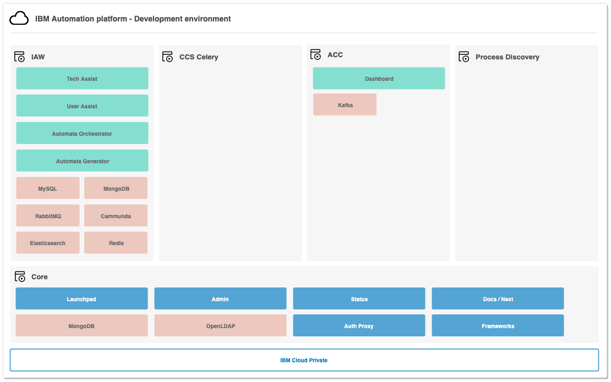

# Environments

The IBM Automation Platform is developed with the following environments available to the solution teams that make up the platform.

To see the gates between environments, please reference [here](/ise-standards/deployments-gates)

|| Development | QA | SERT/PERF | Production |
| --- | --- | --- | --- | --- |
| **Focus** | Code | Quality | Security / Performance | Stability |
| **Purpose** | To develop code | To validate the quality of the code, ensure functionality, and the system as a whole works together | To ensure optimal security and performance of the solution | Production level stable environment |
| **Audience** | Developers / Technical Architects | Developers / Testers / Technical Architects | Security / Performance Testers / Engineers | Customer / Solution / SRE |
| **Structure** | Fixed environment with every solution team getting thier own kubernetes namespace with access to the core services | Fixed environment where all solutions teams are deployed into a shared namespace with a single core services | Transient environment created at time for specific purpose | Customer stable environment |
| **Backed Up** | No | No | No | Yes |
| **Access** | Full access to each Solution Teams space | ISE / SRE access only. Users have additional Port-Forward role. | ISE / SRE access only | ISE / SRE access only |

## Development

## QA

A fixed environment, always available, where the solution teams code is in the same namespace as other solution teams with a single Core platform.

Team members will be provided Viewer plus Port Forward access. For additional levels of access teams will need to work with the ISE SRE support teams. We suggest that you first try to investigate by looking at logs and the events and / or replicate in the development environment.

This environment has elevated security policies with established image, pod security, and resource policies.

*Future*
Currently the pod security policy is using `anyuid` and will eventually be `restricted` requiring pods to run as non root. Additionally the network policy framework will be put in place using labels for zones.

## SERT / PERF

*Future*
Dynamic environments created for the purpose of testing and then blown away.

## Production

Production topology will fluctuate based on the sizing characters and the type of environment being asked for. We currently have two topologies;

- Shared Internal Production: a shared environment where all aspects of the platform have multiple tenants
- Dedicated External Production: a dedicated instance for a single client
