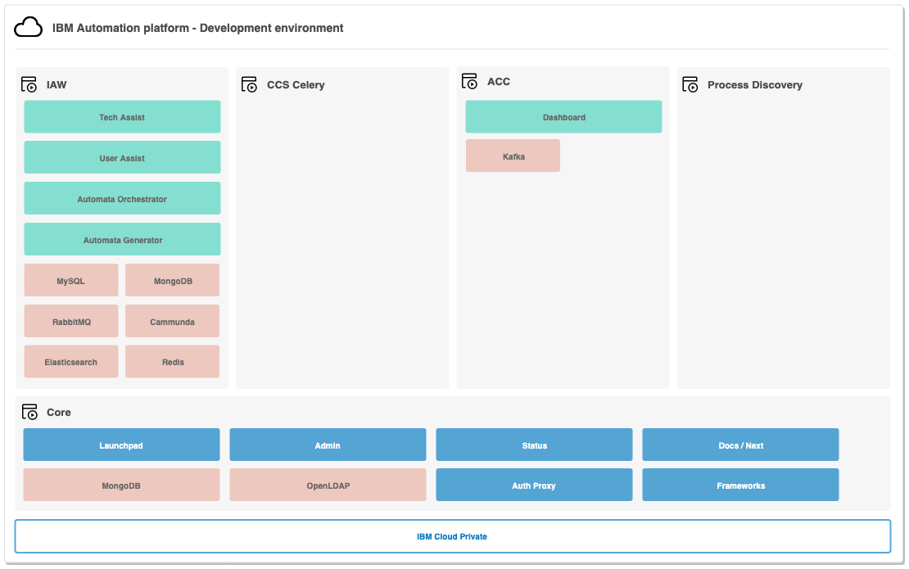

# Environments

The IBM Automation Platform is developed with the following environments available to the solution teams that make up the platform.

To see the gates between environments, please reference [here](/ise-standards/deployments-gates)

| Environment | Abbreviation | Focus | Purpose | Audience | Structure | Access | Backed Up | Network Policy | Default Resource Limits |
| --- | --- | --- | --- | --- | --- | --- | --- | --- | --- |
| Development | DEV | Code | To develop code | Developers / Technical Architects | Fixed environment with every solution team getting thier own kubernetes namespace with access to the core services | Full access to each Solutions Teams namespace | No | No | No |
| Quality Assurance | QA | Testing and Quality | Testers | To validate the quality of the code, ensure functionality, and the system as a whole works together | Fixed environment where all solutions teams are deployed into a shared namespace with a single core services | Solution teams have Viewer + Port-Forward. SRE higher level access only. | No | Yes | Yes |
| User Acceptance Testing | UAT | End Users | Functional users | To receive feedback from end users and demonstrate the functional capabilities | Transient environment created at time for specific period. Solutions only deployed / updated as required. | ISE / SRE access only | Yes | Yes | Yes |
| Penetration Testing _future_ | PEN | Security Validation | Testers | To ensure optimal security of the solution and meet biso requirements | Transient environment created at time for specific period. Solutions only deployed / updated as required. | ISE / SRE access only | Yes | Yes | Yes |
| Performance Testing _future_ | PERF | Performance Validation | Testers | To ensure optimal performance of the solution and drive quality through the gathering of metrics | Transient environment created at time for specific period. Solutions only deployed / updated as required. | ISE / SRE access only | Yes | Yes | Yes |
| Production | PROD | Production | End Users | Production level stable environment. Delivery of the specific solutions to end users / clients | Fixed environment where solutions are deployed into a dedicated or shared namespace | ISE / SRE access only | Yes | Yes | Yes |

## Development

## QA

A fixed environment, always available, where the solution teams code is in the same namespace as other solution teams with a single Core platform.

Team members will be provided Viewer plus Port Forward access. For additional levels of access teams will need to work with the ISE SRE support teams. We suggest that you first try to investigate by looking at logs and the events and / or replicate in the development environment.

This environment has elevated security policies with established image, pod security, and resource policies.

*Future*
Currently the pod security policy is using `anyuid` and will eventually be `restricted` requiring pods to run as non root. Additionally the network policy framework will be put in place using labels for zones.

## UAT

A more transient environment that should only be around for the time of UAT for a particular release or purpose.

There is no operational access to this environment by non SRE members.

## SERT / PERF

*Future*
Dynamic environments created for the purpose of testing and then blown away.

## Production

Production topology will fluctuate based on the sizing characters and the type of environment being asked for. We currently have two topologies;

- Shared Internal Production: a shared environment where all aspects of the platform have multiple tenants
- Dedicated External Production: a dedicated instance for a single client
