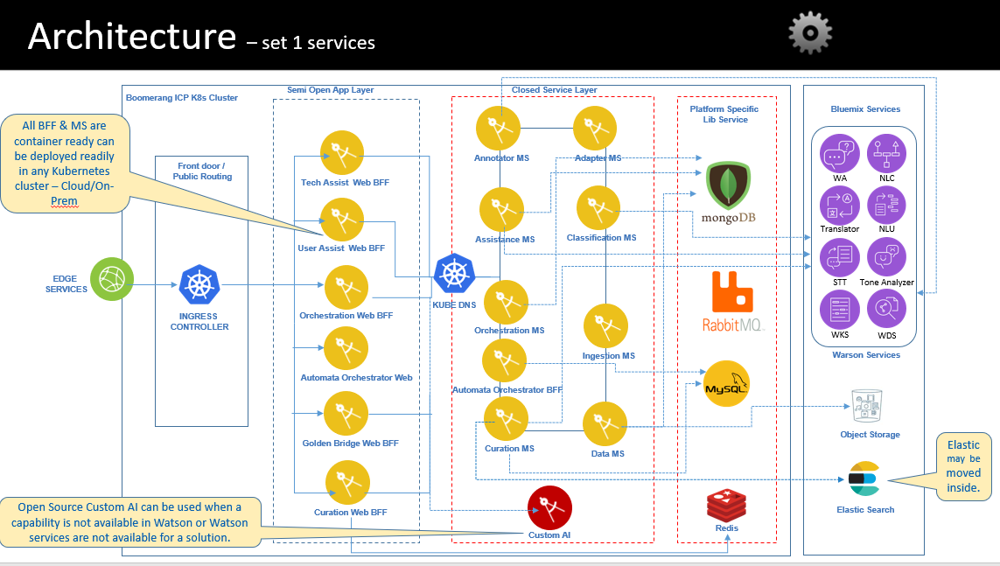
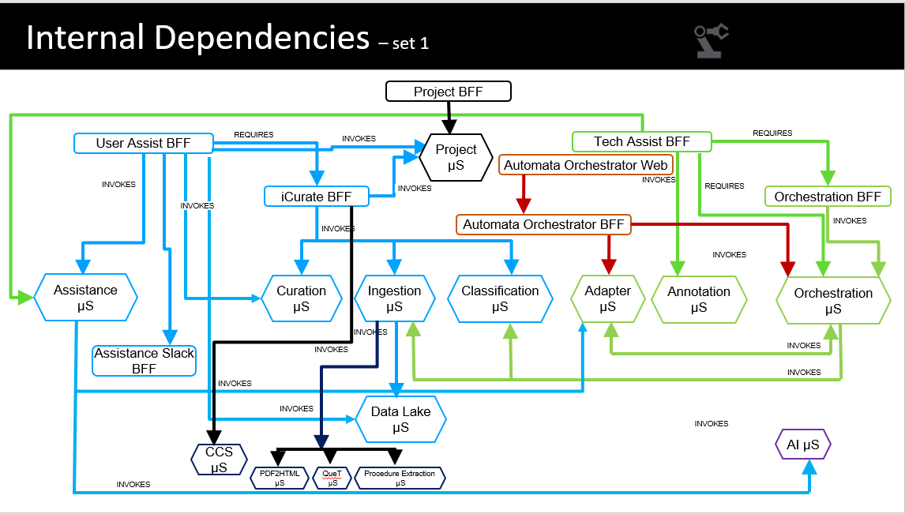

# IAW Architecture Overview
The following diagram presents an overview of the IAW solution architecture:
 

IAW solutions are part of IBM IAP platform and as is deployed utilizing the IAP services as a multi-cloud cloud application on  Kubernetes with the components packaged as Helm charts. IAW uses IAP services in order to abstract the infrastructure and security protocols. The main IAP services used are:
- Security - Authentication and Authorization(RBAC)
- Audit
- Notifications 
- Support
- Docs

## IAW Components
The following table describes main IAW architectural components and their external dependencies:

| Component |  Description |
|---|---|
| Project Onboarding Appliction | Project Onboarding User interface to create and manage “Projects”/”Domains” for the Corpus Curator and User Assist solutions | 
| Project Service | Project microservice which manages project configurations | 
| iCurate Application | Build the corpus for agents on how-to procedures, Q&A, Auto-curation, Curate from Docs/Media | 
| Curation Service | APIs for Curating, managing Tags, Approval workflow, Activities | 
| Classification Service | AI Component that identifying intent like – problem categorization, root cause , owner group, probable action, action type etc. from incident | 
| Ingestion-preprocessor Service | APIs for uploading file to ObjectStore, get the file Metadata details, submit document for analysis, preprocess the contents, create, update, search and add data to index, add a new tag, update an existing tag, delete an existing tag . | 
| Data Lake Service | Python Flask based REST APIs which are used to store and retrieve data in datalake (COS) | 
| AI Service | Python Flask based REST APIs which are used to enrich Q&A , Image OCR, Ticket data ingestions using AI techniques | 
| Assistance Service | APIs to connect different source systems (Elastic Search/WDS/WA/MongoDB/NEDB) mainly to serach the answers (text/audio/vedio/image) for a given question. It is also used to retrieve similar/related/frequently asked questions. | 
| NextGen Service(s) | APIs that will allow project users to ingest documents in CorpusCurator from which question and answers will be generated automatically without any human intervention using latest AI techniques | 
| User Assist Appliction | Interface for Users to get resolution for the problems | 
| Assistance-Slack Appliction | BFF for using Slack as channel | 
| Intelligent Helpdesk Appliction | It provides a single window smart helpdesk capability using artificial intelligence and end to end automation that suggests resolutions, actions problems that are auto-actionable and routes the ones that need human intervention |
| Adapter Service | APIs to connect different source system (ticket, email) and passing data to orchestration workflow and also to invoke target system (For e.g BluePrism). it is a stateless MicroService. | 
| Annotation Service | Annotator microservice is an AI Component of TechAssist-Web BFF that anotate Email and Ticket content with Object, Problem, Ask and User identification. | 
| Orchestration Service | APIs to connect BPMN 2.0 compliant workflow engines to automate orchestrated processes flow execution. Process may include API call, Human Task, and Robotic Process Automation | 
| Automata Orchestrator Appliction | The Automata Orchestration solution provides a flexible workflow to orchestrate automation tasks for remediation of a complex problem that may need execution of multiple automata (virtual robots) in a well defined orchestrated workflow | 
| Automata Generator Appliction | Understand a PDD (text data) and generate process steps , system objects specifications , BOT code required for RPA development automatically. | 

## IAW External Dependencies
IAW is  integrated with other external services in order to provide the current solution. At present the following external services are used:
- Watson Services
- Cloud Object Store 
- Elastic

The following table contains IAW external software dependencies and describes the integration between IAW and each component:

| Software Component |  Version | Description |
|---|---|--|
| Watson Services |  | https://www.ibm.com/watson/products-services/  Watson Assistant , Watson Studio, Watson Discovery, NLU , NLC, Tone Analyzer |
| Cloud Object Store | Standard | https://www.ibm.com/in-en/cloud/object-storage |
| Elastic | 6.6.2| https://www.elastic.co/guide/en/elasticsearch/reference/6.6/release-notes-6.6.2.html
 |
 

# IAW Dependency Diagram
The following diagram presents IAW internal dependencies:

 

## IAW Middleware 
The following middleware components must be available as a prerequisites in order to deploy IAW:

| Software Component |  Version | Description |
|---|---|--|
| IBM Cloud Private | 3.1.1 | Kubernetes cloud environment |
| IBM Automation Platform | R1 |  IAW is using IAP  approach, methods and implementation process in order to be abstracted from the underlying infrastructure and security while enabling a rapid development life cycle. At development level IAW uses IAP common services like authentication, authorization, notifications, audit and is also integrated in IAP Launchpad. |
