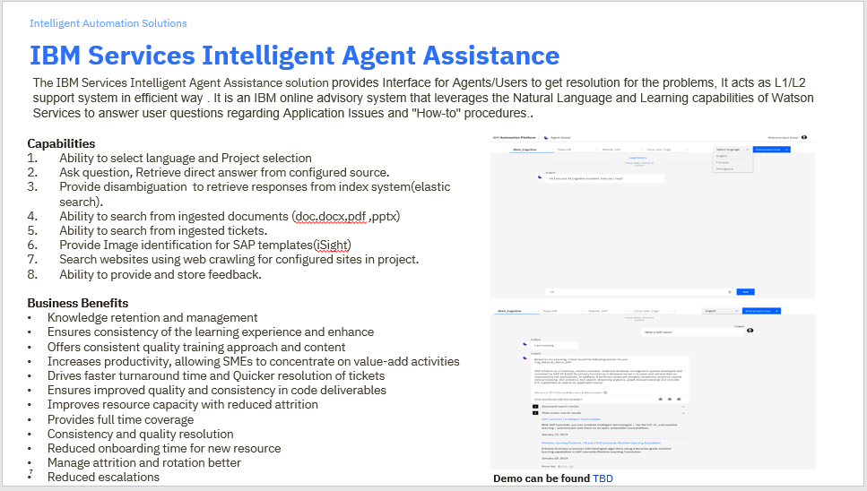
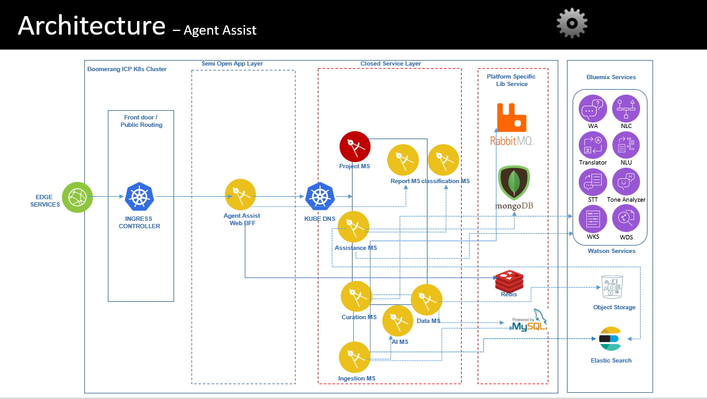
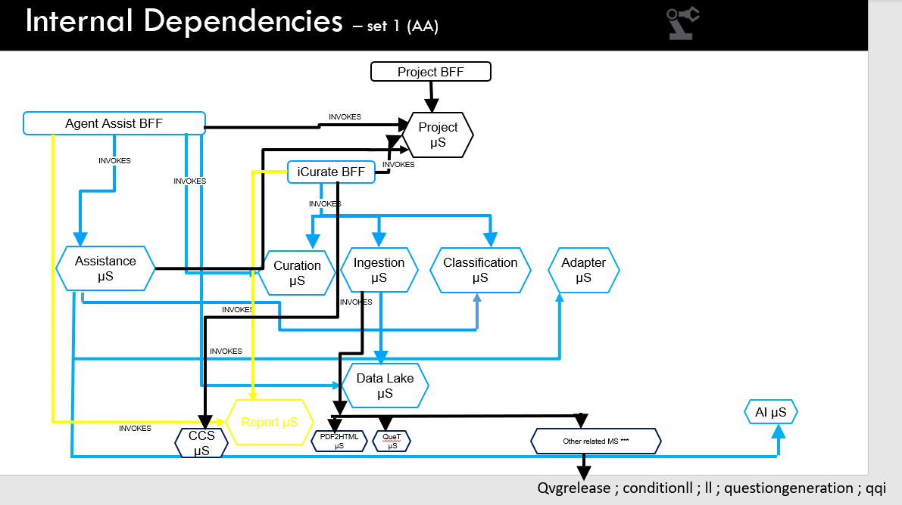

# IAW AgentAssist Solution Overview

 
 
# IAW AgentAssist Architecture Overview
The following diagram presents an overview of the IAW solution architecture of AgentAssist:
 

IAW solutions are part of IBM IAP platform and as is deployed utilizing the IAP services as a multi-cloud cloud application on  Kubernetes with the components packaged as Helm charts. IAW uses IAP services in order to abstract the infrastructure and security protocols. The main IAP services used are:
- Security - Authentication and Authorization(RBAC)
- Audit
- Notifications 
- Support
- Docs

## IAW Components
The following table describes newly added components and their external dependencies as part of R2.0.0:

| Component |  Description |
|---|---|
| AgentAssist Appliction | AgentAssist User interface for Agents/Users to get resolution for the problems, It acts as L1/L2 support system in efficient way . It is an IBM online advisory system that leverages the Natural Language and Learning capabilities of Watson Services to answer user questions regarding Application Issues and "How-to" procedures. | 
| Report Service | iCurate Project level Reports for Project Admin and Product level Reports for Product Admin | 

## IAW External Dependencies
IAW is  integrated with other external services in order to provide the current solution. At present the following external services are used:
- Watson Services
- Cloud Object Store 
- Elastic

The following table contains IAW external software dependencies and describes the integration between IAW and each component:

| Software Component |  Version | Description |
|---|---|--|
| Watson Services |  | https://www.ibm.com/watson/products-services/  Watson Assistant , Watson Studio, Watson Discovery, NLU , NLC, Tone Analyzer |
| Cloud Object Store | Standard | https://www.ibm.com/in-en/cloud/object-storage |
| Elastic | 6.6.2| https://www.elastic.co/guide/en/elasticsearch/reference/6.6/release-notes-6.6.2.html
 |
 

# IAW Dependency Diagram for AgentAssist
The following diagram presents IAW internal dependencies for AgentAssist:

 

## IAW Middleware 
The following middleware components must be available as a prerequisites in order to deploy IAW:

| Software Component |  Version | Description |
|---|---|--|
| IBM Cloud Private | 3.1.1 | Kubernetes cloud environment |
| IBM Automation Platform | R1 |  IAW is using IAP  approach, methods and implementation process in order to be abstracted from the underlying infrastructure and security while enabling a rapid development life cycle. At development level IAW uses IAP common services like authentication, authorization, notifications, audit and is also integrated in IAP Launchpad. |
