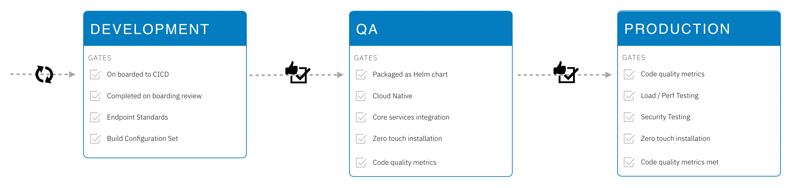

# IBM Services Engineering Deployments & Gates

The following information is a requirement for those solutions being built as part of the platform and a recommendation for external development teams.

When onboarding platform solutions there are a lot of requirements, with the main technical requirement to be cloud-native.



| Entry to | Gate | Detail |
| --- | --- | --- |
| Development | On boarding review | Has gone through onboarding review and the architectural content generated to be used in setting up development environment | 
| Development | On boarded to Boomerang CI | The code repositories have been on boarded to Boomerang CI |
| QA | Packaged as a Helm Chart | See below for more detail. |
| QA | Cloud Native | Including,  but not limited to;<ul><li>Health and Liveness endpoints</li><li>Flexible ingress</li><li>Configurable</li></ul> |
| QA | Implemented Core Services Libraries | This includes, but not limited to; <ul><li>Authentication</li><li>Authorization</li><li>Teams</li><li>Catalog</li><li>Catalog Actions</li><li>Settings</li><li>Proxy</li></ul>Please see the frameworks architecture for more details.
| QA | Zero touch installation | Including,  but not limited to;<ul><li>Data Loader</li><li>Scripts or Configuration for dependent middleware</li></ul>See below for more information. |
| QA | Code Quality | Including,  but not limited to;<ul><li>Static Code Analysis</li><li>Unit Test Pass Rate</li><li>Code Coverage</li></ul> |
| QA | UI Testing | _future_ |
| Production | Load Testing | _future_ |
| Production | Security Testing | Please see Security Architecture and Secure By Design requirements |

## Helm Charts

All solutions and services are to be packaged as helm charts. Refer to the documetation on the [helm chart standards](/ise-standards/helm-charts/)

All dependent middleware is to have a helm chart or, by exception, an alternate installation method.

## Zero Touch Installation

This is a follow on from being packaged as a helm chart. The installation should be treated as a product installer with zero touch required. This includes using a data loader to load collections into mongodb, or running scripts in a container as part of initial install to connect to the database and set up dependencies.

This is critical as in higher level environments there will be no access to do things manually.

These will implemented as `kubernetes jobs` that run via helm chart hooks for; pre-install, pre-upgrade, etc.

A Helm template file will define the job; the job will execute a docker container that run a data loader script. 
The job is launched on a **pre-install** and/or **pre-update** Helm hook. That means that a **hook-delete-policy** needs to be specified, otherwise the job is not deleted when the chart is re-installed or upgraded and it would require manual deletion.

For a smooth management of the job, it is required that:
- **the job is idempotent**, so it is launched on both pre-install and pre-upgrade. The SRE team needs to have the flexibility to do install and upgrade upon the case. 
- **the template for the job specifies a hook-delete-policy** such that the job is automatically deleted. The SRE team should not manually delete the jobs. 
- **the script is well behaving**, that is it returns to the container (and to K8s layer) a correct exit code. For instance:
   ```    
	mysql --host ...
	if [ "$?" -eq 0 ];
	then
  	  ...
	else
  	  ...
	  exit 1
 	fi
   ```


For **DEV** and **QA**, it is adviseable to have the following chart snippet for the job: 
```
  annotations:
    helm.sh/hook: pre-install
    helm.sh/hook: pre-upgrade
    helm.sh/hook-delete-policy: hook-succeeded
```
**This means that the job will be deleted if the script returns success.** If the script erroneously reports success, but one of its commands is actually in error, there will be no log to look at after the helm chart execution. Therefore it is important that the script is correctly written. 


For **PROD**, it is possible that this is changed to:
```
  annotations:
    helm.sh/hook: pre-install
    helm.sh/hook: pre-upgrade
    helm.sh/hook-delete-policy: before-hook-creation
```
**This means that the job will be deleted only when the Helm chart is installed and upgraded.** So, if there is a mistake in the script and it reports success, there is still the change to recuperate the logs for the PROD environment. 


If there are many jobs to be executed and there is an order of execution, weights need to be added:
```
  annotations:
    helm.sh/hook: pre-install
    helm.sh/hook: pre-upgrade
    helm.sh/hook-weight: "10"
    helm.sh/hook-delete-policy: before-hook-creation
```

Note that if another object (f.i. secrets) is used by the job and has to be created before the job, one solution is to trigger the creation of this object on hook and to manage the delete policy for it:
``` 
  annotations:
    helm.sh/hook: pre-install
    helm.sh/hook-delete-policy: before-hook-creation
```

### Data Loader

It is critical that there is a versioned data loader system as part of the platform. This should include and handle running upgrades i.e. what are the differences between the currently installed version and the new version.

For the core services we run a job with profiles that keep a record of change logs to know which change sets to apply when.
