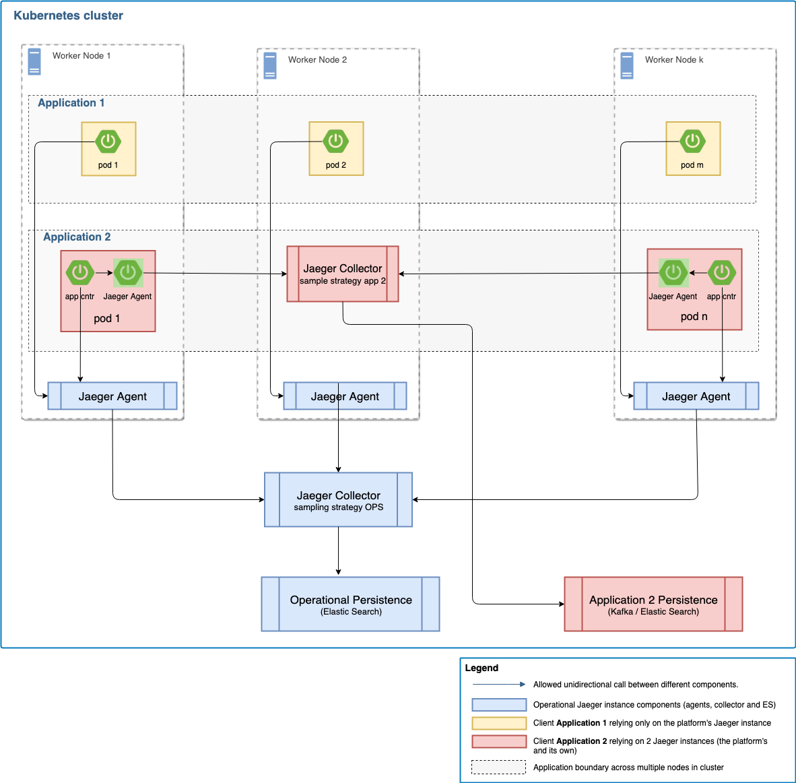

# Developing Helm Charts

The following are the standards, best practices, and accelerators for teams building out helm charts and content for the IBM Automation and Boomerang platforms.

Helm is the best way to find, share, and use software built for Kubernetes. Read the helm documentation and best practices

[Helm Documentation](https://docs.helm.sh/)

## Common Helper Methods

We have packaged a series of common helper methods as a helm v3 chart that can be set as a dependency, importing all of the template methods. This is based on the same design principles as ICP Content teams [Shared Configurable Helpers (SCH)](http://icp-content-playbook.rch.stglabs.ibm.com/shared-configurable-helpers/)

### Design

Most all charts have a `templates/_helpers.tpl` file, and maybe some additional helper .tpl files. In most have some common template definitions such as `"name"` and `"fullname"` for example. These template definitions are many times modified for a specific product chart and are not consistent across charts.

By utilizing [helm subcharts ](https://docs.helm.sh/chart_template_guide/#subcharts-and-global-values) we can take advantage of the fact that all template (tpl) files become globally shared, thus if we have a common subchart with helper tpl files, all of the defined template methods are available across the parent chart and any other subchart. We can then version and lifecycle the helper methods to ensure that they are consistent across charts.

Additionally it allows the power of community development to contribute to the helpers.

### Chart Requirements

To utilize this chart you need to add the following to your `Chart.yaml`

```yaml
dependencies:
  - name: bmrg-common
    repository: "https://raw.githubusercontent.com/boomerang-io/charts/index"
    version: ~1.0.2
    alias: bmrgcommon
```

_Notes:_
1. Ensure you have added the  helm repo as part of your local developer set up
2. Ensure you have used a URL for the repository in the yaml, otherwise Boomerang CICD may not be able to resolve it.

### Available Methods

When using the methods, keep in mind the trimming of white space using `{{-`

| Method                 | Description                                                                                                                             | Example Usage                                                                                                                              |
| ---------------------- | --------------------------------------------------------------------------------------------------------------------------------------- | ------------------------------------------------------------------------------------------------------------------------------------------ |
| `bmrg.labels.standard` | This will generate all the labels used in a resources spec block of match labels and metadata labels                                    | `{{ include "bmrg.labels.standard" (dict "context" . "platform" $platform "product" $product "tier" $tier "component" $k ) | nindent 6 }}` |
| `bmrg.labels.chart`    | This will generate labels for the top metadata and should conside with the recommended helm labels                                      | `{{ include "bmrg.labels.chart" (dict "context" $ "tier" $tier "component" $k ) | nindent 6 }}`                                            |
| `bmrg.core.services`   | If you need to loop through and create linkage to the Core platform services, such as in a configmap to be passed to your microservices. Handles appending the namespace if in a different namespace as long as `boomerang.core.namespace` is set in your values yaml. | `{{- include "bmrg.core.services" $ | indent 4 }}`                                                                                         |
| `bmrg.name.prefix`     | Name prefix. Will default to the chart name unless a name prefix is supplied on install                                                 |                                                                                                                                            |
| `bmrg.name`            | Create a name of a resource by merging `bmrg.name.prefix` with variables for full name                                                  | `'{{ include "bmrg.name" (dict "context" $ "tier" $tier "component" $k ) }}`                                                               |
| `bmrg.util.unique`     | A unique 6 character random number                                                                                                      |                                                                                                                                            |
| `bmrg.util.time`       | Uses the `$.Release.Time` global variable and removes certain string content                                                            |
| `bmrg.ingress.config.auth_proxy_authorization` | Inserts nginx configuration snippet to set the Authorization header | `{{- include "bmrg.ingress.config.auth_proxy_access_control" $ | nindent 6 }}` |
| `bmrg.ingress.config.auth_proxy_access_control` | Inserts nginx configuration snippet for Access Control for auth proxy. | `{{- include "bmrg.ingress.config.auth_proxy_access_control" $ | nindent 6 }}` |
| `bmrg.ingress.config.auth_proxy_auth_annotations` | Inserts nginx auth-url and auth-signin ingress annotations. These in turn pick up the `ingress.auth.url.external` and `ingress.auth.url.internal` from the values yaml. | `{{- include "bmrg.ingress.config.auth_proxy_auth_annotations" $ | nindent 4 }}` |

## Checklist

| Focus                  | Standard Description                                                                                                                                                                                                                                                                                                                                                                                                                                        |
| ---------------------- | ----------------------------------------------------------------------------------------------------------------------------------------------------------------------------------------------------------------------------------------------------------------------------------------------------------------------------------------------------------------------------------------------------------------------------------------------------------- |
| Chart Structure        | As per helm v3 chart standards                                                                                                                                                                                                                                                                                                                                                                                                                                 |
| Chart Name             | As per helm v3 chart standards _AND_<br>All Boomerang platform charts are to be prefixed with `bmrg-` _AND_<br>All IBM Automation platform charts are to be prefixed with `iap-` _AND_<br>All charts must have the required extension as follows;<ul><li>`-dev`, the chart is for development or trial use</li><li>`-demo` the chart is a sample or demo</li><li>`No extension`. Charts that are ready for use and can be used for multiple purposes</li></ul> |
| Chart Version          | Charts must be versioned using SemVer 2 conventions                                                                                                                                                                                                                                                                                                                                                                                                         |
| App Version            | This is set to the version of the platform or the version of the application set                                                                                                                                                                                                                                                                                                                                                                            |
| Labels and Annotations | Helm defines a set of best practices regarding the creation of [labels and annotations](labels and annotations).                                                                                                                                                                                                                                                                                                                                            |
| Ingresses              | Ingress should only be enabled for those applications and services receiving external requests AND have some level of authentication implemented.                                                                                                                                                                                                                                                                                                           |
| Readiness Probe        | All deployments should implement a readiness probe of `/health` that determines when the deployment is ready to take load                                                                                                                                                                                                                                                                                                                                   |

## Available Default Parameters

If the chart is following the platform design, the following parameters will be passed in by default to the configmaps and secrets and available for use.

### Apps

| Property Key | Description | Example Value |
| --- | --- | --- |
| `PORT` | A userful parameter to use to start your app on | `3000` |
| `APP_ROOT` | The context to serve the content from in your application | `/` |
| `NEW_RELIC_APP_NAME` | The is a property that can be fed in as part of the newrelic javascript file to report back to New Relic | |
| `NEW_RELIC_LICENSE_KEY` | The is a property that can be fed in as part of the newrelic javascript file to report back to New Relic  | |
| `BASE_ENV_URL` | The root url to the platform for the environment | `https://rtp1.cloud.boomerangplatform.net/dev` |
| `BASE_APPS_ENV_URL` | The url to the platform apps for the environment | `https://rtp1.cloud.boomerangplatform.net/dev/apps` |
| `BASE_SERVICE_ENV_URL` | The url to the platform services for the environment | `https://rtp1.cloud.boomerangplatform.net/dev/services` |
| `PRODUCT_ENV_URL` | The root url to the product for the environment | `https://rtp1.cloud.boomerangplatform.net/dev/<product>` |
| `PRODUCT_APPS_ENV_URL` | The url to the product apps for the environment | `https://rtp1.cloud.boomerangplatform.net/dev/<product>/apps` |
| `PRODUCT_SERVICE_ENV_URL` | The url to the product services for the environment | `https://rtp1.cloud.boomerangplatform.net/dev/<product>/services` |
| `CORE_ACCESS_TOKEN` | The Access Token to access the core services | |
| `CORE_AUTH_URL` | The URL for the auth service from core | |
| `CORE_AUDIT_URL` | The URL for the audit service from core | |

### Services

| Property Key | Description | Example Value |
| --- | --- | --- |
| `server.port` | A userful parameter to use to start your service on | 8080 |
| `boomerang.proxy.host` | Can be fed into the proxy library or used custom in your service to route requests through a forward proxy when the service is running in a private VLAN | |
| `boomerang.proxy.port` | Can be fed into the proxy library or used custom in your service to route requests through a forward proxy when the service is running in a private VLAN | |
| `logging.level.org.springframework.web.client.RestTemplate` | The url to the platform apps for the environment | `https://rtp1.cloud.boomerangplatform.net/dev/<product>/services` |
| <service_name>.service.host | The internal DNS name for the service | `iap-acc-services-dashboard` |
| <service_name>.service.root | The external DNS url for the service | `https://rtp1.cloud.boomerangplatform.net/dev/acc/services/dashboard` |

*Parameters used automatically if New Relic is enabled*

The following properties will be visible in the configmap but will be used automatically if New Relic is injected into the service to report out.

| Property Key |
| --- |
| `newrelic.config.common.proxy_host` |
| `newrelic.config.common.proxy_port` |

## Ingress

### Authentication

All ingress definitions need to implement a form of authentication. We currently support two methods

#### Auth Proxy IDP Integration

Integration into the platforms auth proxy which in turn will integrate to the chosen IDP

```yaml
{{- include "bmrg.ingress.config.auth_proxy_auth_annotations" $ | nindent 4 }}
```

**Manual**

The following is needed if implementing manually or for common helpers versions less than 0.5.x

```yaml
ingress.kubernetes.io/auth-signin: "{{ $.Values.ingress.auth.url.external }}"
ingress.kubernetes.io/auth-url: "{{ $.Values.ingress.auth.url.internal }}"
```

And the following additional annotation if using Basic auth mode

```yaml
ingress.kubernetes.io/auth-response-headers: "Authorization, X-Forwarded-User"
```

#### Service Token

Integration into the platforms service token mechanism. When using this form of authentication, the ingress should be for specific contexts only.

```yaml
ingress.kubernetes.io/auth-url: "{{ $.Values.ingress.auth.url.token }}"
```

#### Configuration-Snippet Annotation

Configuration required to integrate to the Auth Proxy. See description in above Common Helper methods

```yaml
    ingress.kubernetes.io/configuration-snippet: |
      {{- include "bmrg.ingress.config.auth_proxy_access_control" $ | nindent 6 }}
      {{- include "bmrg.ingress.config.auth_proxy_authorization" $ | nindent 6 }}
```

**Manual**

The following is needed if implementing manually or for common helpers versions less than 0.2.x

```yaml
    ingress.kubernetes.io/configuration-snippet: |
      if ($http_origin ~* '^https?://.*\.{{ include "<host>" $ }}$' ) {
        add_header Access-Control-Allow-Origin $http_origin;
        add_header 'Access-Control-Allow-Credentials' 'true';}
      auth_request_set $token $upstream_http_authorization;
      proxy_set_header Authorization $token;
```

### Rewrite-Target and Path

As of NGINX 0.22.0 the `rewrite-target` annotation changed along with how we implement paths as part of the ingress. [See Rewrite-Target](https://kubernetes.github.io/ingress-nginx/examples/rewrite/#rewrite-target).

The following example shows how to use capture groups for the platform, usually implemented in the service ingress.

```yaml
  annotations:
    ingress.kubernetes.io/rewrite-target: /{{ $k }}/$2
    ...
spec:
  rules:
    - host: {{ $.Values.ingress.host }}
      http:
        paths:
          - path: {{ $.Values.ingress.root }}/{{ $tier }}/{{ $k }}(/|$)(.*)
          {{- end }}
            backend:
              serviceName: {{ include "bmrg.name" (dict "context" $ "tier" $tier "component" $k ) }}
              servicePort: {{ $platform }}-port-svc
```

## Network Policies and Zones

The platform implements kubernetes network policies and is described in the [Boomerang Network Architecture](/boomerang/6.0.0/architecture/network-architecture#kubernetes-network-policies). This architecture and zone mapping needs to be understood based on the solutions architecture as to what needs to talk to what.

For this to work, your chart needs to utilize zones and pass these as labels to the respective services and pass in based on information in the values yaml.

The label in the deployment yaml adds a **zone** attribute.

```yaml
      {{- include "bmrg.labels.standard" (dict "context" . "platform" $platform "product" $product "tier" $tier "component" $k "zone" $v.zone) | nindent 6 }}
```

And in the values yaml adds a zone element to the per image configuration

```yaml
apps:
  launchpad:
    ...
    zone: untrusted
```

## NewRelic Integration

The platform provides integration to NewRelic as an optional part of the helm charts. This is used by the teams when running and operating these solutions in an IBM managed  environment.

There are certain properties that are made available to the deployments via environment variables or configmap to ensure that NewRelic has the required information. These in turn come from the values yaml

```yaml
monitoring:
  newrelic:
    apm:
      name: IAP@IBM FRA1
      key:
    browser:
      id:
      key:
```

There are also requirements or additions to the yaml files to support this.

### Web Application Deployment

If you have bootstrapped your web application with the Boomerang React Scripts it includes a server that allows you to inject arbituary data in local scripts to the head of the HTML document. This server is also published as a separate dependency: boomerang-webapp-server.

We encourage the use of this as it includes everything out of the box to enable the platforms strategic architecture and development standards.

In the deployment yaml you would create environment variables as follows. As you can see, the newrelic-browser.js is injected into the head, without this the environment variables wont be read.

```yaml
            - name: NEW_RELIC_APP_NAME
              value: "{{ $.Values.monitoring.newrelic.apm.name }} - {{ $tier }}"
            - name: NEW_RELIC_LICENSE_KEY
              value: "{{ $.Values.monitoring.newrelic.apm.key }}"
            - name: NEW_RELIC_PROXY_HOST
              value: "{{ $.Values.proxy.host }}"
            - name: NEW_RELIC_PROXY_PORT
              value: "{{ $.Values.proxy.port }}"
            - name: NEW_RELIC_BROWSER_ID
              value: "{{ $.Values.monitoring.newrelic.browser.id }}"
            - name: NEW_RELIC_BROWSER_KEY
              value: "{{ $.Values.monitoring.newrelic.browser.key }}"
            - name: HTML_HEAD_INJECTED_SCRIPTS
              value: {{ if $.Values.monitoring.newrelic.browser.key }}"newrelic-browser.js"{{ else }}""{{ end }}
```

### Service Deployment

An init container holds the APM agent

```yaml
      {{- if $.Values.monitoring.newrelic.apm.key }}
      initContainers:
        - name: util-newrelicapm-cntr
          image: {{ $.Values.image.registry }}/ise/bmrg-util-newrelicapm:5.6.0
          imagePullPolicy: IfNotPresent
          volumeMounts:
          - name: apm-newrelic
            mountPath: /opt/newrelic
      {{- end }}
```

Then for the java process, conditional includes are added to reference the init container, if New Relic is enabled.

```yaml
      containers:
        - name: "{{ $tier }}-{{ $k }}-cntr"
          image: "{{ $.Values.image.registry }}{{ $v.image.repository }}:{{ $v.image.tag }}"
          imagePullPolicy: "{{ $.Values.image.pullPolicy }}"
          env:
          - name: JAVA_OPTS
            value: '-Dspring.config.additional-location=file:/data/application.properties{{- if $.Values.monitoring.newrelic.apm.key }}{{- if $.Values.proxy.enable }} -Dnewrelic.config.proxy_host={{ $.Values.proxy.host }} -Dnewrelic.config.proxy_port={{ $.Values.proxy.port }} -Dnewrelic.config.distributed_tracing.enabled=true{{- end }} -javaagent:/opt/newrelic/newrelic.jar{{- end }}'
          - name: NEW_RELIC_LICENSE_KEY
            value: {{ $.Values.monitoring.newrelic.apm.key }}
          - name: NEW_RELIC_APP_NAME
            value: '{{ $.Values.monitoring.newrelic.apm.name }} - {{ $tier }}'
          - name: NEW_RELIC_PROCESS_HOST_DISPLAY_NAME
            value: '{{ include "bmrg.name" (dict "context" $ "tier" $tier "component" $k ) }}'
```

And Volume Mounts

```yaml
          volumeMounts:
          {{- if $.Values.monitoring.newrelic.apm.key }}
          - name: apm-newrelic
            mountPath: /opt/newrelic
          {{- end }}
```

And Volumes

```yaml
      volumes:
      {{- if $.Values.monitoring.newrelic.apm.key }}
      - name: apm-newrelic
        emptyDir: {}
      {{- end }}
```

## Jaeger Integration

The platform provides integration to Jaeger as an optional part of the helm charts. It is used by the teams for monitoring and troubleshooting microservices-based distributed systems.

This implementation needs to be available as a feature flag and enabled / disabled depending on availability of Jaeger when installed.


### Architectural Overview

Depending on the use-case, if Jaeger integration is enabled, the clients can use it with two flavours:
 - Use only the platform operational Jaeger instance by configuring the properties under the `monitoring` section,
 - Use both, the platform operational Jaeger and the client's managed Jaeger instance(s) by configuring a list of integration configuration under the `monitoring` section.


 The following diagrams depicts the two flavours where `Application 1` is using only the operational (platform provided) Jaeger instance while `Application 2` is using two different instances, the operational one and its own Jaeger instance (where the Jaeger agents are deployed as side-cars to the application containers).



When using multiple Jaeger agents configuration, the same client's trace data is being sent to all the registered senders using the sample strategy picked-up from the configured collector.

### Sampling strategy

Jaeger is using sampling strategies in order to determine the amount of traces that are reported back to the system. The platform uses [Collector Sampling Configuration](https://www.jaegertracing.io/docs/1.19/sampling/#collector-sampling-configuration) which allow the collectors to be instantiated with static sampling strategies. This allows controlling the sampling strategies in the services from a central configuration in Jaeger backend.

The client microservice gets configured with the Collector Sampling Configuration based on the provided parameter `jaeger.remoteControlledSampler`. It loads the remote defined strategy from the collector by invoking the configured agent which proxies the call. Make sure when you deploy and configure your own Jaeger collectors to configure the deployments with a sampling strategy file, otherwise the collectors will return the default probabilistic sampling policy with probability 0.001 (0.1%) for all services. Below is a sample on how to configure a collector using the Jaeger helm chart:

```yaml
collector:
  enabled: true
  image: jaegertracing/jaeger-collector
  samplingConfig: |-
    {
       "default_strategy": {
         "type": "probabilistic",
         "param": 1
       }
     }
```

### Configurable Parameters

There are certain properties that are made available to the deployments via environment variables and application properties configuration to ensure that Jaeger has all the required information. These are configured in the values yaml file under the `monitoring` section.

```yaml
jaeger:
  enabled: true
  remoteControlledSampler:
    host: jaeger-dev-agent
    port: 5778
  instances:
  - name: operational
    namespace: jaeger-ns
    agent:
      host: jaeger-agent
      port: 6831
    collector:
      host: jaeger-collector
      port: 14268
  - name: client
    namespace: client-ns
    agent:
      host: localhost
      port: 6831
      image:
        repository: jaegertracing/jaeger-agent
        tag: 1.17.0
#        resources:
#          limits:
#            cpu: 25m
#            memory: 25Mi
#          requests:
#            cpu: 15m
#            memory: 15Mi
    collector:
      host: jaeger-client-collector
      port: 14268
```

The following table lists the configurable parameters of the Jaeger chart and their default values.

| Parameter | Description | Default |
| --- | --- | --- |
| `enabled` | Enables or disables the Jaeger monitoring | `false` |
| `remoteControlledSampler.host` | Jaeger agent host name | `jaeger-dev-agent` |
| `remoteControlledSampler.port` | Jaeger agent port number  | `5778` |
| `instances` | List of Jaeger instances that are registered to receive the tracing data | `nil` |
| `instances.name` | The name of the Jaeger instance. The platform's provided one must be named `operational`, the other Jaeger instance names don't have a restriction. | `operational` |
| `instances.namespace` | The namespace where the Jaeger engine is installed. | `nil` |
| `instances.agent` | The configuration for the Jaeger agent component. The `host` and `port` parameters are providing information about the location of the agent. Only the non-operational Jaeger instances can be configured with the `image` parameter, to configure the agent deployed as a side-car to the business container. | `nil` |
| `instances.agent.image.resources` | Optional block for setting the Jaeger agent container resources. | `limits.cpu: 20m`, `requests.cpu: 10m` |
| `instances.collector.host` | The configuration for the Jaeger collector component's host. | `jaeger-collector` |
| `instances.collector.port` | The configuration for the Jaeger collector component's port.  | `14268` |


### Using the common helpers methods

The platform provides two helper methods to support the Jaeger integration.  


**1. Using `bmrg.jaeger.config.agents` common method in the configmap resources**

The parameters can be provided through the helm chart. The common helpers defines a method named `bmrg.jaeger.config.agents` that can be used to inject the necessary Jaeger integration values into the helm chart. It can be used in the config-map resource definition as in the following example:

```
data:
  application.properties: |
    {{- include "bmrg.jaeger.config.agents" $ | indent 4 }}
    ....
```

**2. Using `bmrg.jaeger.deployment.agents` common method in the deployment**

In order to deploy multiple Jager agents as side-car to the microservice container, the `bmrg.jaeger.deployment.agents` common method can be used. It will inject the Jaeger agents containers into the deployment's pod ( only the client's defined agents and not the platform provided one - called operational) based on the `jaeger.instances` configuration section from the helm release. It can be used in the deployment resource definition as in the following example:

```yaml
apiVersion: apps/v1
kind: Deployment
...
spec:
  template:
    spec:
      containers:
        - name: "client-microservice-cntr"
          image: "client-microservice-image:tag"
        {{- include "bmrg.jaeger.deployment.agents" (dict "context" $ ) | nindent 8 }}
```


## References

The following are great resources for further content

- ICP Content Playbook: [Developing Helm Charts](http://icp-content-playbook.rch.stglabs.ibm.com/developing-charts/)
