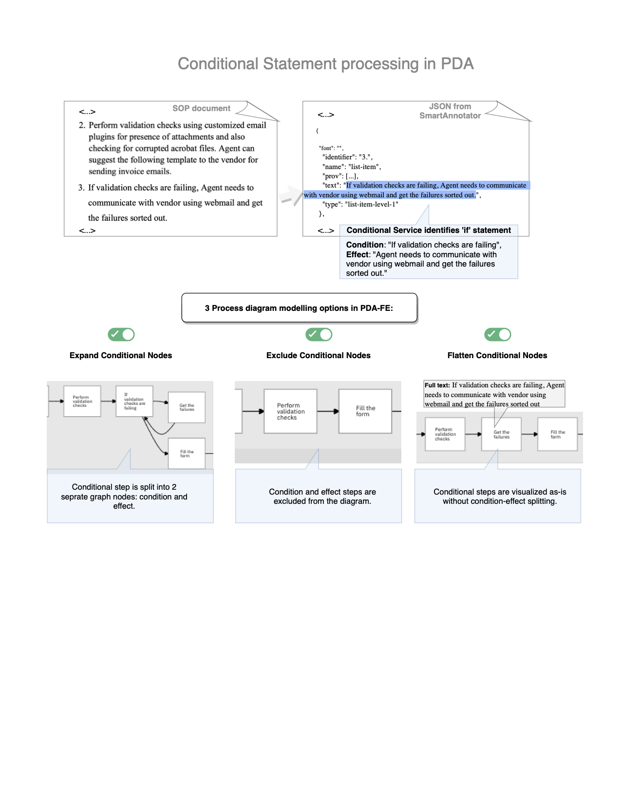

## What's New in PDA 1.2.0

### Features

1. Log and clickstream file analysis is up to 10x faster.
1. Exception list and PDD are streamlined.
1. The workflow for preparing clickstream data for consumption by PDA has been automated with scripting.
1. The new UI flag, "Flatten conditional nodes", allows the option for conditional statements to be included in a single node, rather than attempting to separate the condition and the ensuing action into separate nodes.

### Fixes

- The common path in the PDD is now computed as the shortest path through the process from START to END, rather than the nodes that appear most frequently in the model.
- Japanese characters are displayed correctly in the PDF generated from the process model.
