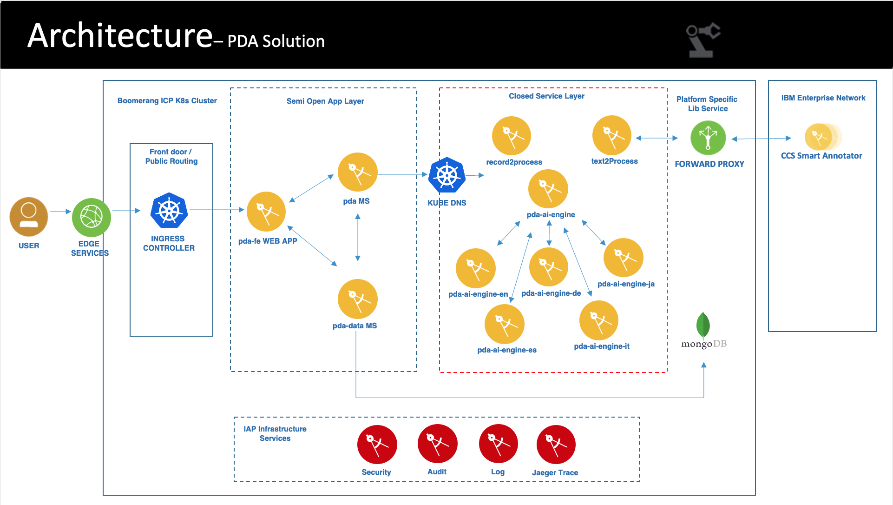

## PDA Architecture Overview

The following diagram presents an overview of the PDA architecture:
 

PDA is part of the IBM Automation Platform and is deployed as a cloud-native application on Kubernetes with the components packaged as Helm charts. PDA uses IAP services in order to abstract the infrastructure and security protocols. The main IAP services used are:

- Security (Authentication and Authorization)
- Auditing
- Logging
- Jaeger Tracing
- Support
- Documentation

## PDA Components

| Component |  Description |
|---|---|
| pda-fe Web App | The graphical front-end app allows user to run PDA interactively. |
| pda Microservice | The pda microservice is the hub of the solution. It orchestrates the process discovery, delegating to other services for analysis of the input data, and harmonizing the disparate results. |
| pda-data Microservice | pda-data provides interfaces for storing and retrieving the artifacts associated with a given PDA analysis. |
| record2process Microservice  | record2process provides process mining services. Given a log or clickstream file, it will generarte a BPMN process model. |
| text2process Microservice | text2process transforms a given system operating procedure (SOP) document into a process model. |
| pda-ai-engine Microservice | pda-ai-engine orchestrates artificial intelligence and natural language processing (NLP). |
| pda-ai-engine-de Microservice | Manages German language NLP. |
| pda-ai-engine-en Microservice | Manages English language NLP. |
| pda-ai-engine-ja Microservice | Manages Japanese language NLP. |
| pda-ai-engine-it Microservice | Manages Spanish language NLP. |
| pda-ai-engine-es Microservice | Manages Italian language NLP. |
| MongoDB | The PDA-Data microservice uses MongoDB to store metadata (such as client names and process types), as well as all of the artifacts associated with a PDA analysis, including input files and output files. |

## PDA External Dependencies

| Software Component |  Version | Description |
|---|---|--|
| CCS Smart Annotator | v3 | CCS is a product from IBM Research that provides tools for transforming unstructured documents, such as an SOP, into a format ingestible by a machine learning tool like PDA. text2process connects directly to CCS if the user uploads an SOP in Word or PDF format.  Alternatively, a user can preprocess an SOP document in CCS. This transforms the SOP to an annotated JSON file that PDA can ingest.|

## PDA Middleware

The following middleware components must be available to PDA at deploy-time and run-time:

| Software Component |  Version | Description |
|---|---|--|
| IBM Cloud Private | 3.2 | Kubernetes cloud environment. |
| IBM Automation Platform | R1 |  PDA is using the IAP method and implementation process. IAP abstracts the underlying infrastructure and security while enabling a rapid development life cycle. PDA uses IAP common services including authentication, authorization, logging and audit and is also integrated in the IAP Launchpad. |
| MongoDB | 4.0.6 | A shared MongoDB Community instance deployed in IAP on Kubernets using a dedicated Helm Chart. |

## Application Services

PDA micro-services are deployed in Kubernetes this Helm chart: <https://github.ibm.com/Boomerang-Delivery/ccspd.chart>

### Technology Component Details

| Component | Type         | Technology               | Internal to Internal      | External Ingress | Internal Dependency | External Dependency | Sidecars |
| --------- | ------------ | ------------------------ | ----------------------- | ---------------- | ------------------- | ------------------- | ------------------ |
| pda-fe Web Application     | Front End    | React + Node.js  | Launchpad&nbsp;MS, Admin&nbsp;MS, Authentication, Authorization  | true             |                     | BPMN files exported from PDA can be imported into Blueworks&nbsp;Live. |
| pda     | Microservice | Flask (Python)       | Authorization, Audit, Logging, Tracing    | true        |             |                    |  |
| text2process | Microservice | Spring Boot (Java)      | Authorization, Audit, Logging, Tracing    | false       |  | CCS Smart Annotator |
| record2process | Microservice | Node.js (JavaScript)  | Authorization, Audit, Logging, Tracing    | false       | ProM Tool |
| pda-data | Microservice | Spring Boot (Java)          | Authorization, Audit, Logging, Tracing    | true        | MongoDB |
| pda-ai-engine | Microservice | Flask (Python)         | Authorization, Audit, Logging, Tracing    | false       | | |
| pda-ai-engine-de | Microservice | Flask (Python)      | Authorization, Audit, Logging, Tracing    | false       | | |
| pda-ai-engine-en | Microservice | Flask (Python)      | Authorization, Audit, Logging, Tracing    | false       | | |
| pda-ai-engine-ja | Microservice | Flask (Python)      | Authorization, Audit, Logging, Tracing    | false       | | |
| pda-ai-engine-es | Microservice | Flask (Python)      | Authorization, Audit, Logging, Tracing    | false       | | |
| pda-ai-engine-it | Microservice | Flask (Python)      | Authorization, Audit, Logging, Tracing    | false       | | |
